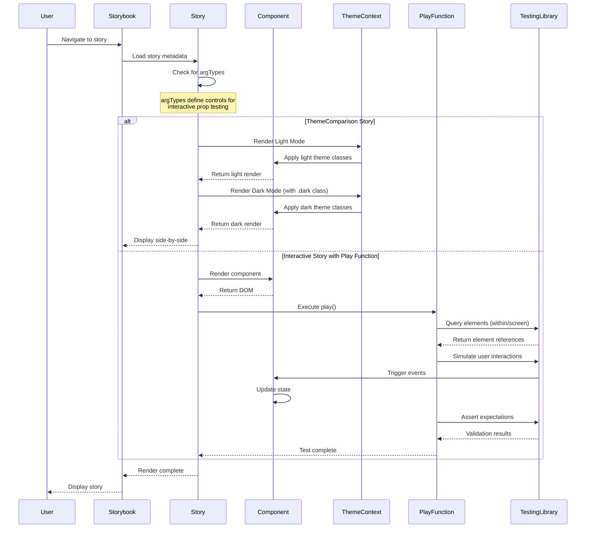

# PR #1: feat: Complete Storybook story standardization for neobrutalism design system

> **Status**: APPROVED | **Author**: @yigitkonur | **Files**: 100 | **Comments**: 107

## Summary

**@copilot-pull-request-reviewer** (COMMENTED): ## Pull request overview This PR comprehensively standardizes **all 314 Storybook stories** across the neobrutalism design system, ensuring consistent patterns for documentation, testing, and theming. The changes add ThemeComparison stories, interactive play functions, and argTypes documentation ...

**@devin-ai-integration** (COMMENTED): **Devin Review** found 1 potential issue. <!-- devin-review-badge-begin --> <a href="https://app.devin.ai/review/yigitkonur/design-system-neobrutalism/pull/1">   <picture>     <source media="(prefers-color-scheme: dark)" srcset="https://static.devin.ai/assets/gh-open-in-devin-review-dark.svg?v=1"...

**@devin-ai-integration** (COMMENTED): **Devin Review** found 1 new potential issue. <!-- devin-review-badge-begin --> <a href="https://app.devin.ai/review/yigitkonur/design-system-neobrutalism/pull/1">   <picture>     <source media="(prefers-color-scheme: dark)" srcset="https://static.devin.ai/assets/gh-open-in-devin-review-dark.svg?...

**@bito-code-review** (CHANGES_REQUESTED): Bito is crafting review details...

**@coderabbitai** (COMMENTED): **Actionable comments posted: 17** > [!CAUTION] > Some comments are outside the diff and can’t be posted inline due to platform limitations. >  >  >  > <details> > <summary>⚠️ Outside diff range comments (2)</summary><blockquote> >  > <details> > <summary>src/stories/overlay/ContextMenu.stories.t...

---

## File Reviews

### 📁 src/stories/accessibility/

### `ARIAPatterns.stories.tsx` (1 comment)

#### Line 632

```diff
@@ -628,3 +628,61 @@ export const Interactive: Story = {
     },
   },
 };
+
+/** Side-by-side comparison in light and dark modes. */
+export const ThemeComparison: Story = {
+  args: {} as unknown as Story["args"],
+  render: () => (
+    <div className="flex gap-8">
+      <div className="p-4 rounded-base bg-background">
+        <p className="mb-2 text-sm font-heading text-foreground">Light Mode</p>
+        <div className="space-y-3">
+          <button
+            aria-label="Close dialog"
// ... (truncated)
```

**@bito-code-review** [bito]:
> **Issue**: Duplicated component structure in theme comparison
> **Duplicated component structure in theme comparison**
> 
> The `ThemeComparison` story contains significant code duplication between the light and dark mode sections (lines 640-658 are nearly identical to lines 663-681). Consider extracting the repeated component structure into a separate component or utility function to reduce maintenance burden and improve code clarity.
> 
> ```suggestion
> const ThemeComparisonContent = () => (
>   <div className="space-y-3">
>     <button
>       aria-label="Close dialog"
>       className="w-10 h-10 bg-main text-main-foreground rounded-base border-2 border-border shadow-shadow flex items-center justify-center"
>     >
>       ×
>     </button>
>     <div className="p-3 rounded-base border-2 border-border bg-secondary-background">
>       <span className="px-2 py-0.5 bg-main text-main-foreground rounded-base border-2 border-border text-xs font-mono">
>         role=&quot;navigation&quot;
>       </span>
>     </div>
>     <div
>       role="status"
>       aria-live="polite"
>       className="p-2 rounded-base border-2 border-border bg-background text-xs text-foreground/70"
>     >
>       aria-live=&quot;polite&quot;
>     </div>
>   </div>
> );
> 
> /** Side-by-side comparison in light and dark modes. */
> export const ThemeComparison: Story = {
>   args: {} as unknown as Story["args"],
>   render: () => (
>     <div className="flex gap-8">
>       <div className="p-4 rounded-base bg-background">
>         <p className="mb-2 text-sm font-heading text-foreground">Light Mode</p>
>         <ThemeComparisonContent />
>       </div>
>       <div className="dark p-4 rounded-base bg-background">
>         <p className="mb-2 text-sm font-heading text-foreground">Dark Mode</p>
>         <ThemeComparisonContent />
>       </div>
>     </div>
>   ),
> ```

> **Fix**: The `ThemeComparison` story contains significant code duplication between the light and dark mode sections (lines 640-658 are nearly identical to lines 663-681). Consider extracting the repeated component structure into a separate component or utility function to reduce maintenance burden and improve code clarity.

> **Suggestion**:
> ```suggestion
> const ThemeComparisonContent = () => (
>   <div className="space-y-3">
>     <button
>       aria-label="Close dialog"
>       className="w-10 h-10 bg-main text-main-foreground rounded-base border-2 border-border shadow-shadow flex items-center justify-center"
>     >
>       ×
>     </button>
>     <div className="p-3 rounded-base border-2 border-border bg-secondary-background">
>       <span className="px-2 py-0.5 bg-main text-main-foreground rounded-base border-2 border-border text-xs font-mono">
>         role=&quot;navigation&quot;
>       </span>
>     </div>
>     <div
>       role="status"
>       aria-live="polite"
>       className="p-2 rounded-base border-2 border-border bg-background text-xs text-foreground/70"
>     >
>       aria-live=&quot;polite&quot;
>     </div>
>   </div>
> );
> 
> /** Side-by-side comparison in light and dark modes. */
> export const ThemeComparison: Story = {
>   args: {} as unknown as Story["args"],
>   render: () => (
>     <div className="flex gap-8">
>       <div className="p-4 rounded-base bg-background">
>         <p className="mb-2 text-sm font-heading text-foreground">Light Mode</p>
>         <ThemeComparisonContent />
>       </div>
>       <div className="dark p-4 rounded-base bg-background">
>         <p className="mb-2 text-sm font-heading text-foreground">Dark Mode</p>
>         <ThemeComparisonContent />
>       </div>
>     </div>
>   ),
> ```

---

### `FocusManagement.stories.tsx` (1 comment)

#### Line 482

```diff
@@ -461,3 +461,57 @@ export const Interactive: Story = {
     },
   },
 };
+
+/** Side-by-side comparison in light and dark modes. */
+export const ThemeComparison: Story = {
+  args: {} as unknown as Story["args"],
+  render: () => (
+    <div className="flex gap-8">
+      <div className="p-4 rounded-base bg-background">
+        <p className="mb-2 text-sm font-heading text-foreground">Light Mode</p>
+        <div className="space-y-3">
+          <button className="px-4 py-2 bg-main text-main-foreground rounded-base border-2 border-border shadow-shadow font-base text-sm focus:outline-none focus-visible:ring-4 focus-visible:ring-foreground focus-visible:ring-offset-2">
+            Focus Visible
// ... (truncated)
```

**@bito-code-review** [bito]:
> **Issue**: Missing focus styles on buttons
> **Missing focus styles on buttons**
> 
> The small buttons '1. First' and '2. Second' lack focus styles, preventing keyboard users from seeing focus indicators. The input uses 'focus:' while buttons use 'focus-visible:', which is inconsistent for accessibility.

> **Fix**: The small buttons '1. First' and '2. Second' lack focus styles, preventing keyboard users from seeing focus indicators. The input uses 'focus:' while buttons use 'focus-visible:', which is inconsistent for accessibility.

---

### `KeyboardNavigation.stories.tsx` (2 comments)

#### Line 524

```diff
@@ -520,3 +520,63 @@ export const Interactive: Story = {
     },
   },
 };
+
+/** Side-by-side comparison in light and dark modes. */
+export const ThemeComparison: Story = {
+  args: {} as unknown as Story["args"],
+  render: () => (
+    <div className="flex gap-8">
+      <div className="p-4 rounded-base bg-background">
+        <p className="mb-2 text-sm font-heading text-foreground">Light Mode</p>
+        <div className="space-y-3">
+          <div className="space-y-2">
+            <label className="block text-sm font-heading font-bold text-foreground">Name</label>
// ... (truncated)
```

**@bito-code-review** [bito]:
> **Issue**: Accessibility: Missing label-input association
> **Accessibility: Missing label-input association**
> 
> Add `htmlFor="light-name-input"` to the light mode `` and `id="light-name-input"` to its ``, and likewise `htmlFor="dark-name-input"` and `id="dark-name-input"` for the dark mode, ensuring labels are properly bound to inputs for screen readers.

> **Fix**: Add `htmlFor="light-name-input"` to the light mode `` and `id="light-name-input"` to its ``, and likewise `htmlFor="dark-name-input"` and `id="dark-name-input"` for the dark mode, ensuring labels are properly bound to inputs for screen readers.

#### Line 578

```diff
@@ -520,3 +520,63 @@ export const Interactive: Story = {
     },
   },
 };
+
+/** Side-by-side comparison in light and dark modes. */
+export const ThemeComparison: Story = {
+  args: {} as unknown as Story["args"],
+  render: () => (
+    <div className="flex gap-8">
+      <div className="p-4 rounded-base bg-background">
+        <p className="mb-2 text-sm font-heading text-foreground">Light Mode</p>
+        <div className="space-y-3">
+          <div className="space-y-2">
+            <label className="block text-sm font-heading font-bold text-foreground">Name</label>
// ... (truncated)
```

**@bito-code-review** [bito]:
> **Issue**: Missing keyboard navigation tests in theme comparison
> **Missing keyboard navigation tests in theme comparison**
> 
> The `ThemeComparison` story demonstrates keyboard navigation patterns but doesn't include any interactive tests or play functions to verify that keyboard navigation actually works in both light and dark modes. Consider adding a `play` function with keyboard navigation tests (similar to the previous story at lines 496-514) to ensure the theme comparison story validates accessibility across both themes.
> 
> ```suggestion
> ),
>   parameters: {
>     docs: { description: { story: 'Side-by-side comparison of accessibility patterns in light and dark modes.' } },
>   },
>   play: async ({ canvasElement }) => {
>     const canvas = within(canvasElement);
>     
>     // Test light mode navigation
>     const lightInput = canvas.getAllByPlaceholderText('Tab here...')[0];
>     await userEvent.click(lightInput);
>     await expect(lightInput).toHaveFocus();
>     
>     await userEvent.tab();
>     const lightCancelButton = canvas.getAllByText('Cancel')[0];
>     await expect(lightCancelButton).toHaveFocus();
>     
>     // Test dark mode navigation
>     const darkInput = canvas.getAllByPlaceholderText('Tab here...')[1];
>     await userEvent.click(darkInput);
>     await expect(darkInput).toHaveFocus();
>     
>     await userEvent.tab();
>     const darkCancelButton = canvas.getAllByText('Cancel')[1];
>     await expect(darkCancelButton).toHaveFocus();
>   },
> ```

> **Fix**: The `ThemeComparison` story demonstrates keyboard navigation patterns but doesn't include any interactive tests or play functions to verify that keyboard navigation actually works in both light and dark modes. Consider adding a `play` function with keyboard navigation tests (similar to the previous story at lines 496-514) to ensure the theme comparison story validates accessibility across both themes.

> **Suggestion**:
> ```suggestion
> ),
>   parameters: {
>     docs: { description: { story: 'Side-by-side comparison of accessibility patterns in light and dark modes.' } },
>   },
>   play: async ({ canvasElement }) => {
>     const canvas = within(canvasElement);
>     
>     // Test light mode navigation
>     const lightInput = canvas.getAllByPlaceholderText('Tab here...')[0];
>     await userEvent.click(lightInput);
>     await expect(lightInput).toHaveFocus();
>     
>     await userEvent.tab();
>     const lightCancelButton = canvas.getAllByText('Cancel')[0];
>     await expect(lightCancelButton).toHaveFocus();
>     
>     // Test dark mode navigation
>     const darkInput = canvas.getAllByPlaceholderText('Tab here...')[1];
>     await userEvent.click(darkInput);
>     await expect(darkInput).toHaveFocus();
>     
>     await userEvent.tab();
>     const darkCancelButton = canvas.getAllByText('Cancel')[1];
>     await expect(darkCancelButton).toHaveFocus();
>   },
> ```

---

### `ScreenReaderTesting.stories.tsx` (1 comment)

#### Line 629

```diff
@@ -625,3 +625,51 @@ export const Interactive: Story = {
     },
   },
 };
+
+/** Side-by-side comparison in light and dark modes. */
+export const ThemeComparison: Story = {
+  args: {} as unknown as Story["args"],
+  render: () => (
+    <div className="flex gap-8">
+      <div className="p-4 rounded-base bg-background">
+        <p className="mb-2 text-sm font-heading text-foreground">Light Mode</p>
+        <div className="space-y-3">
+          <h4 className="font-heading text-sm font-bold text-foreground">Heading (h4)</h4>
+          <ul className="space-y-1 list-disc list-inside text-sm text-foreground">
// ... (truncated)
```

**@bito-code-review** [bito]:
> **Issue**: Duplicated content structure in theme comparison
> **Duplicated content structure in theme comparison**
> 
> The `ThemeComparison` story duplicates the entire content structure (heading, list, form) for both light and dark mode sections. This creates significant code duplication that could be refactored into a reusable component to improve maintainability and reduce the risk of inconsistencies between the two sections.
> 
> ```suggestion
> /** Side-by-side comparison in light and dark modes. */
> const ThemeContent = ({ isDarkMode }: { isDarkMode: boolean }) => (
>   <div className="space-y-3">
>     <h4 className="font-heading text-sm font-bold text-foreground">Heading (h4)</h4>
>     <ul className="space-y-1 list-disc list-inside text-sm text-foreground">
>       <li>Semantic list item</li>
>       <li>Another list item</li>
>     </ul>
>     <label className="block space-y-1">
>       <span className="block text-sm font-heading font-bold text-foreground">Email</span>
>       <input
>         type="email"
>         placeholder="user@example.com"
>         className="w-full px-3 py-1 bg-background rounded-base border-2 border-border text-sm"
>       />
>     </label>
>   </div>
> );
> 
> export const ThemeComparison: Story = {
>   args: {} as unknown as Story["args"],
>   render: () => (
>     <div className="flex gap-8">
>       <div className="p-4 rounded-base bg-background">
>         <p className="mb-2 text-sm font-heading text-foreground">Light Mode</p>
>         <ThemeContent isDarkMode={false} />
>       </div>
>       <div className="dark p-4 rounded-base bg-background">
>         <p className="mb-2 text-sm font-heading text-foreground">Dark Mode</p>
>         <ThemeContent isDarkMode={true} />
>       </div>
>     </div>
>   ),
> ```

> **Fix**: The `ThemeComparison` story duplicates the entire content structure (heading, list, form) for both light and dark mode sections. This creates significant code duplication that could be refactored into a reusable component to improve maintainability and reduce the risk of inconsistencies between the two sections.

> **Suggestion**:
> ```suggestion
> /** Side-by-side comparison in light and dark modes. */
> const ThemeContent = ({ isDarkMode }: { isDarkMode: boolean }) => (
>   <div className="space-y-3">
>     <h4 className="font-heading text-sm font-bold text-foreground">Heading (h4)</h4>
>     <ul className="space-y-1 list-disc list-inside text-sm text-foreground">
>       <li>Semantic list item</li>
>       <li>Another list item</li>
>     </ul>
>     <label className="block space-y-1">
>       <span className="block text-sm font-heading font-bold text-foreground">Email</span>
>       <input
>         type="email"
>         placeholder="user@example.com"
>         className="w-full px-3 py-1 bg-background rounded-base border-2 border-border text-sm"
>       />
>     </label>
>   </div>
> );
> 
> export const ThemeComparison: Story = {
>   args: {} as unknown as Story["args"],
>   render: () => (
>     <div className="flex gap-8">
>       <div className="p-4 rounded-base bg-background">
>         <p className="mb-2 text-sm font-heading text-foreground">Light Mode</p>
>         <ThemeContent isDarkMode={false} />
>       </div>
>       <div className="dark p-4 rounded-base bg-background">
>         <p className="mb-2 text-sm font-heading text-foreground">Dark Mode</p>
>         <ThemeContent isDarkMode={true} />
>       </div>
>     </div>
>   ),
> ```

---

### `WCAGCompliance.stories.tsx` (1 comment)

#### Line 663

```diff
@@ -646,3 +646,49 @@ export const Interactive: Story = {
     },
   },
 };
+
+/** Side-by-side comparison in light and dark modes. */
+export const ThemeComparison: Story = {
+  args: {} as unknown as Story["args"],
+  render: () => (
+    <div className="flex gap-8">
+      <div className="p-4 rounded-base bg-background">
+        <p className="mb-2 text-sm font-heading text-foreground">Light Mode</p>
+        <div className="space-y-3">
+          <div className="p-3 rounded-base border-2 border-border bg-main text-main-foreground text-center">
+            <p className="text-xs opacity-80">Compliance</p>
// ... (truncated)
```

**@bito-code-review** [bito]:
> **Issue**: Screen reader accessibility for status symbols
> **Screen reader accessibility for status symbols**
> 
> The checkmark and cross symbols are using HTML entity codes (`&#10003;` and `&#10007;`) which may not be properly announced by screen readers. Consider using semantic alternatives or ARIA labels to ensure the symbols are accessible to users with assistive technologies.

> **Fix**: The checkmark and cross symbols are using HTML entity codes (`&#10003;` and `&#10007;`) which may not be properly announced by screen readers. Consider using semantic alternatives or ARIA labels to ensure the symbols are accessible to users with assistive technologies.

---

### 📁 src/stories/account/

### `InvoiceHistory.stories.tsx` (1 comment)

#### Line 141

```diff
@@ -107,3 +107,50 @@ export const AllVariants: Story = {
     </div>
   ),
 }
+
+/** Side-by-side comparison in light and dark modes. */
+export const ThemeComparison: Story = {
+  args: {} as unknown as Story["args"],
+  render: () => (
+    <div className="flex gap-8">
+      <div className="p-4 rounded-base bg-background flex-1">
+        <p className="mb-2 text-sm font-heading text-foreground">Light Mode</p>
+        <InvoiceHistory variant="cards" />
+      </div>
+      <div className="dark p-4 rounded-base bg-background flex-1">
// ... (truncated)
```

**@bito-code-review** [bito]:
> **Issue**: Incomplete interaction test
> **Incomplete interaction test**
> 
> After clicking the download button, add an assertion to verify that the onDownload callback is invoked (e.g., `await expect(args.onDownload).toHaveBeenCalled();`).

> **Fix**: After clicking the download button, add an assertion to verify that the onDownload callback is invoked (e.g., `await expect(args.onDownload).toHaveBeenCalled();`).

---

### `LanguageRegion.stories.tsx` (1 comment)

#### Line 2

```diff
@@ -1,5 +1,5 @@
 import type { Meta, StoryObj } from '@storybook/nextjs-vite'
-import { fn } from 'storybook/test'
+import { expect, fn, userEvent, within } from 'storybook/test'
```

**@copilot-pull-request-reviewer** [copilot]:
> Unused import userEvent.
> 
> *(See code suggestion below)*

> **Suggestion**:
> ```suggestion
> import { expect, fn, within } from 'storybook/test'
> ```

---

### `QuotaBreakdown.stories.tsx` (1 comment)

#### Line 2

```diff
@@ -1,5 +1,5 @@
 import type { Meta, StoryObj } from '@storybook/nextjs-vite'
-import { fn } from 'storybook/test'
+import { expect, fn, userEvent, within } from 'storybook/test'
```

**@copilot-pull-request-reviewer** [copilot]:
> Unused import userEvent.
> 
> *(See code suggestion below)*

> **Suggestion**:
> ```suggestion
> import { expect, fn, within } from 'storybook/test'
> ```

---

### `UsageMeter.stories.tsx` (1 comment)

#### Line 216

```diff
@@ -212,3 +212,28 @@ export const AllVariants: Story = {
     },
   },
 }
+
+/** Interactive test verifying usage meter renders and upgrade button works. */
+export const InteractionTest: Story = {
+  args: {
+    variant: 'card',
+    onUpgrade: fn(),
+  },
+  play: async ({ canvasElement, args }) => {
+    const canvas = within(canvasElement)
+    await expect(canvas.getByText('Usage Overview')).toBeInTheDocument()
+    await expect(canvas.getByText('Storage')).toBeInTheDocument()
// ... (truncated)
```

**@coderabbitai** [coderabbit]:
> _⚠️ Potential issue_ | _🟡 Minor_
> 
> **Make InteractionTest data explicit to avoid brittle assertions.**
> 
> 1) What breaks? If default items change, the play test fails on “Storage/Bandwidth.”  
> 2) Blast radius? Storybook test runner / CI only.  
> 3) Other locations? Any stories that assume default UsageMeter items.  
> 4) Startup‑critical? No.
> 
> <details>
> <summary>✅ Suggested diff</summary>
> 
> ```diff
>  export const InteractionTest: Story = {
>    args: {
>      variant: 'card',
> +    items: [
> +      { id: 'storage', label: 'Storage', used: 6, limit: 10, unit: 'GB' },
> +      { id: 'bandwidth', label: 'Bandwidth', used: 120, limit: 500, unit: 'GB' },
> +    ],
>      onUpgrade: fn(),
>    },
> ```
> </details>
> 
> <details>
> <summary>🤖 Prompt for AI Agents</summary>
> 
> ```
> In `@src/stories/account/UsageMeter.stories.tsx` around lines 216 - 231, The
> InteractionTest play function relies on implicit default UsageMeter items
> ("Storage"/"Bandwidth") and will break if defaults change; update the Story
> object's args for InteractionTest to include explicit items data (e.g., an items
> or usageItems prop) that lists the expected entries and values, keep the
> existing play function but assert against those explicit entries and the
> onUpgrade handler, and reference the Story identifier InteractionTest and its
> play/args so reviewers can find and verify the added items prop rather than
> relying on component defaults.
> ```
> 
> </details>

> **Suggestion**:
> ```suggestion
> export const InteractionTest: Story = {
>    args: {
>      variant: 'card',
> +    items: [
> +      { id: 'storage', label: 'Storage', used: 6, limit: 10, unit: 'GB' },
> +      { id: 'bandwidth', label: 'Bandwidth', used: 120, limit: 500, unit: 'GB' },
> +    ],
>      onUpgrade: fn(),
>    },
> ```

---

### 📁 src/stories/admin/

### `ActivityLog.stories.tsx` (1 comment)

#### Line 237

```diff
@@ -218,3 +218,38 @@ export const ThemeComparison: Story = {
     },
   },
 };
+
+/** Interactive test for ActivityLog. */
+export const InteractionTest: Story = {
+  args: {} as unknown as Story["args"],
+  render: () => (
+    <ActivityLog
+      activities={mockActivities}
+      showFilters
+      hasMore
+      onFilterType={fn()}
+      onLoadMore={fn()}
// ... (truncated)
```

**@bito-code-review** [bito]:
> **Issue**: Incorrect test assertion pattern usage
> **Incorrect test assertion pattern usage**
> 
> The test assertion on line 237 uses `await expect(activities.length).toBeGreaterThan(0)` which may not work as intended. The `expect()` function from Storybook's test utilities is designed for DOM elements and matchers, not for plain JavaScript values. Consider using standard assertion syntax or verifying the query result differently to ensure the test behaves as expected.
> 
> ```suggestion
> const activities = canvas.getAllByText(/ago|just now/i);
>     expect(activities.length).toBeGreaterThan(0);
> ```

> **Fix**: The test assertion on line 237 uses `await expect(activities.length).toBeGreaterThan(0)` which may not work as intended. The `expect()` function from Storybook's test utilities is designed for DOM elements and matchers, not for plain JavaScript values. Consider using standard assertion syntax or verifying the query result differently to ensure the test behaves as expected.

> **Suggestion**:
> ```suggestion
> const activities = canvas.getAllByText(/ago|just now/i);
>     expect(activities.length).toBeGreaterThan(0);
> ```

---

### `BulkUserActions.stories.tsx` (1 comment)

#### Line 192

```diff
@@ -186,3 +186,36 @@ export const ThemeComparison: Story = {
     },
   },
 };
+
+/** Interactive test for BulkUserActions. */
+export const InteractionTest: Story = {
+  args: {} as unknown as Story["args"],
```

**@bito-code-review** [bito]:
> **Issue**: Unsafe double type cast pattern
> **Unsafe double type cast pattern**
> 
> The type assertion `args: {} as unknown as Story["args"]` uses a double cast through `unknown`, which bypasses TypeScript type safety. Consider using a proper type that matches `BulkUserActionsProps` or removing the unnecessary cast if the empty object is intentional.
> 
> ```suggestion
> args: {} as BulkUserActionsProps,
> ```

> **Fix**: The type assertion `args: {} as unknown as Story["args"]` uses a double cast through `unknown`, which bypasses TypeScript type safety. Consider using a proper type that matches `BulkUserActionsProps` or removing the unnecessary cast if the empty object is intentional.

> **Suggestion**:
> ```suggestion
> args: {} as BulkUserActionsProps,
> ```

---

### `FlaggedContentQueue.stories.tsx` (2 comments)

#### Line 188

```diff
@@ -184,3 +184,36 @@ export const ThemeComparison: Story = {
     },
   },
 };
+
+/** Interactive test for FlaggedContentQueue. */
+export const InteractionTest: Story = {
+  args: {} as unknown as Story["args"],
+  render: () => (
+    <FlaggedContentQueue
+      items={mockFlaggedContent}
+      showPreview
+      onApprove={fn()}
+      onReject={fn()}
+      onEscalate={fn()}
// ... (truncated)
```

**@bito-code-review** [bito]:
> **Issue**: Incomplete interaction assertions
> **Incomplete interaction assertions**
> 
> The interaction test verifies button rendering and text visibility, but clicking the approve button doesn't assert that the onApprove callback is invoked with the correct item. Consider storing the fn() mocks in variables and adding expect(mockApprove).toHaveBeenCalledWith(expectedItem) after the click to fully validate the interaction.

> **Fix**: The interaction test verifies button rendering and text visibility, but clicking the approve button doesn't assert that the onApprove callback is invoked with the correct item. Consider storing the fn() mocks in variables and adding expect(mockApprove).toHaveBeenCalledWith(expectedItem) after the click to fully validate the interaction.

#### Line 204

```diff
@@ -184,3 +184,36 @@ export const ThemeComparison: Story = {
     },
   },
 };
+
+/** Interactive test for FlaggedContentQueue. */
+export const InteractionTest: Story = {
+  args: {} as unknown as Story["args"],
+  render: () => (
+    <FlaggedContentQueue
+      items={mockFlaggedContent}
+      showPreview
+      onApprove={fn()}
+      onReject={fn()}
+      onEscalate={fn()}
// ... (truncated)
```

**@bito-code-review** [bito]:
> **Issue**: Potential incorrect test assertion usage
> **Potential incorrect test assertion usage**
> 
> The assertion on line 204 uses `await expect(approveButtons.length).toBeGreaterThan(0)` which may not work as intended. The `expect()` function from Storybook's test utilities is designed for DOM elements and matchers like `toBeInTheDocument()`, not for numeric comparisons. Consider using a standard assertion or restructuring the test to properly validate button presence.
> 
> ```suggestion
> expect(approveButtons.length).toBeGreaterThan(0);
> ```

> **Fix**: The assertion on line 204 uses `await expect(approveButtons.length).toBeGreaterThan(0)` which may not work as intended. The `expect()` function from Storybook's test utilities is designed for DOM elements and matchers like `toBeInTheDocument()`, not for numeric comparisons. Consider using a standard assertion or restructuring the test to properly validate button presence.

> **Suggestion**:
> ```suggestion
> expect(approveButtons.length).toBeGreaterThan(0);
> ```

---

### `SystemStatusPage.stories.tsx` (3 comments)

#### Line 190

```diff
@@ -186,3 +186,36 @@ export const ThemeComparison: Story = {
     },
   },
 };
+
+/** Interactive test for SystemStatusPage. */
+export const InteractionTest: Story = {
+  args: {} as unknown as Story["args"],
+  render: () => (
+    <SystemStatusPage
+      services={mockServices}
+      showUptime
+      onRefresh={fn()}
+    />
+  ),
// ... (truncated)
```

**@bito-code-review** [bito]:
> **Issue**: Incomplete Interaction Test
> **Incomplete Interaction Test**
> 
> The InteractionTest appears to simulate a user click on the Refresh button, but it doesn't verify that the onRefresh callback is actually invoked, which could leave the interaction untested. Based on Storybook 10 docs, interaction tests should assert mock calls to ensure the component behaves as expected.

> **Fix**: The InteractionTest appears to simulate a user click on the Refresh button, but it doesn't verify that the onRefresh callback is actually invoked, which could leave the interaction untested. Based on Storybook 10 docs, interaction tests should assert mock calls to ensure the component behaves as expected.

#### Line 200

```diff
@@ -186,3 +186,36 @@ export const ThemeComparison: Story = {
     },
   },
 };
+
+/** Interactive test for SystemStatusPage. */
+export const InteractionTest: Story = {
+  args: {} as unknown as Story["args"],
+  render: () => (
+    <SystemStatusPage
+      services={mockServices}
+      showUptime
+      onRefresh={fn()}
+    />
+  ),
// ... (truncated)
```

**@bito-code-review** [bito]:
> **Issue**: Status heading regex pattern mismatch
> **Status heading regex pattern mismatch**
> 
> The regex pattern `/operational|degradation|outage/i` in the `getByText()` call may not match the actual text rendered by the component. Based on the `SystemStatusPage` component logic, the possible status labels are `'System Outage'`, `'Partial Degradation'`, or `'All Systems Operational'`. Consider updating the regex to match these exact labels: `/System Outage|Partial Degradation|All Systems Operational/i`.
> 
> ```suggestion
> play: async ({ canvasElement }) => {
>     const canvas = within(canvasElement);
>     // Verify the overall status heading renders
>     const statusHeading = canvas.getByText(/System Outage|Partial Degradation|All Systems Operational/i);
>     await expect(statusHeading).toBeInTheDocument();
>     // Verify the Refresh button is present
>     const refreshButton = canvas.getByRole('button', { name: /refresh/i });
> ```

> **Fix**: The regex pattern `/operational|degradation|outage/i` in the `getByText()` call may not match the actual text rendered by the component. Based on the `SystemStatusPage` component logic, the possible status labels are `'System Outage'`, `'Partial Degradation'`, or `'All Systems Operational'`. Consider updating the regex to match these exact labels: `/System Outage|Partial Degradation|All Systems Operational/i`.

> **Suggestion**:
> ```suggestion
> play: async ({ canvasElement }) => {
>     const canvas = within(canvasElement);
>     // Verify the overall status heading renders
>     const statusHeading = canvas.getByText(/System Outage|Partial Degradation|All Systems Operational/i);
>     await expect(statusHeading).toBeInTheDocument();
>     // Verify the Refresh button is present
>     const refreshButton = canvas.getByRole('button', { name: /refresh/i });
> ```

**@coderabbitai** [coderabbit]:
> _⚠️ Potential issue_ | _🟡 Minor_
> 
> <details>
> <summary>🧩 Analysis chain</summary>
> 
> 🏁 Script executed:
> 
> ```shell
> #!/bin/bash
> # First, find and read the story file around the reported lines
> fd 'SystemStatusPage\.stories\.tsx$' src --type f
> ```
> 
> Repository: yigitkonur/design-system-neobrutalism
> 
> Length of output: 127
> 
> ---
> 
> 🏁 Script executed:
> 
> ```shell
> #!/bin/bash
> # Read the story file to see the full context and mockServices setup
> if [ -f "src/stories/admin/SystemStatusPage.stories.tsx" ]; then
>   wc -l "src/stories/admin/SystemStatusPage.stories.tsx"
> fi
> ```
> 
> Repository: yigitkonur/design-system-neobrutalism
> 
> Length of output: 131
> 
> ---
> 
> 🏁 Script executed:
> 
> ```shell
> #!/bin/bash
> # Get the full story file content (check size first)
> if [ -f "src/stories/admin/SystemStatusPage.stories.tsx" ]; then
>   cat "src/stories/admin/SystemStatusPage.stories.tsx"
> fi
> ```
> 
> Repository: yigitkonur/design-system-neobrutalism
> 
> Length of output: 5846
> 
> ---
> 
> 🏁 Script executed:
> 
> ```shell
> #!/bin/bash
> # Also find and inspect the main component to understand what renders
> fd 'SystemStatusPage\.tsx$' src --type f | grep -v stories
> ```
> 
> Repository: yigitkonur/design-system-neobrutalism
> 
> Length of output: 63
> 
> ---
> 
> 🏁 Script executed:
> 
> ```shell
> #!/bin/bash
> # Find the types file that exports mockServices
> fd 'types\.ts' src/stories/admin --type f
> ```
> 
> Repository: yigitkonur/design-system-neobrutalism
> 
> Length of output: 107
> 
> ---
> 
> 🏁 Script executed:
> 
> ```shell
> #!/bin/bash
> # Also search for SystemStatusPage component in components directory
> fd 'SystemStatusPage\.tsx' src --type f
> ```
> 
> Repository: yigitkonur/design-system-neobrutalism
> 
> Length of output: 130
> 
> ---
> 
> 🏁 Script executed:
> 
> ```shell
> #!/bin/bash
> # Broader search for SystemStatusPage component
> find src -name '*SystemStatus*' -type f 2>/dev/null
> ```
> 
> Repository: yigitkonur/design-system-neobrutalism
> 
> Length of output: 177
> 
> ---
> 
> 🏁 Script executed:
> 
> ```shell
> #!/bin/bash
> # Read the types file to see mockServices
> cat "src/stories/admin/types.ts"
> ```
> 
> Repository: yigitkonur/design-system-neobrutalism
> 
> Length of output: 12242
> 
> ---
> 
> 🏁 Script executed:
> 
> ```shell
> #!/bin/bash
> # Read the SystemStatusPage component to see how status labels render
> cat "src/stories/admin/components/SystemStatusPage.tsx"
> ```
> 
> Repository: yigitkonur/design-system-neobrutalism
> 
> Length of output: 8303
> 
> ---
> 
> </details>
> 
> **Play test throws on multiple status text matches.**
> 
> `getByText(/operational|degradation|outage/i)` will throw because the regex matches multiple elements: the overall status heading plus 3-4 service status badges (your mockServices renders "Operational" 3 times, "Degraded" once, "Maintenance" once). `getByText` expects one match and explodes. This breaks the Storybook play test run only—doesn't touch production code or user experience. Fix: use `getAllByText` and assert length > 0.
> 
> <details>
> <summary>Suggested fix</summary>
> 
> ```diff
> -    const statusHeading = canvas.getByText(/operational|degradation|outage/i);
> -    await expect(statusHeading).toBeInTheDocument();
> +    const statusHeadings = canvas.getAllByText(/operational|degradation|outage/i);
> +    await expect(statusHeadings.length).toBeGreaterThan(0);
> ```
> </details>
> 
> <details>
> <summary>📝 Committable suggestion</summary>
> ‼️ **IMPORTANT**
> Carefully review the code before committing. Ensure that it accurately replaces the highlighted code, contains no missing lines, and has no issues with indentation. Thoroughly test & benchmark the code to ensure it meets the requirements.
> 
> ```suggestion
>   play: async ({ canvasElement }) => {
>     const canvas = within(canvasElement);
>     // Verify the overall status heading renders
>     const statusHeadings = canvas.getAllByText(/operational|degradation|outage/i);
>     await expect(statusHeadings.length).toBeGreaterThan(0);
>     // Verify the Refresh button is present
>     const refreshButton = canvas.getByRole('button', { name: /refresh/i });
>     await expect(refreshButton).toBeInTheDocument();
>     // Verify uptime percentage is displayed
>     const uptimeText = canvas.getAllByText(/%/);
>     await expect(uptimeText.length).toBeGreaterThan(0);
> ```
> 
> </details>
> 
> <details>
> <summary>🤖 Prompt for AI Agents</summary>
> 
> ```
> In `@src/stories/admin/SystemStatusPage.stories.tsx` around lines 200 - 210, The
> play test in the play function uses
> canvas.getByText(/operational|degradation|outage/i) which throws because
> multiple elements match; change to
> canvas.getAllByText(/operational|degradation|outage/i) and update the assertion
> to check the returned array length is greater than 0 (e.g.,
> expect(statusHeadings.length).toBeGreaterThan(0)) so the test passes when
> multiple matching elements (service badges + overall heading) exist.
> ```
> 
> </details>

> **Suggestion**:
> ```suggestion
> -    const statusHeading = canvas.getByText(/operational|degradation|outage/i);
> -    await expect(statusHeading).toBeInTheDocument();
> +    const statusHeadings = canvas.getAllByText(/operational|degradation|outage/i);
> +    await expect(statusHeadings.length).toBeGreaterThan(0);
> ```

---

### 📁 src/stories/data-display/

### `Badge.stories.tsx` (2 comments)

#### Lines 150-154

```diff
@@ -140,3 +141,28 @@ export const ThemeComparison: Story = {
     },
   },
 };
+
+/** Interactive test verifying badge renders with correct text. */
+export const InteractionTest: Story = {
+  args: {} as unknown as Story["args"],
+  render: () => (
+    <div className="flex gap-2">
+      <Badge data-testid="badge-default">Default</Badge>
+      <Badge variant="neutral" data-testid="badge-neutral">Neutral</Badge>
+    </div>
+  ),
+  play: async ({ canvasElement }) => {
// ... (truncated)
```

**@coderabbitai** [coderabbit]:
> _⚠️ Potential issue_ | _🟡 Minor_
> 
> **Add `neutral` to argTypes to match the new story.**  
> What breaks: the controls/docs for `variant` won’t reflect the `neutral` value used in Line 151, so the select shows an invalid/blank value and the table summary is wrong. Blast radius: Badge story docs/controls only. Fix: update argTypes in this file.
> 
> <details>
> <summary>✅ Suggested fix</summary>
> 
> ```diff
>    argTypes: {
>      variant: {
>        control: 'select',
> -      options: ['default', 'secondary', 'outline', 'destructive'],
> -      description: 'Visual style: **default** (primary), **secondary** (muted), **outline** (bordered), **destructive** (error).',
> +      options: ['default', 'secondary', 'neutral', 'outline', 'destructive'],
> +      description: 'Visual style: **default** (primary), **secondary** (muted), **neutral** (subtle), **outline** (bordered), **destructive** (error).',
>        table: {
>          defaultValue: { summary: 'default' },
> -        type: { summary: 'default | secondary | outline | destructive' },
> +        type: { summary: 'default | secondary | neutral | outline | destructive' },
>        },
>      },
> ```
> </details>
> 
> <details>
> <summary>🤖 Prompt for AI Agents</summary>
> 
> ```
> In `@src/stories/data-display/Badge.stories.tsx` around lines 150 - 152, The Badge
> story uses a new "neutral" variant but the argTypes for the story's "variant"
> control doesn't include "neutral", causing docs/controls to show a blank/invalid
> value; update the story's argTypes (the variant entry in Badge.stories.tsx) to
> include "neutral" in the options array (and ensure control/type remains "select"
> or appropriate) so the controls and table summary reflect the new value used in
> the story.
> ```
> 
> </details>

> **Suggestion**:
> ```suggestion
> argTypes: {
>      variant: {
>        control: 'select',
> -      options: ['default', 'secondary', 'outline', 'destructive'],
> -      description: 'Visual style: **default** (primary), **secondary** (muted), **outline** (bordered), **destructive** (error).',
> +      options: ['default', 'secondary', 'neutral', 'outline', 'destructive'],
> +      description: 'Visual style: **default** (primary), **secondary** (muted), **neutral** (subtle), **outline** (bordered), **destructive** (error).',
>        table: {
>          defaultValue: { summary: 'default' },
> -        type: { summary: 'default | secondary | outline | destructive' },
> +        type: { summary: 'default | secondary | neutral | outline | destructive' },
>        },
>      },
> ```

**@bito-code-review** [bito]:
> **Issue**: Incorrect async/await usage in play function
> **Incorrect async/await usage in play function**
> 
> The `play` function uses `await expect()` syntax, but the expectations are not awaited properly. The `getByTestId` and `getByText` queries from `within()` are synchronous methods that return elements immediately, not promises. Consider removing the `await` keyword since these queries don't return promises and the `expect()` assertions execute synchronously.
> 
> ```suggestion
> play: async ({ canvasElement }) => {
>     const canvas = within(canvasElement);
>     expect(canvas.getByTestId('badge-default')).toBeInTheDocument();
>     expect(canvas.getByText('Default')).toBeInTheDocument();
>     expect(canvas.getByTestId('badge-neutral')).toBeInTheDocument();
>     expect(canvas.getByText('Neutral')).toBeInTheDocument();
> ```

> **Fix**: The `play` function uses `await expect()` syntax, but the expectations are not awaited properly. The `getByTestId` and `getByText` queries from `within()` are synchronous methods that return elements immediately, not promises. Consider removing the `await` keyword since these queries don't return promises and the `expect()` assertions execute synchronously.

> **Suggestion**:
> ```suggestion
> play: async ({ canvasElement }) => {
>     const canvas = within(canvasElement);
>     expect(canvas.getByTestId('badge-default')).toBeInTheDocument();
>     expect(canvas.getByText('Default')).toBeInTheDocument();
>     expect(canvas.getByTestId('badge-neutral')).toBeInTheDocument();
>     expect(canvas.getByText('Neutral')).toBeInTheDocument();
> ```

---

### `DataTable.stories.tsx` (2 comments)

#### Line 1

```diff
@@ -1,4 +1,5 @@
 import type { Meta, StoryObj } from '@storybook/nextjs-vite';
+import { expect, userEvent, within } from 'storybook/test';
```

**@bito-code-review** [bito]:
> **Issue**: Verify Storybook test import path resolution
> **Verify Storybook test import path resolution**
> 
> The import statement references `storybook/test`, but this module path may not be correctly resolved depending on the Storybook configuration. Consider verifying that the `storybook/test` package is properly installed and that the import path matches the actual package exports. If using Storybook's testing utilities, the import might need to be `@storybook/test` instead.
> 
> ```suggestion
> import type { Meta, StoryObj } from '@storybook/nextjs-vite';
> import { expect, userEvent, within } from '@storybook/test';
> ```

> **Fix**: The import statement references `storybook/test`, but this module path may not be correctly resolved depending on the Storybook configuration. Consider verifying that the `storybook/test` package is properly installed and that the import path matches the actual package exports. If using Storybook's testing utilities, the import might need to be `@storybook/test` instead.

> **Suggestion**:
> ```suggestion
> import type { Meta, StoryObj } from '@storybook/nextjs-vite';
> import { expect, userEvent, within } from '@storybook/test';
> ```

#### Line 32

```diff
@@ -28,6 +29,15 @@ const meta = {
       },
     },
   },
+  argTypes: {
+    className: {
+      control: 'text',
+      description: 'Additional CSS classes for the data table container.',
+      table: {
+        type: { summary: 'string' },
+      },
+    },
```

**@bito-code-review** [bito]:
> **Issue**: Unused argTypes control
> **Unused argTypes control**
> 
> The argTypes includes a className control, but the DataTableDemo component does not accept a className prop, so the Storybook control will not function. Consider modifying the component to support this prop for consistency with other design system components.

> **Fix**: The argTypes includes a className control, but the DataTableDemo component does not accept a className prop, so the Storybook control will not function. Consider modifying the component to support this prop for consistency with other design system components.

---

### `Tooltip.stories.tsx` (1 comment)

#### Line 237

```diff
@@ -164,3 +182,70 @@ export const IconBar: Story = {
     </div>
   ),
 };
+
+/** Side-by-side comparison in light and dark modes. */
+export const ThemeComparison: Story = {
+  args: {} as unknown as Story["args"],
+  render: () => (
+    <div className="flex gap-8">
+      <div className="p-4 rounded-base bg-background">
+        <p className="mb-2 text-sm font-heading text-foreground">Light Mode</p>
+        <Tooltip>
+          <TooltipTrigger asChild>
+            <Button variant="neutral">Hover me</Button>
// ... (truncated)
```

**@bito-code-review** [bito]:
> **Issue**: Tooltip content query scope mismatch
> **Tooltip content query scope mismatch**
> 
> The `InteractionTest` story uses `screen.findByTestId()` without ensuring the tooltip content is rendered in the document root. Since `TooltipContent` is likely rendered in a portal or overlay, `screen.findByTestId()` may fail to locate the element. Consider using `canvas.findByTestId()` instead to search within the canvas element where the tooltip is actually rendered.
> 
> ```suggestion
> play: async ({ canvasElement }) => {
>     const canvas = within(canvasElement);
>     const trigger = canvas.getByTestId('tooltip-trigger');
>     await expect(trigger).toBeInTheDocument();
>     await userEvent.hover(trigger);
>     await expect(await canvas.findByTestId('tooltip-content')).toBeInTheDocument();
> ```

> **Fix**: The `InteractionTest` story uses `screen.findByTestId()` without ensuring the tooltip content is rendered in the document root. Since `TooltipContent` is likely rendered in a portal or overlay, `screen.findByTestId()` may fail to locate the element. Consider using `canvas.findByTestId()` instead to search within the canvas element where the tooltip is actually rendered.

> **Suggestion**:
> ```suggestion
> play: async ({ canvasElement }) => {
>     const canvas = within(canvasElement);
>     const trigger = canvas.getByTestId('tooltip-trigger');
>     await expect(trigger).toBeInTheDocument();
>     await userEvent.hover(trigger);
>     await expect(await canvas.findByTestId('tooltip-content')).toBeInTheDocument();
> ```

---

### 📁 src/stories/ecommerce/

### `OrderTracking.stories.tsx` (1 comment)

#### Line 483

```diff
@@ -472,3 +473,16 @@ export const ThemeComparison: Story = {
     },
   },
 }
+
+/** Interactive test for OrderTracking. */
+export const InteractionTest: Story = {
+  args: {} as unknown as Story["args"],
+  render: () => (
+    <OrderTracking order={mockOrderShipped} events={eventsShipped} variant="timeline" />
+  ),
+  play: async ({ canvasElement }) => {
+    const canvas = within(canvasElement)
+    await expect(canvas.getByRole('heading')).toBeInTheDocument()
```

**@bito-code-review** [bito]:
> **Issue**: Verify heading element presence in timeline variant
> **Verify heading element presence in timeline variant**
> 
> The interaction test queries for a heading element using `getByRole('heading')`, but the `OrderTracking` component with the `timeline` variant may not render a heading element. Consider verifying that the `TimelineTracking` component actually renders a heading, or adjust the test to query for an element that is guaranteed to exist in the rendered output.
> 
> ```suggestion
> play: async ({ canvasElement }) => {
>     const canvas = within(canvasElement)
>     await expect(canvas.getByRole('heading', { level: 1 })).toBeInTheDocument()
> ```

> **Fix**: The interaction test queries for a heading element using `getByRole('heading')`, but the `OrderTracking` component with the `timeline` variant may not render a heading element. Consider verifying that the `TimelineTracking` component actually renders a heading, or adjust the test to query for an element that is guaranteed to exist in the rendered output.

> **Suggestion**:
> ```suggestion
> play: async ({ canvasElement }) => {
>     const canvas = within(canvasElement)
>     await expect(canvas.getByRole('heading', { level: 1 })).toBeInTheDocument()
> ```

---

### 📁 src/stories/education/

### `CoursePreview.stories.tsx` (2 comments)

#### Line 343

```diff
@@ -303,6 +314,39 @@ export const Embedded: Story = {
   },
 };
 
+/** Interactive test. */
+export const InteractionTest: Story = {
+  args: {} as unknown as Story["args"],
+  render: () => (
+    <Card className="w-[400px]">
+      <div className="relative aspect-video">
+        <div className="absolute inset-0 bg-gradient-to-br from-gray-800 to-gray-900 rounded-t-base" />
+        <button className="absolute inset-0 flex items-center justify-center">
+          <div className="flex h-12 w-12 items-center justify-center rounded-full bg-main text-main-foreground">
+            <Play className="h-6 w-6 ml-0.5" />
+          </div>
// ... (truncated)
```

**@bito-code-review** [bito]:
> **Issue**: Incomplete interaction test coverage
> **Incomplete interaction test coverage**
> 
> The `play` function in the `InteractionTest` story only verifies that a heading exists in the document, but doesn't validate the actual interactive behavior of the component. Consider expanding the test to verify user interactions such as button clicks, badge visibility, or play button functionality to ensure the story properly tests interactive elements.
> 
> ```suggestion
> play: async ({ canvasElement }) => {
>     const canvas = within(canvasElement);
>     await expect(canvas.getByRole('heading')).toBeInTheDocument();
>     const enrollButton = canvas.getByRole('button', { name: /enroll/i });
>     await expect(enrollButton).toBeInTheDocument();
>     await expect(canvas.getByText('Preview')).toBeInTheDocument();
>     await expect(canvas.getByText('React Fundamentals')).toBeInTheDocument();
>     await expect(canvas.getByText(/Learn the core concepts/)).toBeInTheDocument();
>   },
> ```

> **Fix**: The `play` function in the `InteractionTest` story only verifies that a heading exists in the document, but doesn't validate the actual interactive behavior of the component. Consider expanding the test to verify user interactions such as button clicks, badge visibility, or play button functionality to ensure the story properly tests interactive elements.

> **Suggestion**:
> ```suggestion
> play: async ({ canvasElement }) => {
>     const canvas = within(canvasElement);
>     await expect(canvas.getByRole('heading')).toBeInTheDocument();
>     const enrollButton = canvas.getByRole('button', { name: /enroll/i });
>     await expect(enrollButton).toBeInTheDocument();
>     await expect(canvas.getByText('Preview')).toBeInTheDocument();
>     await expect(canvas.getByText('React Fundamentals')).toBeInTheDocument();
>     await expect(canvas.getByText(/Learn the core concepts/)).toBeInTheDocument();
>   },
> ```

**@bito-code-review** [bito]:
> **Issue**: Test assertion mismatch
> **Test assertion mismatch**
> 
> The test assertion expects a heading element, but CardTitle renders as a div. This causes the test to fail since no element has the heading role.
> 
> ```suggestion
> play: async ({ canvasElement }) => {
>     const canvas = within(canvasElement);
>     await expect(canvas.getByText('React Fundamentals')).toBeInTheDocument();
>   },
> ```

> **Fix**: The test assertion expects a heading element, but CardTitle renders as a div. This causes the test to fail since no element has the heading role.

> **Suggestion**:
> ```suggestion
> play: async ({ canvasElement }) => {
>     const canvas = within(canvasElement);
>     await expect(canvas.getByText('React Fundamentals')).toBeInTheDocument();
>   },
> ```

---

### `CurriculumOutline.stories.tsx` (1 comment)

#### Line 2

```diff
@@ -1,4 +1,5 @@
 import type { Meta, StoryObj } from '@storybook/nextjs-vite';
+import { expect, userEvent, within } from 'storybook/test';
```

**@copilot-pull-request-reviewer** [copilot]:
> Unused import userEvent.

---

### `StudentDashboard.stories.tsx` (1 comment)

#### Line 319

```diff
@@ -290,6 +301,28 @@ export const Empty: Story = {
   },
 };
 
+/** Interactive test. */
+export const InteractionTest: Story = {
+  args: {} as unknown as Story["args"],
+  render: () => (
+    <div className="w-full max-w-4xl space-y-6">
+      <div>
+        <h1 className="font-heading text-2xl">My Learning</h1>
+        <p className="text-foreground/70">Your learning dashboard</p>
+      </div>
+      <div className="flex flex-wrap gap-4">
+        <StatCard icon={BookOpen} label="Courses" value={5} />
// ... (truncated)
```

**@bito-code-review** [bito]:
> **Issue**: Incomplete interaction test coverage
> **Incomplete interaction test coverage**
> 
> The `play` function in the `InteractionTest` story only verifies that a heading exists in the document. Consider expanding the interaction test to validate more meaningful user interactions or component states, such as checking for the presence of `StatCard` components, verifying icon rendering, or asserting specific text content like 'Courses' and 'Hours' labels.
> 
> ```suggestion
> play: async ({ canvasElement }) => {
>     const canvas = within(canvasElement);
>     await expect(canvas.getByRole('heading')).toBeInTheDocument();
>     await expect(canvas.getByText('Courses')).toBeInTheDocument();
>     await expect(canvas.getByText('Hours')).toBeInTheDocument();
>     await expect(canvas.getByText('5')).toBeInTheDocument();
>     await expect(canvas.getByText('48h')).toBeInTheDocument();
>   },
> ```

> **Fix**: The `play` function in the `InteractionTest` story only verifies that a heading exists in the document. Consider expanding the interaction test to validate more meaningful user interactions or component states, such as checking for the presence of `StatCard` components, verifying icon rendering, or asserting specific text content like 'Courses' and 'Hours' labels.

> **Suggestion**:
> ```suggestion
> play: async ({ canvasElement }) => {
>     const canvas = within(canvasElement);
>     await expect(canvas.getByRole('heading')).toBeInTheDocument();
>     await expect(canvas.getByText('Courses')).toBeInTheDocument();
>     await expect(canvas.getByText('Hours')).toBeInTheDocument();
>     await expect(canvas.getByText('5')).toBeInTheDocument();
>     await expect(canvas.getByText('48h')).toBeInTheDocument();
>   },
> ```

---

### 📁 src/stories/feedback/

### `AlertDialog.stories.tsx` (2 comments)

#### Lines 199-200

```diff
@@ -173,3 +196,59 @@ export const AlertDialogInteraction: Story = {
     },
   },
 };
+
+/** Side-by-side comparison in light and dark modes. */
+export const ThemeComparison: Story = {
+  args: {} as unknown as Story["args"],
+  render: () => (
+    <div className="flex gap-8">
+      <div className="p-4 rounded-base bg-background">
+        <p className="mb-2 text-sm font-heading text-foreground">Light Mode</p>
+        <AlertDialog>
+          <AlertDialogTrigger asChild>
+            <Button variant="neutral">Delete Account</Button>
// ... (truncated)
```

**@coderabbitai** [coderabbit]:
> _⚠️ Potential issue_ | _🟡 Minor_
> 
> **ThemeComparison won't actually show dark mode dialogs.**
> 
> 1) **What breaks?** AlertDialogContent renders via Radix portal to `document.body`, escaping the `.dark` wrapper. Both dialogs will display in light mode when opened.
> 
> 2) **Blast radius?** Devs verifying dark mode styling get misleading results. Not production-breaking, but this story doesn't do what it claims.
> 
> 3) **Other locations?** Check other Radix portal-based components: Dialog, Sheet, Drawer, Popover, DropdownMenu - same pattern will fail.
> 
> 4) **Startup-critical?** No - Storybook artifact only. But broken docs waste dev time.
> 
> For portal-based components, ThemeComparison can only show the *trigger* styling. The actual dialog content needs a different approach (e.g., force-open with `defaultOpen` inside a themed container, or use Storybook's theme addon).
> 
> <details>
> <summary>Option: Show only triggers honestly</summary>
> 
> ```diff
>    parameters: {
>      docs: {
>        description: {
> -        story: 'Side-by-side comparison of alert dialog triggers in light and dark modes.',
> +        story: 'Side-by-side comparison of AlertDialog trigger buttons in light and dark modes. Note: Dialog content renders in a portal and requires theme provider configuration for dark mode.',
>        },
>      },
>    },
> ```
> </details>
> 
> <details>
> <summary>📝 Committable suggestion</summary>
> ‼️ **IMPORTANT**
> Carefully review the code before committing. Ensure that it accurately replaces the highlighted code, contains no missing lines, and has no issues with indentation. Thoroughly test & benchmark the code to ensure it meets the requirements.
> 
> ```suggestion
> 
> /** Side-by-side comparison in light and dark modes. */
> export const ThemeComparison: Story = {
>   args: {} as unknown as Story["args"],
>   render: () => (
>     <div className="flex gap-8">
>       <div className="p-4 rounded-base bg-background">
>         <p className="mb-2 text-sm font-heading text-foreground">Light Mode</p>
>         <AlertDialog>
>           <AlertDialogTrigger asChild>
>             <Button variant="neutral">Delete Account</Button>
>           </AlertDialogTrigger>
>           <AlertDialogContent>
>             <AlertDialogHeader>
>               <AlertDialogTitle>Are you absolutely sure?</AlertDialogTitle>
>               <AlertDialogDescription>
>                 This action cannot be undone.
>               </AlertDialogDescription>
>             </AlertDialogHeader>
>             <AlertDialogFooter>
>               <AlertDialogCancel>Cancel</AlertDialogCancel>
>               <AlertDialogAction>Continue</AlertDialogAction>
>             </AlertDialogFooter>
>           </AlertDialogContent>
>         </AlertDialog>
>       </div>
>       <div className="dark p-4 rounded-base bg-background">
>         <p className="mb-2 text-sm font-heading text-foreground">Dark Mode</p>
>         <AlertDialog>
>           <AlertDialogTrigger asChild>
>             <Button variant="neutral">Delete Account</Button>
>           </AlertDialogTrigger>
>           <AlertDialogContent>
>             <AlertDialogHeader>
>               <AlertDialogTitle>Are you absolutely sure?</AlertDialogTitle>
>               <AlertDialogDescription>
>                 This action cannot be undone.
>               </AlertDialogDescription>
>             </AlertDialogHeader>
>             <AlertDialogFooter>
>               <AlertDialogCancel>Cancel</AlertDialogCancel>
>               <AlertDialogAction>Continue</AlertDialogAction>
>             </AlertDialogFooter>
>           </AlertDialogContent>
>         </AlertDialog>
>       </div>
>     </div>
>   ),
>   parameters: {
>     docs: {
>       description: {
>         story: 'Side-by-side comparison of AlertDialog trigger buttons in light and dark modes. Note: Dialog content renders in a portal and requires theme provider configuration for dark mode.',
>       },
>     },
>   },
> };
> ```
> 
> </details>
> 
> <details>
> <summary>🤖 Prompt for AI Agents</summary>
> 
> ```
> In `@src/stories/feedback/AlertDialog.stories.tsx` around lines 199 - 254, The
> ThemeComparison story's AlertDialogContent is rendered through Radix's portal to
> document.body (so the .dark wrapper doesn't affect it) — update the
> ThemeComparison story to show true dark-mode dialog content by either disabling
> the portal for the dialog content (e.g., pass the component prop that prevents
> portaling on AlertDialogContent, such as portal={false} or the library-specific
> equivalent) or render the dialog content inside the themed container by opening
> the dialog in-place (use AlertDialog with defaultOpen/open and keep
> AlertDialogContent non-portaled), referencing ThemeComparison, AlertDialog,
> AlertDialogTrigger and AlertDialogContent so the dialog content is actually
> rendered inside the .dark wrapper; alternatively mention using Storybook’s theme
> addon if you prefer not to change portaling behavior.
> ```
> 
> </details>

> **Suggestion**:
> ```suggestion
> parameters: {
>      docs: {
>        description: {
> -        story: 'Side-by-side comparison of alert dialog triggers in light and dark modes.',
> +        story: 'Side-by-side comparison of AlertDialog trigger buttons in light and dark modes. Note: Dialog content renders in a portal and requires theme provider configuration for dark mode.',
>        },
>      },
>    },
> ```

**@bito-code-review** [bito]:
> **Issue**: Unsafe type casting in story args
> **Unsafe type casting in story args**
> 
> The `args` property is cast to `unknown` and then to `Story["args"]`, which bypasses TypeScript type checking. This pattern may hide type mismatches and make the story harder to maintain. Consider defining proper args with appropriate types or removing the args entirely if the story doesn't use them.
> 
> ```suggestion
> /** Side-by-side comparison in light and dark modes. */
> export const ThemeComparison: Story = {
>   args: {},
>   render: () => (
> ```

> **Fix**: The `args` property is cast to `unknown` and then to `Story["args"]`, which bypasses TypeScript type checking. This pattern may hide type mismatches and make the story harder to maintain. Consider defining proper args with appropriate types or removing the args entirely if the story doesn't use them.

> **Suggestion**:
> ```suggestion
> /** Side-by-side comparison in light and dark modes. */
> export const ThemeComparison: Story = {
>   args: {},
>   render: () => (
> ```

---

### `Dialog.stories.tsx` (2 comments)

#### Lines 286-287

```diff
@@ -228,3 +283,63 @@ export const InteractiveDialog: Story = {
   },
 };
 
+/** Side-by-side comparison in light and dark modes. */
+export const ThemeComparison: Story = {
+  args: {} as unknown as Story["args"],
+  render: () => (
+    <div className="flex gap-8">
+      <div className="p-4 rounded-base bg-background">
+        <p className="mb-2 text-sm font-heading text-foreground">Light Mode</p>
+        <Dialog>
+          <DialogTrigger asChild>
+            <Button>Edit Profile</Button>
+          </DialogTrigger>
// ... (truncated)
```

**@coderabbitai** [coderabbit]:
> _⚠️ Potential issue_ | _🟡 Minor_
> 
> **ThemeComparison won't show dark mode for the actual dialog content.**
> 
> 1) **What breaks?** Radix `DialogContent` portals to `document.body`, which is outside your `.dark` wrapper on line 313. When user clicks the "dark mode" trigger, the modal renders with light theme styling.
> 
> 2) **Blast radius?** Storybook-only, no production impact. But the story is misleading for devs trying to verify dark mode styling on the dialog itself.
> 
> 3) **Other locations?** Any portalled overlay components (Sheet, Popover, DropdownMenu, AlertDialog, etc.) using this same ThemeComparison pattern will have identical issue.
> 
> 4) **Startup-critical?** No money loss, no user-facing errors. Low priority - it's documentation accuracy only.
> 
> The description correctly says "dialog triggers" (line 340) so it's technically accurate, but it doesn't fulfill the PR's goal of theme comparison for the Dialog component.
> 
> **Options:**
> - Accept as-is since triggers do show theme difference
> - Use Radix's `container` prop to portal into a themed wrapper (more complex)
> - Add a note that full dialog theming requires page-level dark class
> 
> <details>
> <summary>🤖 Prompt for AI Agents</summary>
> 
> ```
> In `@src/stories/feedback/Dialog.stories.tsx` around lines 286 - 344, The
> ThemeComparison story currently shows the DialogContent in document.body (light
> theme) because Radix portals out of the .dark wrapper; fix by creating refs for
> the light and dark wrapper divs in ThemeComparison.render (useRef from React),
> attach the ref to the dark wrapper element, and pass that ref as the portal
> target via the Radix portal/container prop on DialogContent (e.g., container={()
> => darkWrapperRef.current}) for the dark-side DialogContent so the modal is
> portalled into the themed wrapper; also ensure useRef is imported and the ref is
> defined before returning the JSX.
> ```
> 
> </details>

**@bito-code-review** [bito]:
> **Issue**: Unsafe type assertion on story args
> **Unsafe type assertion on story args**
> 
> The `args` property is cast to `unknown` and then to `Story["args"]`, which bypasses TypeScript type checking. This pattern may hide type mismatches and make the story harder to maintain. Consider defining proper args with appropriate types or removing the args entirely if they're not needed.
> 
> ```suggestion
> export const ThemeComparison: Story = {
>   render: () => (
> ```

> **Fix**: The `args` property is cast to `unknown` and then to `Story["args"]`, which bypasses TypeScript type checking. This pattern may hide type mismatches and make the story harder to maintain. Consider defining proper args with appropriate types or removing the args entirely if they're not needed.

> **Suggestion**:
> ```suggestion
> export const ThemeComparison: Story = {
>   render: () => (
> ```

---

### `Sonner.stories.tsx` (1 comment)

#### Line 287

```diff
@@ -198,3 +250,79 @@ export const AllVariants: Story = {
     </div>
   ),
 };
+
+/** Interactive test demonstrating toast trigger and appearance. */
+export const ToastInteraction: Story = {
+  args: {} as unknown as Story["args"],
+  render: () => (
+    <Button
+      data-testid="toast-trigger"
+      onClick={() =>
+        toast('Event has been created', {
+          description: 'Monday, January 3rd at 6:00pm',
+        })
// ... (truncated)
```

**@bito-code-review** [bito]:
> **Issue**: Duplicated toast button rendering logic
> **Duplicated toast button rendering logic**
> 
> The `ThemeComparison` story also uses `args: {} as unknown as Story['args']` with the same unsafe type assertion. Additionally, the story duplicates the button rendering logic between light and dark mode sections. Consider extracting the button group into a reusable component or helper function to reduce duplication.
> 
> ```suggestion
> export const ThemeComparison: Story = {
>   args: {} as unknown as Story["args"],
>   render: () => (
>     <>
>       {[false, true].map((isDark) => (
>         <div key={isDark} className={isDark ? 'dark p-4 rounded-base bg-background' : 'p-4 rounded-base bg-background'}>
>           <p className="mb-2 text-sm font-heading text-foreground">{isDark ? 'Dark Mode' : 'Light Mode'}</p>
>           <div className="flex flex-col gap-2">
>             <Button size="sm" onClick={() => toast('Default message')}>
>               Default
>             </Button>
>             <Button size="sm" onClick={() => toast.success('Success!')}>
>               Success
>             </Button>
>             <Button size="sm" onClick={() => toast.error('Error!')}>
>               Error
>             </Button>
>           </div>
>         </div>
>       ))}
>     </>
>   ),
> ```

> **Fix**: The `ThemeComparison` story also uses `args: {} as unknown as Story['args']` with the same unsafe type assertion. Additionally, the story duplicates the button rendering logic between light and dark mode sections. Consider extracting the button group into a reusable component or helper function to reduce duplication.

> **Suggestion**:
> ```suggestion
> export const ThemeComparison: Story = {
>   args: {} as unknown as Story["args"],
>   render: () => (
>     <>
>       {[false, true].map((isDark) => (
>         <div key={isDark} className={isDark ? 'dark p-4 rounded-base bg-background' : 'p-4 rounded-base bg-background'}>
>           <p className="mb-2 text-sm font-heading text-foreground">{isDark ? 'Dark Mode' : 'Light Mode'}</p>
>           <div className="flex flex-col gap-2">
>             <Button size="sm" onClick={() => toast('Default message')}>
>               Default
>             </Button>
>             <Button size="sm" onClick={() => toast.success('Success!')}>
>               Success
>             </Button>
>             <Button size="sm" onClick={() => toast.error('Error!')}>
>               Error
>             </Button>
>           </div>
>         </div>
>       ))}
>     </>
>   ),
> ```

---

### `TestimonialCarousel.stories.tsx` (1 comment)

#### Line 222

```diff
@@ -211,6 +212,29 @@ export const ThemeComparison: Story = {
   decorators: [(Story) => <div className="w-auto"><Story /></div>],
 };
 
+/** Interactive test verifying carousel renders and next button navigates. */
+export const InteractionTest: Story = {
+  args: {
+    testimonials: sampleTestimonials,
+    showArrows: true,
+  },
+  play: async ({ canvasElement }) => {
+    const canvas = within(canvasElement);
+    await expect(canvas.getByText('Sarah Johnson')).toBeInTheDocument();
+
+    const nextButton = canvas.getByRole('button', { name: /next slide/i });
// ... (truncated)
```

**@bito-code-review** [bito]:
> **Issue**: Missing assertion for carousel navigation result
> **Missing assertion for carousel navigation result**
> 
> The `play` function performs a click action on the next button but doesn't verify that the carousel actually advanced to the next slide. Consider adding an assertion after the click to confirm the carousel state changed, such as checking that a different testimonial is now displayed or that the carousel's internal state reflects the navigation.
> 
> ```suggestion
> const canvas = within(canvasElement);
>     await expect(canvas.getByText('Sarah Johnson')).toBeInTheDocument();
>  
>     const nextButton = canvas.getByRole('button', { name: /next slide/i });
>     await expect(nextButton).toBeInTheDocument();
>     await userEvent.click(nextButton);
>     await expect(canvas.getByText('Michael Chen')).toBeInTheDocument();
> ```

> **Fix**: The `play` function performs a click action on the next button but doesn't verify that the carousel actually advanced to the next slide. Consider adding an assertion after the click to confirm the carousel state changed, such as checking that a different testimonial is now displayed or that the carousel's internal state reflects the navigation.

> **Suggestion**:
> ```suggestion
> const canvas = within(canvasElement);
>     await expect(canvas.getByText('Sarah Johnson')).toBeInTheDocument();
>  
>     const nextButton = canvas.getByRole('button', { name: /next slide/i });
>     await expect(nextButton).toBeInTheDocument();
>     await userEvent.click(nextButton);
>     await expect(canvas.getByText('Michael Chen')).toBeInTheDocument();
> ```

---

### 📁 src/stories/files/

### `StorageQuotaIndicator.stories.tsx` (1 comment)

#### Line 335

```diff
@@ -328,3 +329,18 @@ export const ThemeComparison: Story = {
   },
   decorators: [],
 };
+
+/** Interactive test for StorageQuotaIndicator. */
+export const InteractionTest: Story = {
+  args: {} as unknown as Story["args"],
```

**@bito-code-review** [bito]:
> **Issue**: Unsafe type casting in story args
> **Unsafe type casting in story args**
> 
> The `args` property is cast to `unknown` then to `Story["args"]`, which bypasses TypeScript type checking. Consider using a properly typed args object like `args: {} as React.ComponentProps` (consistent with the `ThemeComparison` story on line 309) to ensure type safety and catch potential issues at compile time.
> 
> ```suggestion
> args: {} as React.ComponentProps<typeof StorageQuotaIndicator>,
> ```

> **Fix**: The `args` property is cast to `unknown` then to `Story["args"]`, which bypasses TypeScript type checking. Consider using a properly typed args object like `args: {} as React.ComponentProps` (consistent with the `ThemeComparison` story on line 309) to ensure type safety and catch potential issues at compile time.

> **Suggestion**:
> ```suggestion
> args: {} as React.ComponentProps<typeof StorageQuotaIndicator>,
> ```

---

### 📁 src/stories/forms/

### `DynamicForm.stories.tsx` (1 comment)

#### Line 57

```diff
@@ -54,6 +54,33 @@ const meta = {
       },
     },
   },
+  argTypes: {
+    minFields: {
+      control: { type: 'number', min: 0, max: 10 },
+      description: 'Minimum number of fields allowed in the dynamic array.',
+      table: {
+        defaultValue: { summary: '1' },
+        type: { summary: 'number' },
+      },
+    },
+    maxFields: {
+      control: { type: 'number', min: 1, max: 20 },
// ... (truncated)
```

**@bito-code-review** [bito]:
> **Issue**: Unused Storybook Controls
> **Unused Storybook Controls**
> 
> The added argTypes define controls for minFields, maxFields, and pattern, but the DynamicFormDemo component does not accept these props. This means the Storybook controls will appear but have no effect, potentially confusing users.

> **Fix**: The added argTypes define controls for minFields, maxFields, and pattern, but the DynamicFormDemo component does not accept these props. This means the Storybook controls will appear but have no effect, potentially confusing users.

---

### `FormValidation.stories.tsx` (1 comment)

#### Line 62

```diff
@@ -59,6 +59,33 @@ const meta = {
       },
     },
   },
+  argTypes: {
+    validationStrategy: {
+      control: 'select',
+      options: ['inline', 'summary', 'realtime', 'async'],
+      description: 'Validation pattern: **inline** (errors below fields), **summary** (errors at top), **realtime** (validates on blur), **async** (server-side checks).',
+      table: {
+        defaultValue: { summary: 'inline' },
+        type: { summary: 'inline | summary | realtime | async' },
+      },
+    },
+    showErrorIcons: {
// ... (truncated)
```

**@bito-code-review** [bito]:
> **Issue**: Unused Storybook Controls
> **Unused Storybook Controls**
> 
> The argTypes define controls for validationStrategy, showErrorIcons, and validateOnBlur, but FormValidationDemo doesn't accept any props. This means the Storybook controls won't affect the component, potentially confusing users who try to interact with them.

> **Fix**: The argTypes define controls for validationStrategy, showErrorIcons, and validateOnBlur, but FormValidationDemo doesn't accept any props. This means the Storybook controls won't affect the component, potentially confusing users who try to interact with them.

---

### `Label.stories.tsx` (2 comments)

#### Line 116

```diff
@@ -87,3 +88,48 @@ export const WithHint: Story = {
     </div>
   ),
 };
+
+/** Side-by-side comparison of Label in light and dark modes. */
+export const ThemeComparison: Story = {
+  args: {} as unknown as Story["args"],
+  render: () => (
+    <div className="flex gap-8">
+      <div className="p-4 rounded-base bg-background">
+        <p className="mb-2 text-sm font-heading text-foreground">Light Mode</p>
+        <Label>Email address</Label>
+      </div>
+      <div className="dark p-4 rounded-base bg-background">
// ... (truncated)
```

**@coderabbitai** [coderabbit]:
> _⚠️ Potential issue_ | _🟡 Minor_
> 
> **Avoid orphaned label in InteractionTest.**  
> What breaks: `htmlFor="test-input"` points to no element, so label association/a11y semantics are broken and a11y checks can flag this.  
> Blast radius: only this story/test; component runtime is unaffected.  
> Other locations to look: other InteractionTest stories with labels.  
> Startup‑critical? No.
> 
> <details>
> <summary>✅ Suggested fix</summary>
> 
> ```diff
>  export const InteractionTest: Story = {
>    args: {} as unknown as Story["args"],
>    render: () => (
> -    <Label htmlFor="test-input">Username</Label>
> +    <div className="grid gap-2 w-[300px]">
> +      <Label htmlFor="test-input">Username</Label>
> +      <Input id="test-input" type="text" />
> +    </div>
>    ),
>    play: async ({ canvasElement }) => {
>      const canvas = within(canvasElement);
>      const label = canvas.getByText('Username');
>      await expect(label).toBeInTheDocument();
>      await expect(label).toHaveTextContent('Username');
>    },
> ```
> </details>
> 
> <details>
> <summary>📝 Committable suggestion</summary>
> ‼️ **IMPORTANT**
> Carefully review the code before committing. Ensure that it accurately replaces the highlighted code, contains no missing lines, and has no issues with indentation. Thoroughly test & benchmark the code to ensure it meets the requirements.
> 
> ```suggestion
> /** Interactive test for Label - verifies label renders with correct text. */
> export const InteractionTest: Story = {
>   args: {} as unknown as Story["args"],
>   render: () => (
>     <div className="grid gap-2 w-[300px]">
>       <Label htmlFor="test-input">Username</Label>
>       <Input id="test-input" type="text" />
>     </div>
>   ),
>   play: async ({ canvasElement }) => {
>     const canvas = within(canvasElement);
>     const label = canvas.getByText('Username');
>     await expect(label).toBeInTheDocument();
>     await expect(label).toHaveTextContent('Username');
>   },
> ```
> 
> </details>
> 
> <details>
> <summary>🤖 Prompt for AI Agents</summary>
> 
> ```
> In `@src/stories/forms/Label.stories.tsx` around lines 116 - 127, The
> InteractionTest story renders a Label with htmlFor="test-input" but no matching
> input exists, breaking label association; update the InteractionTest render to
> include a form control with id="test-input" (e.g., an <input id="test-input" />)
> so Label's htmlFor links to a real element, and adjust the play test queries if
> needed (the story identifier InteractionTest, component Label, and the htmlFor
> value "test-input" are the references to change). Ensure the added input is
> inside the same render tree so canvas.getByText('Username') and any
> accessibility assertions remain valid.
> ```
> 
> </details>

> **Suggestion**:
> ```suggestion
> export const InteractionTest: Story = {
>    args: {} as unknown as Story["args"],
>    render: () => (
> -    <Label htmlFor="test-input">Username</Label>
> +    <div className="grid gap-2 w-[300px]">
> +      <Label htmlFor="test-input">Username</Label>
> +      <Input id="test-input" type="text" />
> +    </div>
>    ),
>    play: async ({ canvasElement }) => {
>      const canvas = within(canvasElement);
>      const label = canvas.getByText('Username');
>      await expect(label).toBeInTheDocument();
>      await expect(label).toHaveTextContent('Username');
>    },
> ```

#### Line 122

```diff
@@ -87,3 +88,48 @@ export const WithHint: Story = {
     </div>
   ),
 };
+
+/** Side-by-side comparison of Label in light and dark modes. */
+export const ThemeComparison: Story = {
+  args: {} as unknown as Story["args"],
+  render: () => (
+    <div className="flex gap-8">
+      <div className="p-4 rounded-base bg-background">
+        <p className="mb-2 text-sm font-heading text-foreground">Light Mode</p>
+        <Label>Email address</Label>
+      </div>
+      <div className="dark p-4 rounded-base bg-background">
// ... (truncated)
```

**@bito-code-review** [bito]:
> **Issue**: Verify async/await pattern in play function
> **Verify async/await pattern in play function**
> 
> The `play` function in the `InteractionTest` story uses `await expect()` syntax, but Storybook's test utilities typically use synchronous `expect()` calls. Consider verifying if the `await` keyword is necessary here, as it may cause the test to behave unexpectedly or timeout. The `within()` and `getByText()` functions are synchronous and return results immediately, so awaiting the `expect()` calls might not be the intended pattern.
> 
> ```suggestion
> play: async ({ canvasElement }) => {
>     const canvas = within(canvasElement);
>     const label = canvas.getByText('Username');
> ```

> **Fix**: The `play` function in the `InteractionTest` story uses `await expect()` syntax, but Storybook's test utilities typically use synchronous `expect()` calls. Consider verifying if the `await` keyword is necessary here, as it may cause the test to behave unexpectedly or timeout. The `within()` and `getByText()` functions are synchronous and return results immediately, so awaiting the `expect()` calls might not be the intended pattern.

> **Suggestion**:
> ```suggestion
> play: async ({ canvasElement }) => {
>     const canvas = within(canvasElement);
>     const label = canvas.getByText('Username');
> ```

---

### 📁 src/stories/foundation/

### `CSSVariables.stories.tsx` (1 comment)

#### Line 212

```diff
@@ -208,3 +208,43 @@ export const VariablePlaygroundStory: Story = {
     </VariablePlayground>
   ),
 };
+
+/** Side-by-side comparison of CSS variable tokens in light and dark modes. */
+export const ThemeComparison: Story = {
+  args: {} as unknown as Story["args"],
+  render: () => (
+    <div className="flex gap-8">
+      <div className="p-4 rounded-base bg-background">
+        <p className="mb-2 text-sm font-heading text-foreground">Light Mode</p>
+        <div className="space-y-3">
+          <div className="p-3 bg-main text-main-foreground rounded-base border-2 border-border shadow-shadow">
+            <p className="font-mono text-xs">--main / --main-foreground</p>
// ... (truncated)
```

**@bito-code-review** [bito]:
> **Issue**: Duplicated component structure in theme comparison
> **Duplicated component structure in theme comparison**
> 
> The `ThemeComparison` story duplicates the same component structure twice (lines 217-229 and 231-243) with only the container wrapper and label differing. This duplication could be refactored into a reusable component to reduce maintenance burden and improve consistency. Consider extracting the repeated `div` structure into a separate component that accepts a `mode` prop.
> 
> ```suggestion
> const ThemeTokens: React.FC<{ mode: 'light' | 'dark' }> = ({ mode }) => (
>   <div className={mode === 'dark' ? 'dark p-4 rounded-base bg-background' : 'p-4 rounded-base bg-background'}>
>     <p className="mb-2 text-sm font-heading text-foreground">{mode === 'light' ? 'Light Mode' : 'Dark Mode'}</p>
>     <div className="space-y-3">
>       <div className="p-3 bg-main text-main-foreground rounded-base border-2 border-border shadow-shadow">
>         <p className="font-mono text-xs">--main / --main-foreground</p>
>       </div>
>       <div className="p-3 bg-secondary-background rounded-base border-2 border-border">
>         <p className="font-mono text-xs text-foreground">--secondary-background</p>
>       </div>
>       <div className="p-3 bg-background rounded-base border-2 border-border">
>         <p className="font-mono text-xs text-foreground">--background / --foreground</p>
>       </div>
>     </div>
>   </div>
> );
> 
> /** Side-by-side comparison of CSS variable tokens in light and dark modes. */
> export const ThemeComparison: Story = {
>   args: {} as unknown as Story["args"],
>   render: () => (
>     <div className="flex gap-8">
>       <ThemeTokens mode="light" />
>       <ThemeTokens mode="dark" />
>     </div>
>   ),
> ```

> **Fix**: The `ThemeComparison` story duplicates the same component structure twice (lines 217-229 and 231-243) with only the container wrapper and label differing. This duplication could be refactored into a reusable component to reduce maintenance burden and improve consistency. Consider extracting the repeated `div` structure into a separate component that accepts a `mode` prop.

> **Suggestion**:
> ```suggestion
> const ThemeTokens: React.FC<{ mode: 'light' | 'dark' }> = ({ mode }) => (
>   <div className={mode === 'dark' ? 'dark p-4 rounded-base bg-background' : 'p-4 rounded-base bg-background'}>
>     <p className="mb-2 text-sm font-heading text-foreground">{mode === 'light' ? 'Light Mode' : 'Dark Mode'}</p>
>     <div className="space-y-3">
>       <div className="p-3 bg-main text-main-foreground rounded-base border-2 border-border shadow-shadow">
>         <p className="font-mono text-xs">--main / --main-foreground</p>
>       </div>
>       <div className="p-3 bg-secondary-background rounded-base border-2 border-border">
>         <p className="font-mono text-xs text-foreground">--secondary-background</p>
>       </div>
>       <div className="p-3 bg-background rounded-base border-2 border-border">
>         <p className="font-mono text-xs text-foreground">--background / --foreground</p>
>       </div>
>     </div>
>   </div>
> );
> 
> /** Side-by-side comparison of CSS variable tokens in light and dark modes. */
> export const ThemeComparison: Story = {
>   args: {} as unknown as Story["args"],
>   render: () => (
>     <div className="flex gap-8">
>       <ThemeTokens mode="light" />
>       <ThemeTokens mode="dark" />
>     </div>
>   ),
> ```

---

### `Decorators.stories.tsx` (1 comment)

#### Line 328

```diff
@@ -316,3 +316,39 @@ export const ScribbleUnderline: Story = {
     </div>
   ),
 };
+
+/** Side-by-side comparison of decorative elements in light and dark modes. */
+export const ThemeComparison: Story = {
+  args: {} as unknown as Story["args"],
+  render: () => (
+    <div className="flex gap-8">
+      <div className="p-4 rounded-base bg-background">
+        <p className="mb-2 text-sm font-heading text-foreground">Light Mode</p>
+        <div className="space-y-3">
+          <div className="relative p-4 bg-secondary-background rounded-base border-2 border-border">
+            <div className="absolute -top-2 -right-2 w-8 h-8 bg-main rounded-full border-2 border-border" />
// ... (truncated)
```

**@bito-code-review** [bito]:
> **Issue**: Inconsistent text color styling across themes
> **Inconsistent text color styling across themes**
> 
> The `Circle accent` text element in the light mode section (line 330) is missing the `text-foreground` class that is present in the dark mode section (line 342). This inconsistency may cause the text to be unreadable or have poor contrast in the light mode variant. Consider adding `text-foreground` to line 330 to ensure consistent text color handling across both theme variants.
> 
> ```suggestion
> <div className="relative p-4 bg-secondary-background rounded-base border-2 border-border">
>             <div className="absolute -top-2 -right-2 w-8 h-8 bg-main rounded-full border-2 border-border" />
>             <p className="font-base text-sm text-foreground">Circle accent</p>
>           </div>
>           <div className="inline-block px-4 py-2 bg-main text-main-foreground rounded-base border-2 border-border shadow-[4px_4px_0px_0px_black]" style={{ transform: 'rotate(-2deg)' }}>
>             <p className="font-heading text-sm font-bold">Sticker</p>
> ```

> **Fix**: The `Circle accent` text element in the light mode section (line 330) is missing the `text-foreground` class that is present in the dark mode section (line 342). This inconsistency may cause the text to be unreadable or have poor contrast in the light mode variant. Consider adding `text-foreground` to line 330 to ensure consistent text color handling across both theme variants.

> **Suggestion**:
> ```suggestion
> <div className="relative p-4 bg-secondary-background rounded-base border-2 border-border">
>             <div className="absolute -top-2 -right-2 w-8 h-8 bg-main rounded-full border-2 border-border" />
>             <p className="font-base text-sm text-foreground">Circle accent</p>
>           </div>
>           <div className="inline-block px-4 py-2 bg-main text-main-foreground rounded-base border-2 border-border shadow-[4px_4px_0px_0px_black]" style={{ transform: 'rotate(-2deg)' }}>
>             <p className="font-heading text-sm font-bold">Sticker</p>
> ```

---

### `Elevation.stories.tsx` (2 comments)

#### Line 209

```diff
@@ -203,3 +203,43 @@ export const DoubleStroke: Story = {
     </div>
   ),
 };
+
+/** Side-by-side comparison of elevation tokens in light and dark modes. */
+export const ThemeComparison: Story = {
+  args: {} as unknown as Story["args"],
```

**@bito-code-review** [bito]:
> **Issue**: Unsafe type assertion on args property
> **Unsafe type assertion on args property**
> 
> The `args` property is cast to `unknown` and then to `Story["args"]`, which bypasses TypeScript type checking. Consider defining proper args or using an empty object `{}` directly if no args are needed, to maintain type safety and clarity.
> 
> ```suggestion
> args: {} as Story["args"],
> ```

> **Fix**: The `args` property is cast to `unknown` and then to `Story["args"]`, which bypasses TypeScript type checking. Consider defining proper args or using an empty object `{}` directly if no args are needed, to maintain type safety and clarity.

> **Suggestion**:
> ```suggestion
> args: {} as Story["args"],
> ```

#### Line 215

```diff
@@ -203,3 +203,43 @@ export const DoubleStroke: Story = {
     </div>
   ),
 };
+
+/** Side-by-side comparison of elevation tokens in light and dark modes. */
+export const ThemeComparison: Story = {
+  args: {} as unknown as Story["args"],
+  render: () => (
+    <div className="flex gap-8">
+      <div className="p-4 rounded-base bg-background">
+        <p className="mb-2 text-sm font-heading text-foreground">Light Mode</p>
+        <div className="space-y-4">
+          <div className="inline-block p-4 bg-main text-main-foreground rounded-base border-2 border-border" style={{ boxShadow: '4px 4px 0px 0px black' }}>
+            <p className="font-base text-sm">Layer 1 (4px)</p>
// ... (truncated)
```

**@bito-code-review** [bito]:
> **Issue**: Shadow color not theme-aware in dark mode
> **Shadow color not theme-aware in dark mode**
> 
> The `boxShadow` style is hardcoded to `'black'` for both light and dark modes. In dark mode, a black shadow may not provide sufficient contrast or visual distinction. Consider using a theme-aware shadow color that adapts to the current mode, such as `'rgba(255, 255, 255, 0.3)'` for dark mode to ensure consistent visibility across themes.
> 
> ```suggestion
> <div className="inline-block p-4 bg-main text-main-foreground rounded-base border-2 border-border" style={{ boxShadow: '4px 4px 0px 0px rgba(0, 0, 0, 0.5)' }}>
>             <p className="font-base text-sm">Layer 1 (4px)</p>
>           </div>
>           <div className="inline-block p-4 bg-main text-main-foreground rounded-base border-2 border-border" style={{ boxShadow: '8px 8px 0px 0px rgba(0, 0, 0, 0.5)' }}>
>             <p className="font-base text-sm">Layer 2 (8px)</p>
>           </div>
>           <div className="inline-block p-4 bg-main text-main-foreground rounded-base border-2 border-border" style={{ boxShadow: '12px 12px 0px 0px rgba(0, 0, 0, 0.5)' }}>
>             <p className="font-base text-sm">Layer 3 (12px)</p>
>           </div>
>         </div>
>       </div>
>       <div className="dark p-4 rounded-base bg-background">
>         <p className="mb-2 text-sm font-heading text-foreground">Dark Mode</p>
>         <div className="space-y-4">
>           <div className="inline-block p-4 bg-main text-main-foreground rounded-base border-2 border-border" style={{ boxShadow: '4px 4px 0px 0px rgba(255, 255, 255, 0.3)' }}>
>             <p className="font-base text-sm">Layer 1 (4px)</p>
>           </div>
>           <div className="inline-block p-4 bg-main text-main-foreground rounded-base border-2 border-border" style={{ boxShadow: '8px 8px 0px 0px rgba(255, 255, 255, 0.3)' }}>
>             <p className="font-base text-sm">Layer 2 (8px)</p>
>           </div>
>           <div className="inline-block p-4 bg-main text-main-foreground rounded-base border-2 border-border" style={{ boxShadow: '12px 12px 0px 0px rgba(255, 255, 255, 0.3)' }}>
>             <p className="font-base text-sm">Layer 3 (12px)</p>
>           </div>
>         </div>
> ```

> **Fix**: The `boxShadow` style is hardcoded to `'black'` for both light and dark modes. In dark mode, a black shadow may not provide sufficient contrast or visual distinction. Consider using a theme-aware shadow color that adapts to the current mode, such as `'rgba(255, 255, 255, 0.3)'` for dark mode to ensure consistent visibility across themes.

> **Suggestion**:
> ```suggestion
> <div className="inline-block p-4 bg-main text-main-foreground rounded-base border-2 border-border" style={{ boxShadow: '4px 4px 0px 0px rgba(0, 0, 0, 0.5)' }}>
>             <p className="font-base text-sm">Layer 1 (4px)</p>
>           </div>
>           <div className="inline-block p-4 bg-main text-main-foreground rounded-base border-2 border-border" style={{ boxShadow: '8px 8px 0px 0px rgba(0, 0, 0, 0.5)' }}>
>             <p className="font-base text-sm">Layer 2 (8px)</p>
>           </div>
>           <div className="inline-block p-4 bg-main text-main-foreground rounded-base border-2 border-border" style={{ boxShadow: '12px 12px 0px 0px rgba(0, 0, 0, 0.5)' }}>
>             <p className="font-base text-sm">Layer 3 (12px)</p>
>           </div>
>         </div>
>       </div>
>       <div className="dark p-4 rounded-base bg-background">
>         <p className="mb-2 text-sm font-heading text-foreground">Dark Mode</p>
>         <div className="space-y-4">
>           <div className="inline-block p-4 bg-main text-main-foreground rounded-base border-2 border-border" style={{ boxShadow: '4px 4px 0px 0px rgba(255, 255, 255, 0.3)' }}>
>             <p className="font-base text-sm">Layer 1 (4px)</p>
>           </div>
>           <div className="inline-block p-4 bg-main text-main-foreground rounded-base border-2 border-border" style={{ boxShadow: '8px 8px 0px 0px rgba(255, 255, 255, 0.3)' }}>
>             <p className="font-base text-sm">Layer 2 (8px)</p>
>           </div>
>           <div className="inline-block p-4 bg-main text-main-foreground rounded-base border-2 border-border" style={{ boxShadow: '12px 12px 0px 0px rgba(255, 255, 255, 0.3)' }}>
>             <p className="font-base text-sm">Layer 3 (12px)</p>
>           </div>
>         </div>
> ```

---

### `FocusStates.stories.tsx` (1 comment)

#### Line 353

```diff
@@ -341,3 +341,37 @@ export const KeyboardTest: Story = {
     },
   },
 };
+
+/** Side-by-side comparison of focus state styles in light and dark modes. */
+export const ThemeComparison: Story = {
+  args: {} as unknown as Story["args"],
+  render: () => (
+    <div className="flex gap-8">
+      <div className="p-4 rounded-base bg-background">
+        <p className="mb-2 text-sm font-heading text-foreground">Light Mode</p>
+        <div className="space-y-3">
+          <button className="px-4 py-2 bg-main text-main-foreground rounded-base border-2 border-border shadow-shadow font-base text-sm focus:outline-none focus:ring-4 focus:ring-foreground focus:ring-offset-2">
+            Ring Focus
// ... (truncated)
```

**@bito-code-review** [bito]:
> **Issue**: Missing test identifiers on buttons
> **Missing test identifiers on buttons**
> 
> The `ThemeComparison` story renders two identical button sets with the same focus state styles but relies on CSS class scoping for theme differentiation. However, there are no `data-testid` attributes or other identifiers on the buttons, which could make it difficult to test or interact with specific elements programmatically. Consider adding test identifiers to the buttons for better testability and maintainability.
> 
> ```suggestion
> <button data-testid="theme-comparison-light-ring" className="px-4 py-2 bg-main text-main-foreground rounded-base border-2 border-border shadow-shadow font-base text-sm focus:outline-none focus:ring-4 focus:ring-foreground focus:ring-offset-2">
>             Ring Focus
>           </button>
>           <button data-testid="theme-comparison-light-outline" className="px-4 py-2 bg-background text-foreground rounded-base border-2 border-border shadow-shadow font-base text-sm focus:outline-4 focus:outline-foreground focus:outline-offset-2">
>             Outline Focus
>           </button>
>         </div>
>       </div>
>       <div className="dark p-4 rounded-base bg-background">
>         <p className="mb-2 text-sm font-heading text-foreground">Dark Mode</p>
>         <div className="space-y-3">
>           <button data-testid="theme-comparison-dark-ring" className="px-4 py-2 bg-main text-main-foreground rounded-base border-2 border-border shadow-shadow font-base text-sm focus:outline-none focus:ring-4 focus:ring-foreground focus:ring-offset-2">
>             Ring Focus
>           </button>
>           <button data-testid="theme-comparison-dark-outline" className="px-4 py-2 bg-background text-foreground rounded-base border-2 border-border shadow-shadow font-base text-sm focus:outline-4 focus:outline-foreground focus:outline-offset-2">
>             Outline Focus
>           </button>
> ```

> **Fix**: The `ThemeComparison` story renders two identical button sets with the same focus state styles but relies on CSS class scoping for theme differentiation. However, there are no `data-testid` attributes or other identifiers on the buttons, which could make it difficult to test or interact with specific elements programmatically. Consider adding test identifiers to the buttons for better testability and maintainability.

> **Suggestion**:
> ```suggestion
> <button data-testid="theme-comparison-light-ring" className="px-4 py-2 bg-main text-main-foreground rounded-base border-2 border-border shadow-shadow font-base text-sm focus:outline-none focus:ring-4 focus:ring-foreground focus:ring-offset-2">
>             Ring Focus
>           </button>
>           <button data-testid="theme-comparison-light-outline" className="px-4 py-2 bg-background text-foreground rounded-base border-2 border-border shadow-shadow font-base text-sm focus:outline-4 focus:outline-foreground focus:outline-offset-2">
>             Outline Focus
>           </button>
>         </div>
>       </div>
>       <div className="dark p-4 rounded-base bg-background">
>         <p className="mb-2 text-sm font-heading text-foreground">Dark Mode</p>
>         <div className="space-y-3">
>           <button data-testid="theme-comparison-dark-ring" className="px-4 py-2 bg-main text-main-foreground rounded-base border-2 border-border shadow-shadow font-base text-sm focus:outline-none focus:ring-4 focus:ring-foreground focus:ring-offset-2">
>             Ring Focus
>           </button>
>           <button data-testid="theme-comparison-dark-outline" className="px-4 py-2 bg-background text-foreground rounded-base border-2 border-border shadow-shadow font-base text-sm focus:outline-4 focus:outline-foreground focus:outline-offset-2">
>             Outline Focus
>           </button>
> ```

---

### `GridSystem.stories.tsx` (3 comments)

#### Lines 1-207

```diff
@@ -190,7 +190,7 @@ export const GutterScale: Story = {
   render: () => (
     <div className="p-8 max-w-6xl mx-auto">
       <h3 className="font-heading text-lg font-bold mb-6">Gap/Gutter Sizing</h3>
-      
+
       <div className="space-y-8">
         {[
           { gap: 2, label: 'Tight (gap-2 = 8px)' },
```

**@devin-ai-integration** [devin]:
> **Issue**: Dynamic Tailwind class `gap-${gap}` prevents gap utilities from being generated
> 🟡 **Dynamic Tailwind class `gap-${gap}` prevents gap utilities from being generated**
> 
> The `GutterScale` story builds a Tailwind class name dynamically:
> 
> ```tsx
> <div className={`grid grid-cols-4 gap-${gap}`}>
> ```
> 
> Tailwind’s class scanning can’t reliably detect dynamically constructed class names, so the `gap-*` utilities may be missing from the built CSS. In production Storybook builds this can render all gutter examples with the wrong/no gap spacing (actual), instead of showing the intended spacing scale (expected).
> 
> <details>
> <summary>Click to expand</summary>
> 
> **Where**
> - `src/stories/foundation/GridSystem.stories.tsx:195-207`
> 
> **Impact**
> - Storybook documentation examples may be visually incorrect / misleading.
> 
> </details>
> 
> *(Refers to lines 195-207)*
> 
> **Recommendation:** Avoid dynamic Tailwind class construction. Replace with explicit mappings, e.g. `const gapClass = {2:'gap-2',4:'gap-4',6:'gap-6',8:'gap-8'}[gap]` and use `className={cn('grid grid-cols-4', gapClass)}`, or use inline `style={{ gap: ... }}` for this demo.
> 
> ---
> *Was this helpful? React with 👍 or 👎 to provide feedback.*

**@devin-ai-integration** [devin]:
> **Issue**: Resolved
> ✅ **Resolved**: Fixed by replacing dynamic Tailwind class construction `gap-${gap}` with explicit mapping object `gapClasses[gap]` where gapClasses = {2:'gap-2', 4:'gap-4', 6:'gap-6', 8:'gap-8'}

#### Line 225

```diff
@@ -209,5 +217,52 @@ export const GutterScale: Story = {
         ))}
       </div>
     </div>
+    );
+  },
+};
+
+/** Side-by-side comparison of grid system tokens in light and dark modes. */
+export const ThemeComparison: Story = {
+  args: {} as unknown as Story["args"],
```

**@bito-code-review** [bito]:
> **Issue**: Unsafe type casting in story args
> **Unsafe type casting in story args**
> 
> The `args` property is cast to `unknown` and then to `Story['args']`, which bypasses TypeScript type checking. This pattern may hide type mismatches. Consider either providing proper args that match the story's expected type or removing the args property if it's not needed for this story.
> 
> ```suggestion
> export const ThemeComparison: Story = {
>   args: {},
> ```

> **Fix**: The `args` property is cast to `unknown` and then to `Story['args']`, which bypasses TypeScript type checking. This pattern may hide type mismatches. Consider either providing proper args that match the story's expected type or removing the args property if it's not needed for this story.

> **Suggestion**:
> ```suggestion
> export const ThemeComparison: Story = {
>   args: {},
> ```

---

### `Iconography.stories.tsx` (1 comment)

#### Line 428

```diff
@@ -424,3 +424,49 @@ Task completed`}
     },
   },
 };
+
+/** Side-by-side comparison of iconography tokens in light and dark modes. */
+export const ThemeComparison: Story = {
+  args: {} as unknown as Story["args"],
+  render: () => (
+    <div className="flex gap-8">
+      <div className="p-4 rounded-base bg-background">
+        <p className="mb-2 text-sm font-heading text-foreground">Light Mode</p>
+        <div className="space-y-3">
+          <div className="flex items-center gap-4 p-3 bg-secondary-background rounded-base border-2 border-border">
+            <Home className="w-6 h-6" strokeWidth={2} />
// ... (truncated)
```

**@bito-code-review** [bito]:
> **Issue**: Significant code duplication in theme sections
> **Significant code duplication in theme sections**
> 
> The `ThemeComparison` story renders two nearly identical sections with only the `dark` class differentiating them. This creates significant code duplication. Consider extracting the repeated structure into a reusable component or using a loop to render both themes, which would improve maintainability and reduce the risk of inconsistencies between light and dark mode sections.
> 
> ```suggestion
> const ThemeSection = ({ isDark, label }: { isDark: boolean; label: string }) => (
>   <div className={`${isDark ? 'dark' : ''} p-4 rounded-base bg-background`}>
>     <p className="mb-2 text-sm font-heading text-foreground">{label}</p>
>     <div className="space-y-3">
>       <div className="flex items-center gap-4 p-3 bg-secondary-background rounded-base border-2 border-border">
>         <Home className="w-6 h-6" strokeWidth={2} />
>         <Settings className="w-6 h-6" strokeWidth={2} />
>         <Mail className="w-6 h-6" strokeWidth={2} />
>       </div>
>       <button className="flex items-center gap-2 px-4 py-2 bg-main text-main-foreground rounded-base border-2 border-border shadow-shadow font-base">
>         <Download className="w-5 h-5" strokeWidth={2} />
>         Download
>       </button>
>       <button className="p-2 bg-background rounded-base border-2 border-border shadow-shadow" aria-label="Search">
>         <Search className="w-5 h-5" strokeWidth={2} />
>       </button>
>     </div>
>   </div>
> );
> 
> /** Side-by-side comparison of iconography tokens in light and dark modes. */
> export const ThemeComparison: Story = {
>   args: {} as unknown as Story["args"],
>   render: () => (
>     <div className="flex gap-8">
>       <ThemeSection isDark={false} label="Light Mode" />
>       <ThemeSection isDark={true} label="Dark Mode" />
>     </div>
>   ),
> ```

> **Fix**: The `ThemeComparison` story renders two nearly identical sections with only the `dark` class differentiating them. This creates significant code duplication. Consider extracting the repeated structure into a reusable component or using a loop to render both themes, which would improve maintainability and reduce the risk of inconsistencies between light and dark mode sections.

> **Suggestion**:
> ```suggestion
> const ThemeSection = ({ isDark, label }: { isDark: boolean; label: string }) => (
>   <div className={`${isDark ? 'dark' : ''} p-4 rounded-base bg-background`}>
>     <p className="mb-2 text-sm font-heading text-foreground">{label}</p>
>     <div className="space-y-3">
>       <div className="flex items-center gap-4 p-3 bg-secondary-background rounded-base border-2 border-border">
>         <Home className="w-6 h-6" strokeWidth={2} />
>         <Settings className="w-6 h-6" strokeWidth={2} />
>         <Mail className="w-6 h-6" strokeWidth={2} />
>       </div>
>       <button className="flex items-center gap-2 px-4 py-2 bg-main text-main-foreground rounded-base border-2 border-border shadow-shadow font-base">
>         <Download className="w-5 h-5" strokeWidth={2} />
>         Download
>       </button>
>       <button className="p-2 bg-background rounded-base border-2 border-border shadow-shadow" aria-label="Search">
>         <Search className="w-5 h-5" strokeWidth={2} />
>       </button>
>     </div>
>   </div>
> );
> 
> /** Side-by-side comparison of iconography tokens in light and dark modes. */
> export const ThemeComparison: Story = {
>   args: {} as unknown as Story["args"],
>   render: () => (
>     <div className="flex gap-8">
>       <ThemeSection isDark={false} label="Light Mode" />
>       <ThemeSection isDark={true} label="Dark Mode" />
>     </div>
>   ),
> ```

---

### `Transitions.stories.tsx` (1 comment)

#### Line 406

```diff
@@ -394,3 +394,43 @@ export const PropertyTransitions: Story = {
     },
   },
 };
+
+/** Side-by-side comparison of transition tokens in light and dark modes. */
+export const ThemeComparison: Story = {
+  args: {} as unknown as Story["args"],
+  render: () => (
+    <div className="flex gap-8">
+      <div className="p-4 rounded-base bg-background">
+        <p className="mb-2 text-sm font-heading text-foreground">Light Mode</p>
+        <div className="space-y-3">
+          <button className="px-5 py-2 bg-main text-main-foreground rounded-base border-2 border-border shadow-shadow font-base transition-all duration-150 hover:translate-x-1 hover:translate-y-1 hover:shadow-none">
```

**@bito-code-review** [bito]:
> **Issue**: Contradicts documented performance guidance
> **Contradicts documented performance guidance**
> 
> The `transition-all` class is used on lines 406 and 420, but the story's documentation emphasizes avoiding `transition-all` unless absolutely necessary (line 376). Consider using `transition-transform` instead, since only `transform` properties (`translate-x-1`, `translate-y-1`) and `shadow-none` are being animated on hover. This aligns with the performance best practices documented in the same file.

> **Fix**: The `transition-all` class is used on lines 406 and 420, but the story's documentation emphasizes avoiding `transition-all` unless absolutely necessary (line 376). Consider using `transition-transform` instead, since only `transform` properties (`translate-x-1`, `translate-y-1`) and `shadow-none` are being animated on hover. This aligns with the performance best practices documented in the same file.

---

### `Typography.stories.tsx` (1 comment)

#### Line 541

```diff
@@ -530,3 +530,31 @@ export const AccessibilityDemo: Story = {
     },
   },
 };
+
+/** Side-by-side comparison of typography tokens in light and dark modes. */
+export const ThemeComparison: Story = {
+  args: {} as unknown as Story["args"],
+  render: () => (
+    <div className="flex gap-8">
+      <div className="p-4 rounded-base bg-background">
+        <p className="mb-2 text-sm font-heading text-foreground">Light Mode</p>
+        <div className="space-y-2">
+          <h3 className="font-heading text-lg">Heading (700)</h3>
+          <p className="font-base">Body text (500)</p>
// ... (truncated)
```

**@bito-code-review** [bito]:
> **Issue**: Inconsistent color classes in theme comparison
> **Inconsistent color classes in theme comparison**
> 
> The light mode section (lines 542-544) does not explicitly apply `text-foreground` class to the heading and body text elements, while the dark mode section (lines 550-552) does. This inconsistency may cause the light mode text to use default colors instead of the intended design system colors, resulting in inconsistent appearance between the two theme comparisons.
> 
> ```suggestion
> <div className="space-y-2">
>           <h3 className="font-heading text-lg text-foreground">Heading (700)</h3>
>           <p className="font-base text-foreground">Body text (500)</p>
>           <p className="text-foreground/70 text-sm">Muted text (70%)</p>
> ```

> **Fix**: The light mode section (lines 542-544) does not explicitly apply `text-foreground` class to the heading and body text elements, while the dark mode section (lines 550-552) does. This inconsistency may cause the light mode text to use default colors instead of the intended design system colors, resulting in inconsistent appearance between the two theme comparisons.

> **Suggestion**:
> ```suggestion
> <div className="space-y-2">
>           <h3 className="font-heading text-lg text-foreground">Heading (700)</h3>
>           <p className="font-base text-foreground">Body text (500)</p>
>           <p className="text-foreground/70 text-sm">Muted text (70%)</p>
> ```

---

### `ZIndex.stories.tsx` (1 comment)

#### Line 472

```diff
@@ -451,3 +451,31 @@ Array.from(document.querySelectorAll('*'))
     },
   },
 };
+
+/** Side-by-side comparison of z-index layers in light and dark modes. */
+export const ThemeComparison: Story = {
+  args: {} as unknown as Story["args"],
+  render: () => (
+    <div className="flex gap-8">
+      <div className="p-4 rounded-base bg-background">
+        <p className="mb-2 text-sm font-heading text-foreground">Light Mode</p>
+        <div className="relative h-32 w-48 rounded-base border-2 border-border bg-secondary-background p-2">
+          <div className="absolute top-2 left-2 p-2 bg-main text-main-foreground rounded-base border-2 border-border text-xs font-mono" style={{ zIndex: 10 }}>z-10</div>
+          <div className="absolute top-8 left-8 p-2 bg-background rounded-base border-2 border-border shadow-shadow text-xs font-mono" style={{ zIndex: 20 }}>z-20</div>
// ... (truncated)
```

**@bito-code-review** [bito]:
> **Issue**: Inconsistent text styling between theme modes
> **Inconsistent text styling between theme modes**
> 
> The `z-20` layer in dark mode includes `text-foreground` class (line 472), while the light mode version (line 464) does not. This inconsistency may cause the text color to render differently between the two theme demonstrations. Consider verifying whether this class should be present in both versions or removed from the dark mode to maintain visual parity.
> 
> ```suggestion
> <div className="absolute top-8 left-8 p-2 bg-background rounded-base border-2 border-border shadow-shadow text-xs font-mono" style={{ zIndex: 20 }}>z-20</div>
> ```

> **Fix**: The `z-20` layer in dark mode includes `text-foreground` class (line 472), while the light mode version (line 464) does not. This inconsistency may cause the text color to render differently between the two theme demonstrations. Consider verifying whether this class should be present in both versions or removed from the dark mode to maintain visual parity.

> **Suggestion**:
> ```suggestion
> <div className="absolute top-8 left-8 p-2 bg-background rounded-base border-2 border-border shadow-shadow text-xs font-mono" style={{ zIndex: 20 }}>z-20</div>
> ```

---

### 📁 src/stories/layout/

### `Sheet.stories.tsx` (1 comment)

#### Line 295

```diff
@@ -235,3 +272,47 @@ export const InteractiveSheet: Story = {
     },
   },
 };
+
+/** Side-by-side comparison in light and dark modes. */
+export const ThemeComparison: Story = {
+  args: {} as unknown as Story["args"],
+  render: () => (
+    <div className="flex gap-8">
+      <div className="p-4 rounded-base bg-background">
+        <p className="mb-2 text-sm font-heading text-foreground">Light Mode</p>
+        <Sheet>
+          <SheetTrigger asChild>
+            <Button>Open Light</Button>
// ... (truncated)
```

**@coderabbitai** [coderabbit]:
> _⚠️ Potential issue_ | _🟡 Minor_
> 
> **Dark mode won't apply to portalled Sheet content.**
> 
> 1) **What breaks?** The `.dark` class on line 295 scopes to the trigger container only. Radix UI portals `SheetContent` to `document.body`, so the actual sheet panel inherits root document theme—not this wrapper's dark class.
> 
> 2) **Blast radius?** Story claims theme comparison but both sheets render identically when opened. Misleading for anyone checking dark mode styling.
> 
> 3) **Other locations?** Check other portal-based overlay stories (Dialog, Popover, DropdownMenu) for same pattern.
> 
> 4) **Startup-critical?** No—dev tooling only. But it's broken documentation that'll waste someone's time debugging "why dark mode looks identical."
> 
> Fix options:
> - Use Storybook's `globals` or `parameters.backgrounds` to actually switch theme at root level
> - Or explicitly note in story description that this only demos trigger styling, not sheet content
> 
> <details>
> <summary>🤖 Prompt for AI Agents</summary>
> 
> ```
> In `@src/stories/layout/Sheet.stories.tsx` around lines 295 - 307, The story's
> .dark wrapper only scopes the trigger container but not the portalled
> SheetContent (Radix portals mount to document.body), so the sheet panel doesn't
> render in dark mode; update the story to toggle the dark theme at the document
> root (e.g., add a Storybook decorator or story-level setup that adds/removes the
> "dark" class on document.documentElement or document.body before rendering) so
> SheetContent, SheetHeader, SheetTitle, SheetDescription and the opened panel
> inherit dark styling, and also update the story text to remove the misleading
> claim if you prefer not to change global theme.
> ```
> 
> </details>

---

### 📁 src/stories/marketing/

### `SocialProof.stories.tsx` (1 comment)

#### Line 289

```diff
@@ -275,3 +276,19 @@ export const ThemeComparison: Story = {
     },
   },
 };
+
+/** Interactive test for SocialProof. */
+export const InteractionTest: Story = {
+  args: {} as unknown as Story["args"],
+  render: () => (
+    <SocialProof
+      variant="stats"
+      stats={defaultStats}
+    />
+  ),
+  play: async ({ canvasElement }) => {
// ... (truncated)
```

**@bito-code-review** [bito]:
> **Issue**: Test assertion mismatch with component
> **Test assertion mismatch with component**
> 
> The interaction test uses `canvas.getByRole('heading')` but the `SocialProof` component with `variant="stats"` doesn't render a heading element. Looking at the component code (lines 212-240), the stats variant renders a `div` with `role="list"` and `Card` components containing only paragraphs for the value and label. Consider verifying what accessible element should actually be tested, or adjust the test to match the component's actual DOM structure.
> 
> ```suggestion
> play: async ({ canvasElement }) => {
>     const canvas = within(canvasElement);
>     await expect(canvas.getByRole('list')).toBeInTheDocument();
> ```

> **Fix**: The interaction test uses `canvas.getByRole('heading')` but the `SocialProof` component with `variant="stats"` doesn't render a heading element. Looking at the component code (lines 212-240), the stats variant renders a `div` with `role="list"` and `Card` components containing only paragraphs for the value and label. Consider verifying what accessible element should actually be tested, or adjust the test to match the component's actual DOM structure.

> **Suggestion**:
> ```suggestion
> play: async ({ canvasElement }) => {
>     const canvas = within(canvasElement);
>     await expect(canvas.getByRole('list')).toBeInTheDocument();
> ```

---

### 📁 src/stories/navigation/

### `Sidebar.stories.tsx` (1 comment)

#### Line 201

```diff
@@ -126,3 +160,129 @@ export const Default: Story = {
     },
   },
 };
+
+/** Interactive test verifying sidebar items render correctly. */
+export const InteractionTest: Story = {
+  args: {} as unknown as Story["args"],
+  render: () => (
+    <SidebarProvider>
+      <div className="flex min-h-[400px] w-full">
+        <Sidebar>
+          <SidebarHeader className="p-4">
+            <h2 className="font-heading text-lg">My App</h2>
+          </SidebarHeader>
// ... (truncated)
```

**@bito-code-review** [bito]:
> **Issue**: Incorrect async/await usage in test assertions
> **Incorrect async/await usage in test assertions**
> 
> The `play` function in the `InteractionTest` story uses `await expect()` syntax, but the assertions should not be awaited. The `expect()` function from `@storybook/test` returns a synchronous matcher object, not a Promise. Consider removing the `await` keyword before each `expect()` call to align with standard testing patterns.
> 
> ```suggestion
> play: async ({ canvasElement }) => {
>     const canvas = within(canvasElement);
>  
>     expect(canvas.getByText('Home')).toBeInTheDocument();
>     expect(canvas.getByText('Documents')).toBeInTheDocument();
>     expect(canvas.getByText('Profile')).toBeInTheDocument();
>     expect(canvas.getByText('Settings')).toBeInTheDocument();
> ```

> **Fix**: The `play` function in the `InteractionTest` story uses `await expect()` syntax, but the assertions should not be awaited. The `expect()` function from `@storybook/test` returns a synchronous matcher object, not a Promise. Consider removing the `await` keyword before each `expect()` call to align with standard testing patterns.

> **Suggestion**:
> ```suggestion
> play: async ({ canvasElement }) => {
>     const canvas = within(canvasElement);
>  
>     expect(canvas.getByText('Home')).toBeInTheDocument();
>     expect(canvas.getByText('Documents')).toBeInTheDocument();
>     expect(canvas.getByText('Profile')).toBeInTheDocument();
>     expect(canvas.getByText('Settings')).toBeInTheDocument();
> ```

---

### `Tabs.stories.tsx` (1 comment)

#### Line 271

```diff
@@ -237,3 +254,45 @@ export const InteractiveTabs: Story = {
     },
   },
 };
+
+/** Side-by-side comparison in light and dark modes. */
+export const ThemeComparison: Story = {
+  args: {} as unknown as Story["args"],
+  render: () => (
+    <div className="flex gap-8">
+      <div className="p-4 rounded-base bg-background">
+        <p className="mb-2 text-sm font-heading text-foreground">Light Mode</p>
+        <Tabs defaultValue="tab1" className="w-[300px]">
+          <TabsList>
+            <TabsTrigger value="tab1">Tab 1</TabsTrigger>
// ... (truncated)
```

**@bito-code-review** [bito]:
> **Issue**: Incomplete tab content demonstration
> **Incomplete tab content demonstration**
> 
> The `ThemeComparison` story only renders content for `tab1` but defines three tabs. Consider adding `TabsContent` for `tab2` and `tab3` to ensure all tabs have corresponding content and provide a more complete demonstration of the component's functionality.

> **Fix**: The `ThemeComparison` story only renders content for `tab1` but defines three tabs. Consider adding `TabsContent` for `tab2` and `tab3` to ensure all tabs have corresponding content and provide a more complete demonstration of the component's functionality.

---

### 📁 src/stories/overlay/

### `Command.stories.tsx` (1 comment)

#### Line 56

```diff
@@ -44,6 +45,38 @@ const meta = {
       },
     },
   },
+  argTypes: {
+    className: {
+      control: 'text',
+      description: 'Additional CSS class names for the command container.',
+      table: {
+        type: { summary: 'string' },
+      },
+    },
+    label: {
+      control: 'text',
+      description: 'Accessible label for the command menu.',
// ... (truncated)
```

**@bito-code-review** [bito]:
> **Issue**: Invalid Storybook argType
> **Invalid Storybook argType**
> 
> The 'label' argType appears to be invalid since cmdk's Command component does not support a 'label' prop based on the official documentation for v1.0.4. This could confuse Storybook users expecting to control an accessible label, but it won't function. Consider removing it or replacing with a valid prop like 'aria-label' if accessibility labeling is needed.

> **Fix**: The 'label' argType appears to be invalid since cmdk's Command component does not support a 'label' prop based on the official documentation for v1.0.4. This could confuse Storybook users expecting to control an accessible label, but it won't function. Consider removing it or replacing with a valid prop like 'aria-label' if accessibility labeling is needed.

---

### `DropdownMenu.stories.tsx` (1 comment)

#### Line 226

```diff
@@ -197,3 +222,73 @@ export const MenuInteraction: Story = {
     },
   },
 };
+
+/** Side-by-side comparison in light and dark modes. */
+export const ThemeComparison: Story = {
+  args: {} as unknown as Story["args"],
+  render: () => (
+    <div className="flex gap-8">
+      <div className="p-4 rounded-base bg-background">
+        <p className="mb-2 text-sm font-heading text-foreground">Light Mode</p>
+        <DropdownMenu>
+          <DropdownMenuTrigger asChild>
+            <Button>Open Menu</Button>
// ... (truncated)
```

**@bito-code-review** [bito]:
> **Issue**: Duplicated dropdown menu structure
> **Duplicated dropdown menu structure**
> 
> The `ThemeComparison` story contains significant code duplication - the light and dark mode sections render nearly identical dropdown menu structures. Consider extracting the dropdown menu content into a reusable component or helper function to reduce duplication and improve maintainability.

> **Fix**: The `ThemeComparison` story contains significant code duplication - the light and dark mode sections render nearly identical dropdown menu structures. Consider extracting the dropdown menu content into a reusable component or helper function to reduce duplication and improve maintainability.

---

### 📁 src/stories/payments/

### `OrderSummaryCard.stories.tsx` (3 comments)

#### Line 429

```diff
@@ -425,3 +426,40 @@ export const ThemeComparison: Story = {
     },
   },
 };
+
+/** Interactive test for OrderSummaryCard. */
+export const InteractionTest: Story = {
+  args: {} as unknown as Story["args"],
+  render: () => (
+    <OrderSummaryCard
+      items={sampleItems}
+      subtotal={199.97}
+      discount={{ code: 'WELCOME10', amount: 20.00 }}
+      shipping={9.99}
+      tax={14.40}
// ... (truncated)
```

**@bito-code-review** [bito]:
> **Issue**: Incomplete interaction test
> **Incomplete interaction test**
> 
> The interaction test clicks a quantity button but doesn't verify that the onQuantityChange callback is triggered, making it ineffective at testing the editable functionality. Consider adding mock functions and assertions to ensure interactions work as expected, similar to other story tests in the repo.

> **Fix**: The interaction test clicks a quantity button but doesn't verify that the onQuantityChange callback is triggered, making it ineffective at testing the editable functionality. Consider adding mock functions and assertions to ensure interactions work as expected, similar to other story tests in the repo.

#### Lines 444-445

```diff
@@ -425,3 +426,40 @@ export const ThemeComparison: Story = {
     },
   },
 };
+
+/** Interactive test for OrderSummaryCard. */
+export const InteractionTest: Story = {
+  args: {} as unknown as Story["args"],
+  render: () => (
+    <OrderSummaryCard
+      items={sampleItems}
+      subtotal={199.97}
+      discount={{ code: 'WELCOME10', amount: 20.00 }}
+      shipping={9.99}
+      tax={14.40}
// ... (truncated)
```

**@coderabbitai** [coderabbit]:
> _⚠️ Potential issue_ | _🟡 Minor_
> 
> **Fragile button selection - test may click wrong element.**
> 
> 1) What breaks? `buttons[1]` assumes specific DOM order. If component structure changes, test clicks wrong button (trash vs plus) → confusing CI failures.
> 2) Blast radius? Just this test - no prod impact.
> 3) Fix: Use more specific selector like `getByRole('button', { name: /increase|plus/i })` or `getByLabelText`.
> 
> Not blocking, but will cause head-scratching when it inevitably breaks.
> 
> <details>
> <summary>Suggested fix</summary>
> 
> ```diff
> -    // Verify editable quantity buttons render (plus/minus icons)
> -    const buttons = canvas.getAllByRole('button');
> -    await expect(buttons.length).toBeGreaterThan(0);
> -    // Click a quantity increase button
> -    await userEvent.click(buttons[1]);
> +    // Verify editable quantity buttons render
> +    const plusButtons = canvas.getAllByRole('button').filter(
> +      btn => btn.querySelector('svg.lucide-plus')
> +    );
> +    await expect(plusButtons.length).toBeGreaterThan(0);
> +    // Click first quantity increase button
> +    if (plusButtons[0]) await userEvent.click(plusButtons[0]);
> ```
> 
> Or better: add `aria-label` to the Button components and query by label.
> </details>
> 
> <details>
> <summary>📝 Committable suggestion</summary>
> ‼️ **IMPORTANT**
> Carefully review the code before committing. Ensure that it accurately replaces the highlighted code, contains no missing lines, and has no issues with indentation. Thoroughly test & benchmark the code to ensure it meets the requirements.
> 
> ```suggestion
>   play: async ({ canvasElement }) => {
>     const canvas = within(canvasElement);
>     // Verify Order Summary title renders
>     await expect(canvas.getByText('Order Summary')).toBeInTheDocument();
>     // Verify item names are displayed
>     await expect(canvas.getByText('Premium Headphones')).toBeInTheDocument();
>     // Verify total is displayed
>     await expect(canvas.getByText('Total')).toBeInTheDocument();
>     // Verify editable quantity buttons render
>     const plusButtons = canvas.getAllByRole('button').filter(
>       btn => btn.querySelector('svg.lucide-plus')
>     );
>     await expect(plusButtons.length).toBeGreaterThan(0);
>     // Click first quantity increase button
>     if (plusButtons[0]) await userEvent.click(plusButtons[0]);
>   },
> ```
> 
> </details>
> 
> <details>
> <summary>🤖 Prompt for AI Agents</summary>
> 
> ```
> In `@src/stories/payments/OrderSummaryCard.stories.tsx` around lines 444 - 457,
> The test in the play function of OrderSummaryCard.stories.tsx is clicking
> buttons[1] which is fragile because it depends on DOM order; update the test to
> target the exact control by accessible name instead (e.g., replace
> canvas.getAllByRole('button') + userEvent.click(buttons[1]) with
> canvas.getByRole('button', { name: /increase|plus|add quantity/i }) or
> canvas.getByLabelText('increase quantity')), and if the buttons lack stable
> accessible names add an aria-label (e.g., "increase quantity" / "decrease
> quantity") to the Button component rendering the plus/minus so the play function
> can query deterministically.
> ```
> 
> </details>

> **Suggestion**:
> ```suggestion
> -    // Verify editable quantity buttons render (plus/minus icons)
> -    const buttons = canvas.getAllByRole('button');
> -    await expect(buttons.length).toBeGreaterThan(0);
> -    // Click a quantity increase button
> -    await userEvent.click(buttons[1]);
> +    // Verify editable quantity buttons render
> +    const plusButtons = canvas.getAllByRole('button').filter(
> +      btn => btn.querySelector('svg.lucide-plus')
> +    );
> +    await expect(plusButtons.length).toBeGreaterThan(0);
> +    // Click first quantity increase button
> +    if (plusButtons[0]) await userEvent.click(plusButtons[0]);
> ```

**@bito-code-review** [bito]:
> **Issue**: Incorrect async/await usage in assertions
> **Incorrect async/await usage in assertions**
> 
> The `play` function uses `await` on `expect()` calls (lines 447, 449, 451, 454), but `expect()` assertions are typically synchronous and should not be awaited. This may cause the test to behave unexpectedly or fail silently. Consider removing the `await` keywords from the assertion lines.
> 
> ```suggestion
> const canvas = within(canvasElement);
>   // Verify Order Summary title renders
>   expect(canvas.getByText('Order Summary')).toBeInTheDocument();
>   // Verify item names are displayed
>   expect(canvas.getByText('Premium Headphones')).toBeInTheDocument();
>   // Verify total is displayed
>   expect(canvas.getByText('Total')).toBeInTheDocument();
>   // Verify editable quantity buttons render (plus/minus icons)
>   const buttons = canvas.getAllByRole('button');
>   expect(buttons.length).toBeGreaterThan(0);
> ```

> **Fix**: The `play` function uses `await` on `expect()` calls (lines 447, 449, 451, 454), but `expect()` assertions are typically synchronous and should not be awaited. This may cause the test to behave unexpectedly or fail silently. Consider removing the `await` keywords from the assertion lines.

> **Suggestion**:
> ```suggestion
> const canvas = within(canvasElement);
>   // Verify Order Summary title renders
>   expect(canvas.getByText('Order Summary')).toBeInTheDocument();
>   // Verify item names are displayed
>   expect(canvas.getByText('Premium Headphones')).toBeInTheDocument();
>   // Verify total is displayed
>   expect(canvas.getByText('Total')).toBeInTheDocument();
>   // Verify editable quantity buttons render (plus/minus icons)
>   const buttons = canvas.getAllByRole('button');
>   expect(buttons.length).toBeGreaterThan(0);
> ```

---

### `PaymentSecurityNotice.stories.tsx` (1 comment)

#### Line 2

```diff
@@ -1,4 +1,5 @@
 import type { Meta, StoryObj } from '@storybook/nextjs-vite';
+import { expect, userEvent, within } from 'storybook/test';
```

**@copilot-pull-request-reviewer** [copilot]:
> Unused import userEvent.

---

### `PaymentStatusBadges.stories.tsx` (2 comments)

#### Line 2

```diff
@@ -1,4 +1,5 @@
 import type { Meta, StoryObj } from '@storybook/nextjs-vite';
+import { expect, userEvent, within } from 'storybook/test';
```

**@copilot-pull-request-reviewer** [copilot]:
> Unused import userEvent.

#### Line 332

```diff
@@ -305,3 +306,53 @@ export const ThemeComparison: Story = {
     },
   },
 };
+
+/** Interactive test for PaymentStatusBadges. */
+export const InteractionTest: Story = {
+  args: {} as unknown as Story["args"],
+  render: () => (
+    <div className="flex flex-wrap gap-3">
+      <Badge className="bg-main text-main-foreground">
+        <CheckCircle2 className="h-3 w-3" />
+        Paid
+      </Badge>
+      <Badge variant="neutral" className="border-foreground/30">
// ... (truncated)
```

**@bito-code-review** [bito]:
> **Issue**: Inconsistent Processing Badge Animation
> **Inconsistent Processing Badge Animation**
> 
> The Processing badge in the new InteractionTest story lacks the animate-spin class that appears in the individual Processing story and AllStatuses story. This creates inconsistent visual behavior for the processing state.
> 
> ```suggestion
> <RotateCcw className="h-3 w-3 animate-spin" />
> ```

> **Fix**: The Processing badge in the new InteractionTest story lacks the animate-spin class that appears in the individual Processing story and AllStatuses story. This creates inconsistent visual behavior for the processing state.

> **Suggestion**:
> ```suggestion
> <RotateCcw className="h-3 w-3 animate-spin" />
> ```

---

### `ReceiptInvoiceCard.stories.tsx` (1 comment)

#### Line 494

```diff
@@ -471,3 +471,45 @@ export const ThemeComparison: Story = {
     },
   },
 };
+
+/** Interactive test for ReceiptInvoiceCard. */
+export const InteractionTest: Story = {
+  args: {} as unknown as Story["args"],
+  render: () => (
+    <ReceiptInvoiceCard
+      orderId="ORD-12345"
+      date="December 30, 2024"
+      items={sampleItems}
+      subtotal={175.97}
+      discount={17.60}
// ... (truncated)
```

**@coderabbitai** [coderabbit]:
> _⚠️ Potential issue_ | _🟡 Minor_
> 
> **Ambiguous “Download PDF” query will fail the play test.**  
> What breaks: `getByRole` throws because two buttons share the same accessible name (icon + footer). Blast radius: this story’s play test (and Storybook test run) fails; not user-facing. Other places to check: any story with duplicate button names.  
> 
> <details>
> <summary>✅ Proposed fix (target the labeled icon button)</summary>
> 
> ```diff
> -    const downloadButton = canvas.getByRole('button', { name: /download pdf/i });
> +    const downloadButton = canvas.getByLabelText(/download pdf/i);
> ```
> </details>
> 
> <details>
> <summary>🤖 Prompt for AI Agents</summary>
> 
> ```
> In `@src/stories/payments/ReceiptInvoiceCard.stories.tsx` around lines 494 - 506,
> The play test fails because getByRole('button', { name: /download pdf/i }) is
> ambiguous (two buttons share that accessible name); update the play function to
> target the specific labeled icon button instead of the ambiguous query—replace
> the downloadButton lookup with a more specific selector such as
> canvas.getByLabelText('Download PDF') or canvas.getAllByRole('button', { name:
> /download pdf/i }) and pick the exact element (e.g., [0] or the one within the
> expected container) before calling userEvent.click(downloadButton) so the play
> uses the intended button; keep the rest of the play assertions (emailButton,
> expects) unchanged and reference the downloadButton variable and userEvent.click
> usage.
> ```
> 
> </details>

> **Suggestion**:
> ```suggestion
> -    const downloadButton = canvas.getByRole('button', { name: /download pdf/i });
> +    const downloadButton = canvas.getByLabelText(/download pdf/i);
> ```

---

### `RecurringPaymentSetup.stories.tsx` (1 comment)

#### Line 436

```diff
@@ -404,3 +404,44 @@ export const ThemeComparison: Story = {
     },
   },
 };
+
+/** Interactive test for RecurringPaymentSetup. */
+export const InteractionTest: Story = {
+  args: {} as unknown as Story["args"],
+  render: () => (
+    <RecurringPaymentSetup
+      planName="Pro Plan"
+      basePrice={29.99}
+      trialDays={14}
+      paymentMethods={samplePaymentMethods}
+      selectedPaymentMethod="1"
// ... (truncated)
```

**@bito-code-review** [bito]:
> **Issue**: Missing callback verification in interaction test
> **Missing callback verification in interaction test**
> 
> The interaction test clicks the Annual radio button but doesn't verify that the `onFrequencyChange` callback was actually invoked with the correct value. Consider adding an assertion to confirm the callback was called with `'annual'` to ensure the interaction is properly validated.
> 
> ```suggestion
> // Click the Annual radio option
>     const annualRadio = canvas.getByRole('radio', { name: /annual/i });
>     await userEvent.click(annualRadio);
>     await expect(onFrequencyChange).toHaveBeenCalledWith('annual');
> ```

> **Fix**: The interaction test clicks the Annual radio button but doesn't verify that the `onFrequencyChange` callback was actually invoked with the correct value. Consider adding an assertion to confirm the callback was called with `'annual'` to ensure the interaction is properly validated.

> **Suggestion**:
> ```suggestion
> // Click the Annual radio option
>     const annualRadio = canvas.getByRole('radio', { name: /annual/i });
>     await userEvent.click(annualRadio);
>     await expect(onFrequencyChange).toHaveBeenCalledWith('annual');
> ```

---

### `RefundRequestFlow.stories.tsx` (1 comment)

#### Line 488

```diff
@@ -460,3 +460,42 @@ export const ThemeComparison: Story = {
     },
   },
 };
+
+/** Interactive test for RefundRequestFlow. */
+export const InteractionTest: Story = {
+  args: {} as unknown as Story["args"],
+  render: () => (
+    <RefundRequestFlow
+      orderId="ORD-12345"
+      orderAmount={149.99}
+      orderDate="December 25, 2024"
+      onSubmit={fn()}
+      onCancel={fn()}
// ... (truncated)
```

**@bito-code-review** [bito]:
> **Issue**: Incomplete interaction test coverage
> **Incomplete interaction test coverage**
> 
> The `play` function in the `InteractionTest` story performs assertions but doesn't interact with the form to test the actual submission flow. Consider adding user interactions such as selecting a reason from the dropdown and clicking the submit button to verify the `onSubmit` callback is triggered, which would provide more comprehensive interaction testing.
> 
> ```suggestion
> // Type into the additional details textarea
>     await userEvent.type(textarea, 'The product arrived damaged.');
>     // Verify Submit Request button exists but is disabled without reason
>     const submitButton = canvas.getByRole('button', { name: /submit request/i });
>     await expect(submitButton).toBeInTheDocument();
>     // Select a reason from the dropdown
>     await userEvent.click(reasonSelect);
>     const reasonOption = canvas.getByRole('option', { name: /defective/i });
>     await userEvent.click(reasonOption);
>     // Verify Submit Request button is now enabled
>     await expect(submitButton).not.toBeDisabled();
>     // Click submit and verify the callback is called
>     await userEvent.click(submitButton);
> ```

> **Fix**: The `play` function in the `InteractionTest` story performs assertions but doesn't interact with the form to test the actual submission flow. Consider adding user interactions such as selecting a reason from the dropdown and clicking the submit button to verify the `onSubmit` callback is triggered, which would provide more comprehensive interaction testing.

> **Suggestion**:
> ```suggestion
> // Type into the additional details textarea
>     await userEvent.type(textarea, 'The product arrived damaged.');
>     // Verify Submit Request button exists but is disabled without reason
>     const submitButton = canvas.getByRole('button', { name: /submit request/i });
>     await expect(submitButton).toBeInTheDocument();
>     // Select a reason from the dropdown
>     await userEvent.click(reasonSelect);
>     const reasonOption = canvas.getByRole('option', { name: /defective/i });
>     await userEvent.click(reasonOption);
>     // Verify Submit Request button is now enabled
>     await expect(submitButton).not.toBeDisabled();
>     // Click submit and verify the callback is called
>     await userEvent.click(submitButton);
> ```

---

### 📁 src/stories/primitives/

### `Grid.stories.tsx` (1 comment)

#### Line 412

```diff
@@ -405,3 +406,27 @@ export const ThemeComparison: Story = {
     },
   },
 };
+
+/** Render verification test. */
+export const RenderTest: Story = {
+  args: {} as unknown as Story["args"],
```

**@bito-code-review** [bito]:
> **Issue**: Type assertion bypasses type safety
> **Type assertion bypasses type safety**
> 
> The `args` property is being cast to `unknown` and then to `Story["args"]`, which bypasses TypeScript type checking. Consider defining proper args or using an empty object `{}` directly if no args are needed for this story.
> 
> ```suggestion
> args: {},
> ```

> **Fix**: The `args` property is being cast to `unknown` and then to `Story["args"]`, which bypasses TypeScript type checking. Consider defining proper args or using an empty object `{}` directly if no args are needed for this story.

> **Suggestion**:
> ```suggestion
> args: {},
> ```

---

### `Spacer.stories.tsx` (1 comment)

#### Line 300

```diff
@@ -293,3 +294,31 @@ export const ThemeComparison: Story = {
     },
   },
 };
+
+/** Render verification test. */
+export const RenderTest: Story = {
+  args: {} as unknown as Story["args"],
```

**@bito-code-review** [bito]:
> **Issue**: Type assertion bypasses type safety checks
> **Type assertion bypasses type safety checks**
> 
> The `args` property is being cast to `unknown` and then to `Story["args"]`, which bypasses TypeScript type checking. Consider either providing proper args that match the expected type or removing the type assertion if the story doesn't require args.
> 
> ```suggestion
> args: {},
> ```

> **Fix**: The `args` property is being cast to `unknown` and then to `Story["args"]`, which bypasses TypeScript type checking. Consider either providing proper args that match the expected type or removing the type assertion if the story doesn't require args.

> **Suggestion**:
> ```suggestion
> args: {},
> ```

---

### 📁 src/stories/project-management/

### `ProjectCard.stories.tsx` (2 comments)

#### Line 335

```diff
@@ -320,3 +321,20 @@ export const ThemeComparison: Story = {
     },
   },
 }
+
+/** Interactive test for ProjectCard. */
+export const InteractionTest: Story = {
+  args: {} as unknown as Story["args"],
+  render: () => (
+    <div className="grid grid-cols-1 md:grid-cols-2 gap-4 max-w-[800px]">
+      {sampleProjects.slice(0, 2).map((project) => (
+        <ProjectCard key={project.id} project={project} variant="grid" />
+      ))}
+    </div>
+  ),
// ... (truncated)
```

**@bito-code-review** [bito]:
> **Issue**: Vague heading role assertion in test
> **Vague heading role assertion in test**
> 
> The `play` function in the `InteractionTest` story queries for a heading role without verifying that the rendered content actually contains one. Since `ProjectCard` renders project information with various heading levels depending on the variant, consider verifying the specific heading that should be present. For example, if the grid variant uses an `h3` for the project name, the test could be more explicit: `await expect(canvas.getByRole('heading', { level: 3 })).toBeInTheDocument()`.
> 
> ```suggestion
> play: async ({ canvasElement }) => {
>     const canvas = within(canvasElement)
>     await expect(canvas.getByRole('heading', { level: 3 })).toBeInTheDocument()
> ```

> **Fix**: The `play` function in the `InteractionTest` story queries for a heading role without verifying that the rendered content actually contains one. Since `ProjectCard` renders project information with various heading levels depending on the variant, consider verifying the specific heading that should be present. For example, if the grid variant uses an `h3` for the project name, the test could be more explicit: `await expect(canvas.getByRole('heading', { level: 3 })).toBeInTheDocument()`.

> **Suggestion**:
> ```suggestion
> play: async ({ canvasElement }) => {
>     const canvas = within(canvasElement)
>     await expect(canvas.getByRole('heading', { level: 3 })).toBeInTheDocument()
> ```

**@coderabbitai** [coderabbit]:
> _⚠️ Potential issue_ | _🟠 Major_
> 
> **`getByRole('heading')` will throw when multiple headings exist.**
> 
> 1) **What breaks?** The render shows 2 `ProjectCard` components, each likely has a heading (project name). `getByRole('heading')` fails with "Found multiple elements with the role 'heading'" when >1 match exists. Play function crashes before assertion runs.
> 
> 2) **Blast radius?** Storybook interaction test fails for this component. If CI runs interaction tests, pipeline blocks. PR claims 93% of 314 stories have working play functions—this one won't work.
> 
> 3) **Other locations?** Check other `InteractionTest` stories in PR that render multiple components with headings.
> 
> 4) **Startup-critical?** Blocks CI if interaction tests gate deployments. Not user-facing, but slows shipping.
> 
> <details>
> <summary>🐛 Fix: use getAllByRole or target specific heading</summary>
> 
> ```diff
>    play: async ({ canvasElement }) => {
>      const canvas = within(canvasElement)
> -    await expect(canvas.getByRole('heading')).toBeInTheDocument()
> +    const headings = canvas.getAllByRole('heading')
> +    await expect(headings.length).toBeGreaterThan(0)
> +    await expect(headings[0]).toBeInTheDocument()
>    },
> ```
> 
> Or query by specific text if you want to target one card:
> ```typescript
> await expect(canvas.getByRole('heading', { name: /Website Redesign/i })).toBeInTheDocument()
> ```
> </details>
> 
> <details>
> <summary>📝 Committable suggestion</summary>
> ‼️ **IMPORTANT**
> Carefully review the code before committing. Ensure that it accurately replaces the highlighted code, contains no missing lines, and has no issues with indentation. Thoroughly test & benchmark the code to ensure it meets the requirements.
> 
> ```suggestion
>   play: async ({ canvasElement }) => {
>     const canvas = within(canvasElement)
>     const headings = canvas.getAllByRole('heading')
>     await expect(headings.length).toBeGreaterThan(0)
>     await expect(headings[0]).toBeInTheDocument()
>   },
> ```
> 
> </details>
> 
> <details>
> <summary>🤖 Prompt for AI Agents</summary>
> 
> ```
> In `@src/stories/project-management/ProjectCard.stories.tsx` around lines 335 -
> 338, The play function uses canvas.getByRole('heading') which throws when
> multiple headings exist; update the play block in ProjectCard.stories.tsx to use
> a non-throwing selector or a more specific query (e.g.,
> canvas.getAllByRole('heading') and assert the expected count, or
> canvas.getByRole('heading', { name: /Specific Project Name/i }) to target one
> card) so the interaction test doesn’t crash when two ProjectCard components
> render; modify the play async function (the canvas variable and expect call)
> accordingly.
> ```
> 
> </details>

> **Suggestion**:
> ```suggestion
> play: async ({ canvasElement }) => {
>      const canvas = within(canvasElement)
> -    await expect(canvas.getByRole('heading')).toBeInTheDocument()
> +    const headings = canvas.getAllByRole('heading')
> +    await expect(headings.length).toBeGreaterThan(0)
> +    await expect(headings[0]).toBeInTheDocument()
>    },
> ```

---

### `SprintBoard.stories.tsx` (2 comments)

#### Lines 273-277

```diff
@@ -266,3 +267,16 @@ export const ThemeComparison: Story = {
     },
   },
 }
+
+/** Interactive test for SprintBoard. */
+export const InteractionTest: Story = {
+  args: {} as unknown as Story["args"],
+  render: () => (
+    <SprintBoard sprint={currentSprint} variant="overview" />
+  ),
+  play: async ({ canvasElement }) => {
+    const canvas = within(canvasElement)
+    await expect(canvas.getByRole('heading')).toBeInTheDocument()
+  },
```

**@bito-code-review** [bito]:
> **Issue**: Inconsistent args type casting pattern
> **Inconsistent args type casting pattern**
> 
> The `args` property is being cast as `unknown` before casting to `Story["args"]`, which may mask type mismatches. Consider aligning the args type with the component's expected props. The `ThemeComparison` story uses `React.ComponentProps` for args - should `InteractionTest` follow the same pattern for consistency?
> 
> ```suggestion
> args: {} as React.ComponentProps<typeof SprintBoard>,
> ```

> **Fix**: The `args` property is being cast as `unknown` before casting to `Story["args"]`, which may mask type mismatches. Consider aligning the args type with the component's expected props. The `ThemeComparison` story uses `React.ComponentProps` for args - should `InteractionTest` follow the same pattern for consistency?

> **Suggestion**:
> ```suggestion
> args: {} as React.ComponentProps<typeof SprintBoard>,
> ```

**@bito-code-review** [bito]:
> **Issue**: Incorrect test assertion
> **Incorrect test assertion**
> 
> The play function checks for a heading element, but the SprintBoard component renders the sprint name using CardTitle, which is a div, not a semantic heading. This will cause the test to fail.
> 
> ```suggestion
> play: async ({ canvasElement }) => {
>     const canvas = within(canvasElement)
>     await expect(canvas.getByText('Sprint 24')).toBeInTheDocument()
>   },
> ```

> **Fix**: The play function checks for a heading element, but the SprintBoard component renders the sprint name using CardTitle, which is a div, not a semantic heading. This will cause the test to fail.

> **Suggestion**:
> ```suggestion
> play: async ({ canvasElement }) => {
>     const canvas = within(canvasElement)
>     await expect(canvas.getByText('Sprint 24')).toBeInTheDocument()
>   },
> ```

---

### 📁 src/stories/scheduling/

### `AppointmentReminder.stories.tsx` (1 comment)

#### Line 350

```diff
@@ -326,3 +326,41 @@ export const AllVariants: Story = {
     },
   },
 }
+
+/** Interactive test for AppointmentReminder. */
+export const InteractionTest: Story = {
+  args: {} as unknown as Story["args"],
+  render: () => {
+    const joinFn = fn()
+    const rescheduleFn = fn()
+    const dismissFn = fn()
+    return (
+      <AppointmentReminder
+        variant="card"
// ... (truncated)
```

**@bito-code-review** [bito]:
> **Issue**: Missing callback verification in test
> **Missing callback verification in test**
> 
> The `play` function clicks buttons but doesn't verify that the callback functions (`joinFn`, `rescheduleFn`, `dismissFn`) were actually invoked. Consider adding assertions to verify the mock functions were called with `expect(joinFn).toHaveBeenCalled()` after each button click to ensure the component properly triggers the callbacks.
> 
> ```suggestion
> play: async ({ canvasElement }) => {
>     const canvas = within(canvasElement)
>     await expect(canvas.getByRole('alert')).toBeInTheDocument()
>     await expect(canvas.getByText('Strategy Meeting')).toBeInTheDocument()
>     await expect(canvas.getByText('Conference Room A')).toBeInTheDocument()
>     const joinButton = canvas.getByRole('button', { name: 'Join Now' })
>     await expect(joinButton).toBeInTheDocument()
>     await userEvent.click(joinButton)
>     await expect(joinFn).toHaveBeenCalled()
>     const rescheduleButton = canvas.getByRole('button', { name: 'Reschedule' })
>     await expect(rescheduleButton).toBeInTheDocument()
>     await userEvent.click(rescheduleButton)
>     await expect(rescheduleFn).toHaveBeenCalled()
>     const dismissButton = canvas.getByRole('button', { name: 'Dismiss reminder' })
>     await expect(dismissButton).toBeInTheDocument()
>     await userEvent.click(dismissButton)
>     await expect(dismissFn).toHaveBeenCalled()
> ```

> **Fix**: The `play` function clicks buttons but doesn't verify that the callback functions (`joinFn`, `rescheduleFn`, `dismissFn`) were actually invoked. Consider adding assertions to verify the mock functions were called with `expect(joinFn).toHaveBeenCalled()` after each button click to ensure the component properly triggers the callbacks.

> **Suggestion**:
> ```suggestion
> play: async ({ canvasElement }) => {
>     const canvas = within(canvasElement)
>     await expect(canvas.getByRole('alert')).toBeInTheDocument()
>     await expect(canvas.getByText('Strategy Meeting')).toBeInTheDocument()
>     await expect(canvas.getByText('Conference Room A')).toBeInTheDocument()
>     const joinButton = canvas.getByRole('button', { name: 'Join Now' })
>     await expect(joinButton).toBeInTheDocument()
>     await userEvent.click(joinButton)
>     await expect(joinFn).toHaveBeenCalled()
>     const rescheduleButton = canvas.getByRole('button', { name: 'Reschedule' })
>     await expect(rescheduleButton).toBeInTheDocument()
>     await userEvent.click(rescheduleButton)
>     await expect(rescheduleFn).toHaveBeenCalled()
>     const dismissButton = canvas.getByRole('button', { name: 'Dismiss reminder' })
>     await expect(dismissButton).toBeInTheDocument()
>     await userEvent.click(dismissButton)
>     await expect(dismissFn).toHaveBeenCalled()
> ```

---

### `AvailabilityConflictDetector.stories.tsx` (1 comment)

#### Line 316

```diff
@@ -287,3 +287,39 @@ export const AllVariants: Story = {
     },
   },
 }
+
+/** Interactive test for AvailabilityConflictDetector. */
+export const InteractionTest: Story = {
+  args: {} as unknown as Story["args"],
+  render: () => {
+    const selectFn = fn()
+    const overrideFn = fn()
+    return (
+      <AvailabilityConflictDetector
+        hasConflict
+        conflicts={sampleConflicts}
// ... (truncated)
```

**@bito-code-review** [bito]:
> **Issue**: Fragile button selection in interaction test
> **Fragile button selection in interaction test**
> 
> The test retrieves all buttons using `getAllByRole('button')` and assumes the first one is a suggestion button, but this approach is fragile. The component renders multiple buttons (suggestion buttons and potentially an override button), making the index-based selection unreliable. Consider using a more specific selector like `getByRole('button', { name: /\d{1,2}:\d{2}/ })` or adding a `data-testid` attribute to suggestion buttons for more robust test targeting.
> 
> ```suggestion
> const firstSuggestion = canvas.getByRole('button', { name: /\d{1,2}:\d{2}/ })
> ```

> **Fix**: The test retrieves all buttons using `getAllByRole('button')` and assumes the first one is a suggestion button, but this approach is fragile. The component renders multiple buttons (suggestion buttons and potentially an override button), making the index-based selection unreliable. Consider using a more specific selector like `getByRole('button', { name: /\d{1,2}:\d{2}/ })` or adding a `data-testid` attribute to suggestion buttons for more robust test targeting.

> **Suggestion**:
> ```suggestion
> const firstSuggestion = canvas.getByRole('button', { name: /\d{1,2}:\d{2}/ })
> ```

---

### `BookingConfirmationCard.stories.tsx` (1 comment)

#### Line 310

```diff
@@ -306,3 +306,43 @@ export const AllStatuses: Story = {
     },
   },
 }
+
+/** Interactive test for BookingConfirmationCard. */
+export const InteractionTest: Story = {
+  args: {} as unknown as Story["args"],
+  render: () => {
+    const viewFn = fn()
+    const rescheduleFn = fn()
+    const googleFn = fn()
+    const icalFn = fn()
+    return (
+      <BookingConfirmationCard
// ... (truncated)
```

**@bito-code-review** [bito]:
> **Issue**: Mock functions not verified in play test
> **Mock functions not verified in play test**
> 
> The `fn()` mock functions created in the `render` function are recreated on every render, which means the `play` function's click assertions may not properly verify that the callbacks were invoked. Consider storing the mock functions in a way that persists across the render lifecycle, or verify the mock invocations within the `play` function using `expect(viewFn).toHaveBeenCalled()` after each click.
> 
> ```suggestion
> /** Interactive test for BookingConfirmationCard. */
> export const InteractionTest: Story = {
>   args: {} as unknown as Story["args"],
>   play: async ({ canvasElement, step }) => {
>     const canvas = within(canvasElement)
>     await step('Verify booking details are displayed', async () => {
>       await expect(canvas.getByText('Strategy Consultation')).toBeInTheDocument()
>       await expect(canvas.getByText('Confirmed')).toBeInTheDocument()
>       await expect(canvas.getByText('Zoom Meeting')).toBeInTheDocument()
>       await expect(canvas.getByText('Dr. Sarah Johnson')).toBeInTheDocument()
>     })
>     await step('Verify View Details button exists and is clickable', async () => {
>       const viewButton = canvas.getByRole('button', { name: 'View Details' })
>       await expect(viewButton).toBeInTheDocument()
>       await userEvent.click(viewButton)
>     })
>     await step('Verify Reschedule button exists and is clickable', async () => {
>       const rescheduleButton = canvas.getByRole('button', { name: 'Reschedule' })
>       await userEvent.click(rescheduleButton)
>     })
>     await step('Verify calendar options are available', async () => {
>       const googleButton = canvas.getByRole('button', { name: /Google/i })
>       await userEvent.click(googleButton)
>       const icalButton = canvas.getByRole('button', { name: /iCal/i })
>       await userEvent.click(icalButton)
>     })
>   },
>   render: () => {
>     const viewFn = fn()
>     const rescheduleFn = fn()
>     const googleFn = fn()
>     const icalFn = fn()
>     return (
>       <BookingConfirmationCard
>         booking={sampleBooking}
>         status="confirmed"
>         showCalendarOptions
>         onViewDetails={viewFn}
>         onReschedule={rescheduleFn}
>         onAddToGoogle={googleFn}
>         onAddToICal={icalFn}
>         className="w-[380px]"
>       />
>     )
>   },
>   parameters: { docs: { description: { story: 'Interactive test.' } } },
> }
> ```

> **Fix**: The `fn()` mock functions created in the `render` function are recreated on every render, which means the `play` function's click assertions may not properly verify that the callbacks were invoked. Consider storing the mock functions in a way that persists across the render lifecycle, or verify the mock invocations within the `play` function using `expect(viewFn).toHaveBeenCalled()` after each click.

> **Suggestion**:
> ```suggestion
> /** Interactive test for BookingConfirmationCard. */
> export const InteractionTest: Story = {
>   args: {} as unknown as Story["args"],
>   play: async ({ canvasElement, step }) => {
>     const canvas = within(canvasElement)
>     await step('Verify booking details are displayed', async () => {
>       await expect(canvas.getByText('Strategy Consultation')).toBeInTheDocument()
>       await expect(canvas.getByText('Confirmed')).toBeInTheDocument()
>       await expect(canvas.getByText('Zoom Meeting')).toBeInTheDocument()
>       await expect(canvas.getByText('Dr. Sarah Johnson')).toBeInTheDocument()
>     })
>     await step('Verify View Details button exists and is clickable', async () => {
>       const viewButton = canvas.getByRole('button', { name: 'View Details' })
>       await expect(viewButton).toBeInTheDocument()
>       await userEvent.click(viewButton)
>     })
>     await step('Verify Reschedule button exists and is clickable', async () => {
>       const rescheduleButton = canvas.getByRole('button', { name: 'Reschedule' })
>       await userEvent.click(rescheduleButton)
>     })
>     await step('Verify calendar options are available', async () => {
>       const googleButton = canvas.getByRole('button', { name: /Google/i })
>       await userEvent.click(googleButton)
>       const icalButton = canvas.getByRole('button', { name: /iCal/i })
>       await userEvent.click(icalButton)
>     })
>   },
>   render: () => {
>     const viewFn = fn()
>     const rescheduleFn = fn()
>     const googleFn = fn()
>     const icalFn = fn()
>     return (
>       <BookingConfirmationCard
>         booking={sampleBooking}
>         status="confirmed"
>         showCalendarOptions
>         onViewDetails={viewFn}
>         onReschedule={rescheduleFn}
>         onAddToGoogle={googleFn}
>         onAddToICal={icalFn}
>         className="w-[380px]"
>       />
>     )
>   },
>   parameters: { docs: { description: { story: 'Interactive test.' } } },
> }
> ```

---

### `BookingHistory.stories.tsx` (2 comments)

#### Lines 358-362

```diff
@@ -334,3 +334,38 @@ export const AllVariants: Story = {
     },
   },
 }
+
+/** Interactive test for BookingHistory. */
+export const InteractionTest: Story = {
+  args: {} as unknown as Story["args"],
+  render: () => {
+    const [filter, setFilter] = React.useState<BookingStatus | 'all'>('all')
+    return (
+      <BookingHistory
+        bookings={sampleBookings}
+        variant="table"
+        showFilters
// ... (truncated)
```

**@bito-code-review** [bito]:
> **Issue**: Incomplete test assertions
> **Incomplete test assertions**
> 
> The play function checks for presence of specific booking titles but does not verify that filtering actually removes non-matching items. For instance, after clicking 'Upcoming', it should confirm 'Cancelled Session' is not visible, and after clicking 'All', ensure multiple booking types are shown. Without these checks, the test passes even if onFilterChange fails to update the filter state.

> **Fix**: The play function checks for presence of specific booking titles but does not verify that filtering actually removes non-matching items. For instance, after clicking 'Upcoming', it should confirm 'Cancelled Session' is not visible, and after clicking 'All', ensure multiple booking types are shown. Without these checks, the test passes even if onFilterChange fails to update the filter state.

**@bito-code-review** [bito]:
> **Issue**: Potential test assertion mismatch with component
> **Potential test assertion mismatch with component**
> 
> The test expects a button with the name `'Upcoming'`, but based on the `renderFilters()` function in the component (line 136), the button label is generated from `statusConfig[f].label`. Consider verifying that `statusConfig['upcoming'].label` actually equals `'Upcoming'` to ensure the test assertion matches the actual rendered text.
> 
> ```suggestion
> const upcomingButton = canvas.getByRole('button', { name: /upcoming/i })
> ```

> **Fix**: The test expects a button with the name `'Upcoming'`, but based on the `renderFilters()` function in the component (line 136), the button label is generated from `statusConfig[f].label`. Consider verifying that `statusConfig['upcoming'].label` actually equals `'Upcoming'` to ensure the test assertion matches the actual rendered text.

> **Suggestion**:
> ```suggestion
> const upcomingButton = canvas.getByRole('button', { name: /upcoming/i })
> ```

---

### `EventDetailPopover.stories.tsx` (2 comments)

#### Line 326

```diff
@@ -304,3 +304,36 @@ export const ThemeComparison: Story = {
     },
   },
 }
+
+/** Interactive test for EventDetailPopover. */
+export const InteractionTest: Story = {
+  args: {} as unknown as Story["args"],
+  render: () => {
+    const editFn = fn()
+    const deleteFn = fn()
+    const joinFn = fn()
+    return (
+      <EventDetailPopover
+        event={sampleEvent}
// ... (truncated)
```

**@coderabbitai** [coderabbit]:
> _⚠️ Potential issue_ | _🟡 Minor_
> 
> <details>
> <summary>🧩 Analysis chain</summary>
> 
> 🌐 Web query:
> 
> `Storybook play function Testing Library findBy* waitFor async UI best practices`
> 
> 💡 Result:
> 
> ## Storybook `play()` + Testing Library async UI: best practices
> 
> - **Scope queries to the story canvas** to avoid collisions (especially in Docs where multiple stories can render on one page): `const canvas = within(canvasElement)` (or use the provided `canvas`). [1][2]
> - **Prefer “user-visible” queries first** (`*ByRole`, `*ByLabelText`, etc.); use `data-testid` as a last resort. [1]
> - **Use `findBy*` when you expect an element to appear asynchronously** (it’s effectively `getBy*` + `waitFor`, and accepts `waitFor` options). [1][3]
>   - Example: `await canvas.findByRole('alert')`
> - **Use `waitFor` for async assertions that aren’t simply “element appears”**, e.g.:
>   - waiting for a mock to be called (`await waitFor(() => expect(args.onSubmit).toHaveBeenCalled())`) [2]
>   - waiting for text/attributes to change when there isn’t a single good `findBy*` query to express it. [3]
> - **Don’t wrap everything in `waitFor`**:
>   - If you can express it as “element appears”, prefer `findBy*` over `waitFor(() => getBy*)`. [3]
>   - Keep `waitFor` callbacks **pure assertions** (no clicks/typing inside), so retries don’t repeat side effects.
> - **Always `await` Storybook-instrumented interactions and assertions** inside `play()` (e.g., `await userEvent.click(...)`, `await expect(...)`) to keep Interaction panel logging/debugging reliable. [1]
> - **Group flows with `step()`** for clearer timelines and easier debugging. [2]
> 
> **Rule of thumb:** *Wait for UI with `findBy*`; wait for “eventually true” conditions (spies, derived state) with `waitFor`.* [2][3]
> 
> **Sources:** Storybook Interaction tests docs [1], Storybook Interactions addon docs (example using `waitFor`) [2], Testing Library async API docs (`findBy*` vs `waitFor`) [3].
> 
> ---
> 
> 🏁 Script executed:
> 
> ```shell
> # First, locate and read the specific file
> fd "EventDetailPopover.stories.tsx" -x cat -n {} | head -350
> ```
> 
> Repository: yigitkonur/design-system-neobrutalism
> 
> Length of output: 10945
> 
> ---
> 
> </details>
> 
> **Replace synchronous queries with async `findBy*` to avoid race conditions with popover animation.**
> 
> After `userEvent.click()`, the popover renders asynchronously. Using `getByText()` immediately attempts to query before the DOM updates, causing intermittent test failures in CI.
> 
> Switch to `findBy*` queries (which wait for elements to appear):
> - `screen.getByText()` → `await screen.findByText()`
> - `screen.getByRole()` → `await screen.findByRole()`
> 
> <details>
> <summary>🔧 Fix</summary>
> 
> ```diff
>    play: async ({ canvasElement }) => {
>      const canvas = within(canvasElement)
>      const triggerButton = canvas.getByRole('button', { name: 'View Event' })
>      await expect(triggerButton).toBeInTheDocument()
>      await userEvent.click(triggerButton)
> -    await expect(screen.getByText('Product Strategy Review')).toBeInTheDocument()
> -    await expect(screen.getByText('Confirmed')).toBeInTheDocument()
> -    await expect(screen.getByText('Conference Room A / Zoom')).toBeInTheDocument()
> -    await expect(screen.getByText('Jane Smith')).toBeInTheDocument()
> -    const joinButton = screen.getByRole('button', { name: /Join/i })
> +    await expect(await screen.findByText('Product Strategy Review')).toBeInTheDocument()
> +    await expect(await screen.findByText('Confirmed')).toBeInTheDocument()
> +    await expect(await screen.findByText('Conference Room A / Zoom')).toBeInTheDocument()
> +    await expect(await screen.findByText('Jane Smith')).toBeInTheDocument()
> +    const joinButton = await screen.findByRole('button', { name: /Join/i })
>      await userEvent.click(joinButton)
>    },
> ```
> </details>
> 
> <details>
> <summary>🤖 Prompt for AI Agents</summary>
> 
> ```
> In `@src/stories/scheduling/EventDetailPopover.stories.tsx` around lines 326 -
> 336, The popover renders asynchronously after userEvent.click in the play
> function, so replace the synchronous screen.getByText()/screen.getByRole() calls
> with their async counterparts to wait for the DOM update: change
> screen.getByText('Product Strategy Review'), screen.getByText('Confirmed'),
> screen.getByText('Conference Room A / Zoom'), and screen.getByText('Jane Smith')
> to await screen.findByText(...) and change const joinButton =
> screen.getByRole('button', { name: /Join/i }) to const joinButton = await
> screen.findByRole('button', { name: /Join/i }); keep the initial
> canvas.getByRole('button', { name: 'View Event' }) for triggerButton as-is.
> ```
> 
> </details>

> **Suggestion**:
> ```suggestion
> play: async ({ canvasElement }) => {
>      const canvas = within(canvasElement)
>      const triggerButton = canvas.getByRole('button', { name: 'View Event' })
>      await expect(triggerButton).toBeInTheDocument()
>      await userEvent.click(triggerButton)
> -    await expect(screen.getByText('Product Strategy Review')).toBeInTheDocument()
> -    await expect(screen.getByText('Confirmed')).toBeInTheDocument()
> -    await expect(screen.getByText('Conference Room A / Zoom')).toBeInTheDocument()
> -    await expect(screen.getByText('Jane Smith')).toBeInTheDocument()
> -    const joinButton = screen.getByRole('button', { name: /Join/i })
> +    await expect(await screen.findByText('Product Strategy Review')).toBeInTheDocument()
> +    await expect(await screen.findByText('Confirmed')).toBeInTheDocument()
> +    await expect(await screen.findByText('Conference Room A / Zoom')).toBeInTheDocument()
> +    await expect(await screen.findByText('Jane Smith')).toBeInTheDocument()
> +    const joinButton = await screen.findByRole('button', { name: /Join/i })
>      await userEvent.click(joinButton)
>    },
> ```

#### Line 335

```diff
@@ -304,3 +304,36 @@ export const ThemeComparison: Story = {
     },
   },
 }
+
+/** Interactive test for EventDetailPopover. */
+export const InteractionTest: Story = {
+  args: {} as unknown as Story["args"],
+  render: () => {
+    const editFn = fn()
+    const deleteFn = fn()
+    const joinFn = fn()
+    return (
+      <EventDetailPopover
+        event={sampleEvent}
// ... (truncated)
```

**@bito-code-review** [bito]:
> **Issue**: Missing callback verification assertion
> **Missing callback verification assertion**
> 
> The test clicks the join button but doesn't verify that the `onJoin` callback was actually invoked. Consider adding an assertion to confirm the mock function was called with the correct event data to ensure the interaction test fully validates the expected behavior.
> 
> ```suggestion
> const joinButton = screen.getByRole('button', { name: /Join/i })
>     await userEvent.click(joinButton)
>     await expect(joinFn).toHaveBeenCalledWith(sampleEvent)
> ```

> **Fix**: The test clicks the join button but doesn't verify that the `onJoin` callback was actually invoked. Consider adding an assertion to confirm the mock function was called with the correct event data to ensure the interaction test fully validates the expected behavior.

> **Suggestion**:
> ```suggestion
> const joinButton = screen.getByRole('button', { name: /Join/i })
>     await userEvent.click(joinButton)
>     await expect(joinFn).toHaveBeenCalledWith(sampleEvent)
> ```

---

### `RescheduleCancelDialog.stories.tsx` (3 comments)

#### Lines 268-277

```diff
@@ -248,3 +248,33 @@ export const ThemeComparison: Story = {
     },
   },
 }
+
+/** Interactive test for RescheduleCancelDialog. */
+export const InteractionTest: Story = {
+  args: {} as unknown as Story["args"],
+  render: () => {
+    const cancelFn = fn()
+    return (
+      <RescheduleCancelDialog
+        mode="cancel"
+        originalDate={addDays(new Date(), 3)}
+        originalTime="14:30"
// ... (truncated)
```

**@devin-ai-integration** [devin]:
> **Issue**: RescheduleCancelDialog InteractionTest queries dialog title with an overly specific selector that likely never matches
> 🟡 **RescheduleCancelDialog InteractionTest queries dialog title with an overly specific selector that likely never matches**
> 
> The play function asserts the dialog title using `screen.getByText('Cancel Appointment', { selector: 'h2 *' })`. That selector only matches if the text node is inside *a child element* of an `h2`, not the `h2` itself.
> 
> In typical Radix/Dialog implementations, the title text is rendered directly inside the heading element (e.g. `<h2>Cancel Appointment</h2>`), so this query will fail even when the dialog opens correctly.
> 
> <details>
> <summary>Click to expand</summary>
> 
> ### Where
> `src/stories/scheduling/RescheduleCancelDialog.stories.tsx:268-277`
> 
> ```tsx
> await userEvent.click(triggerButton)
> await expect(screen.getByText('Cancel Appointment', { selector: 'h2 *' })).toBeInTheDocument()
> ```
> 
> ### Actual vs expected
> - **Actual:** InteractionTest can fail to find the title due to selector mismatch.
> - **Expected:** It should reliably find the dialog title when the dialog opens.
> 
> ### Impact
> Automated Storybook interaction tests for this story can be red/red and mask real regressions.
> 
> </details>
> 
> **Recommendation:** Use a role-based query or remove the selector constraint, e.g. `screen.getByRole('heading', { name: /cancel appointment/i })` or `screen.getByText('Cancel Appointment')`.
> 
> ---
> *Was this helpful? React with 👍 or 👎 to provide feedback.*

**@coderabbitai** [coderabbit]:
> _⚠️ Potential issue_ | _🟡 Minor_
> 
> <details>
> <summary>🧩 Analysis chain</summary>
> 
> 🏁 Script executed:
> 
> ```shell
> find . -type f -name "*.tsx" -o -name "*.ts" | head -20
> ```
> 
> Repository: yigitkonur/design-system-neobrutalism
> 
> Length of output: 636
> 
> ---
> 
> 🏁 Script executed:
> 
> ```shell
> fd "RescheduleCancelDialog" --type f
> ```
> 
> Repository: yigitkonur/design-system-neobrutalism
> 
> Length of output: 138
> 
> ---
> 
> 🏁 Script executed:
> 
> ```shell
> rg "selector.*h2" --type tsx --type ts -A 2 -B 2
> ```
> 
> Repository: yigitkonur/design-system-neobrutalism
> 
> Length of output: 108
> 
> ---
> 
> 🏁 Script executed:
> 
> ```shell
> cat -n src/stories/scheduling/RescheduleCancelDialog.stories.tsx | sed -n '268,275p'
> ```
> 
> Repository: yigitkonur/design-system-neobrutalism
> 
> Length of output: 655
> 
> ---
> 
> 🏁 Script executed:
> 
> ```shell
> fd "RescheduleCancelDialog" --type f --extension tsx | xargs cat -n | head -100
> ```
> 
> Repository: yigitkonur/design-system-neobrutalism
> 
> Length of output: 3529
> 
> ---
> 
> 🏁 Script executed:
> 
> ```shell
> rg "selector.*h2\s*\*" -t js -t jsx -t ts -t tsx
> ```
> 
> Repository: yigitkonur/design-system-neobrutalism
> 
> Length of output: 108
> 
> ---
> 
> 🏁 Script executed:
> 
> ```shell
> rg "selector:" -t js -t jsx -t ts -t tsx | head -20
> ```
> 
> Repository: yigitkonur/design-system-neobrutalism
> 
> Length of output: 108
> 
> ---
> 
> 🏁 Script executed:
> 
> ```shell
> cat src/stories/scheduling/RescheduleCancelDialog.stories.tsx | head -50
> ```
> 
> Repository: yigitkonur/design-system-neobrutalism
> 
> Length of output: 1644
> 
> ---
> 
> 🏁 Script executed:
> 
> ```shell
> rg "selector" --type-list
> ```
> 
> Repository: yigitkonur/design-system-neobrutalism
> 
> Length of output: 470
> 
> ---
> 
> 🏁 Script executed:
> 
> ```shell
> fd "reschedule-cancel-dialog" --type f
> ```
> 
> Repository: yigitkonur/design-system-neobrutalism
> 
> Length of output: 144
> 
> ---
> 
> 🏁 Script executed:
> 
> ```shell
> rg "selector:" -A 1 -B 1
> ```
> 
> Repository: yigitkonur/design-system-neobrutalism
> 
> Length of output: 624
> 
> ---
> 
> 🏁 Script executed:
> 
> ```shell
> cat -n src/components/features/scheduling/reschedule-cancel-dialog.tsx
> ```
> 
> Repository: yigitkonur/design-system-neobrutalism
> 
> Length of output: 10352
> 
> ---
> 
> 🏁 Script executed:
> 
> ```shell
> wc -l src/components/features/scheduling/reschedule-cancel-dialog.tsx
> ```
> 
> Repository: yigitkonur/design-system-neobrutalism
> 
> Length of output: 148
> 
> ---
> 
> 🏁 Script executed:
> 
> ```shell
> cat -n src/components/overlays/dialog.tsx | head -50
> ```
> 
> Repository: yigitkonur/design-system-neobrutalism
> 
> Length of output: 1708
> 
> ---
> 
> 🏁 Script executed:
> 
> ```shell
> rg "getByText.*selector" --max-count 20
> ```
> 
> Repository: yigitkonur/design-system-neobrutalism
> 
> Length of output: 237
> 
> ---
> 
> 🏁 Script executed:
> 
> ```shell
> cat -n src/stories/scheduling/RescheduleCancelDialog.stories.tsx | sed -n '260,280p'
> ```
> 
> Repository: yigitkonur/design-system-neobrutalism
> 
> Length of output: 1193
> 
> ---
> 
> </details>
> 
> **Selector won't find the heading text; use role-based query instead.**
> 
> Line 273: `getByText('Cancel Appointment', { selector: 'h2 *' })` fails because the text is a direct child of the `<h2>`, not inside a nested element. The selector `h2 *` only matches descendants, not text nodes. This breaks the play test assertion.
> 
> 1) **What breaks?** The InteractionTest play function fails when running in CI.  
> 2) **Blast radius?** Just this story's test.  
> 3) **Other locations to look?** Only occurrence in the codebase.  
> 4) **Startup-critical or enterprise shit?** No.
> 
> <details>
> <summary>✅ Suggested fix</summary>
> 
> ```diff
> -    await expect(screen.getByText('Cancel Appointment', { selector: 'h2 *' })).toBeInTheDocument()
> +    await expect(screen.getByRole('heading', { name: /cancel appointment/i })).toBeInTheDocument()
> ```
> </details>
> 
> <details>
> <summary>📝 Committable suggestion</summary>
> ‼️ **IMPORTANT**
> Carefully review the code before committing. Ensure that it accurately replaces the highlighted code, contains no missing lines, and has no issues with indentation. Thoroughly test & benchmark the code to ensure it meets the requirements.
> 
> ```suggestion
>   play: async ({ canvasElement }) => {
>     const canvas = within(canvasElement)
>     const triggerButton = canvas.getByRole('button', { name: 'Cancel Appointment' })
>     await expect(triggerButton).toBeInTheDocument()
>     await userEvent.click(triggerButton)
>     await expect(screen.getByRole('heading', { name: /cancel appointment/i })).toBeInTheDocument()
>     await expect(screen.getByText('Weekly Check-in')).toBeInTheDocument()
>     await expect(screen.getByText(/This action cannot be undone/i)).toBeInTheDocument()
> ```
> 
> </details>
> 
> <details>
> <summary>🤖 Prompt for AI Agents</summary>
> 
> ```
> In `@src/stories/scheduling/RescheduleCancelDialog.stories.tsx` around lines 268 -
> 275, The play function's assertion using screen.getByText('Cancel Appointment',
> { selector: 'h2 *' }) fails because that selector matches descendants not a
> direct h2 text node; replace this with a role-based query such as
> screen.getByRole('heading', { name: 'Cancel Appointment' }) (or getByRole with
> level: 2 if you need to enforce h2) inside the play function to reliably locate
> the heading; update the assertion in the RescheduleCancelDialog story's play to
> use getByRole('heading', { name: 'Cancel Appointment' }) instead of the current
> getByText selector.
> ```
> 
> </details>

> **Suggestion**:
> ```suggestion
> -    await expect(screen.getByText('Cancel Appointment', { selector: 'h2 *' })).toBeInTheDocument()
> +    await expect(screen.getByRole('heading', { name: /cancel appointment/i })).toBeInTheDocument()
> ```

**@bito-code-review** [bito]:
> **Issue**: Fragile selector in interaction test
> **Fragile selector in interaction test**
> 
> The selector `'h2 *'` in the `getByText` query may not reliably target the dialog title. Consider using a more specific query like `getByRole('heading', { level: 2, name: 'Cancel Appointment' })` to ensure the test accurately verifies the correct element is rendered.
> 
> ```suggestion
> await expect(screen.getByRole('heading', { level: 2, name: 'Cancel Appointment' })).toBeInTheDocument()
> ```

> **Fix**: The selector `'h2 *'` in the `getByText` query may not reliably target the dialog title. Consider using a more specific query like `getByRole('heading', { level: 2, name: 'Cancel Appointment' })` to ensure the test accurately verifies the correct element is rendered.

> **Suggestion**:
> ```suggestion
> await expect(screen.getByRole('heading', { level: 2, name: 'Cancel Appointment' })).toBeInTheDocument()
> ```

---

### `ServiceResourceSelector.stories.tsx` (2 comments)

#### Line 3

```diff
@@ -1,6 +1,6 @@
 import type { Meta, StoryObj } from '@storybook/nextjs-vite'
 import * as React from 'react'
-import { fn } from 'storybook/test'
+import { expect, fn, userEvent, within } from 'storybook/test'
```

**@copilot-pull-request-reviewer** [copilot]:
> Unused import fn.

#### Line 321

```diff
@@ -317,3 +317,37 @@ export const ThemeComparison: Story = {
     },
   },
 }
+
+/** Interactive test for ServiceResourceSelector. */
+export const InteractionTest: Story = {
+  args: {} as unknown as Story["args"],
+  render: () => {
+    const [service, setService] = React.useState<string>()
+    const [resource, setResource] = React.useState<string>()
+    return (
+      <ServiceResourceSelector
+        services={sampleServices}
+        resources={sampleResources}
// ... (truncated)
```

**@coderabbitai** [coderabbit]:
> _⚠️ Potential issue_ | _🟡 Minor_
> 
> <details>
> <summary>🧩 Analysis chain</summary>
> 
> 🌐 Web query:
> 
> `Storybook play function testing-library findByText vs getByText after userEvent best practices`
> 
> 💡 Result:
> 
> ### Rule of thumb (Storybook `play` + Testing Library)
> - Use **`getBy*`** when the element **must already be in the DOM right now** (initial render, or synchronous UI change). It throws immediately if not found. [1], [2]
> - Use **`findBy*`** when the element is **expected to appear after an async change** (state update, network/mock, debounce, transition, lazy render). It **waits/retries** until timeout (it’s essentially `getBy*` + `waitFor`). [1]
> - Always **`await userEvent.*`** calls in `play` (Storybook’s `userEvent` is the Testing Library API and is async). [3], [4]
> 
> ### “After `userEvent`, should I use `getByText` or `findByText`?”
> - If the post-interaction DOM update is **guaranteed synchronous**, `getByText` is fine:
>   ```ts
>   await userEvent.click(canvas.getByRole('button', { name: /save/i }));
>   expect(canvas.getByText(/saved/i)).toBeInTheDocument();
>   ```
> - If there’s **any chance** the UI updates asynchronously (common in React/Vue/Angular), prefer `findByText`:
>   ```ts
>   await userEvent.click(canvas.getByRole('button', { name: /save/i }));
>   expect(await canvas.findByText(/saved/i)).toBeInTheDocument();
>   ```
>   `findBy*` is specifically for “element appears but not immediately.” [1]
> 
> ### Best practices specific to Storybook `play`
> - Prefer **accessible queries** (`getByRole`, `getByLabelText`) over `*ByText` when possible (more robust, closer to user intent). Storybook examples primarily use `getByRole` / `findByLabelText`. [3], [5]
> - Query inside the story with **`canvas`**; use **`screen`** only when the element renders outside the canvas (e.g., portals/modals). [2]
> - If you need to assert something **eventually disappears**, use `waitForElementToBeRemoved` (not `findBy*`). [1]
> 
> ### Practical decision table
> - **Element should exist immediately** → `getBy...`
> - **Element should appear later** → `findBy...` [1]
> - **Element should not exist** → `queryBy...` (returns `null`, no throw) [2]
> - **Element should disappear** → `waitForElementToBeRemoved` [1]
> 
> **Sources:** Testing Library async query docs (get/query/find + `findBy` semantics) [1]; Storybook `play`/canvas querying guidance [2]; Storybook interaction testing guidance (get/query/find table, `userEvent` usage) [5]; Testing Library `userEvent` guidance (async usage patterns) [4]; Storybook testing examples using `findByLabelText` + `userEvent` [3].
> 
> ---
> 
> 🏁 Script executed:
> 
> ```shell
> # Find and examine the actual file
> find . -name "ServiceResourceSelector.stories.tsx" -type f
> ```
> 
> Repository: yigitkonur/design-system-neobrutalism
> 
> Length of output: 141
> 
> ---
> 
> 🏁 Script executed:
> 
> ```shell
> # Search for other play functions with similar patterns (getByText after userEvent)
> rg "play:\s*async" -A 15 --type tsx --type ts | head -100
> ```
> 
> Repository: yigitkonur/design-system-neobrutalism
> 
> Length of output: 108
> 
> ---
> 
> 🏁 Script executed:
> 
> ```shell
> # Read the actual file to confirm the code and context
> cat ./src/stories/scheduling/ServiceResourceSelector.stories.tsx | tail -80 | head -50
> ```
> 
> Repository: yigitkonur/design-system-neobrutalism
> 
> Length of output: 1488
> 
> ---
> 
> 🏁 Script executed:
> 
> ```shell
> # Search for other play functions in the codebase (broader search)
> rg "play:\s*async" -A 10 --type-list | head -20
> ```
> 
> Repository: yigitkonur/design-system-neobrutalism
> 
> Length of output: 470
> 
> ---
> 
> 🏁 Script executed:
> 
> ```shell
> # Try different approach - search for play async functions
> rg "play:\s*async" -A 10 | grep -E "(play:|getByText|findByText)" | head -40
> ```
> 
> Repository: yigitkonur/design-system-neobrutalism
> 
> Length of output: 3934
> 
> ---
> 
> 🏁 Script executed:
> 
> ```shell
> # Read the full InteractionTest story (lines around 321-353)
> sed -n '300,360p' ./src/stories/scheduling/ServiceResourceSelector.stories.tsx
> ```
> 
> Repository: yigitkonur/design-system-neobrutalism
> 
> Length of output: 1947
> 
> ---
> 
> 🏁 Script executed:
> 
> ```shell
> # Check if the component has async behavior or animations/transitions
> fd "ServiceResourceSelector" --type f | head -5
> ```
> 
> Repository: yigitkonur/design-system-neobrutalism
> 
> Length of output: 139
> 
> ---
> 
> 🏁 Script executed:
> 
> ```shell
> # Look at the component implementation
> cat ./src/components/scheduling/ServiceResourceSelector.tsx | head -100
> ```
> 
> Repository: yigitkonur/design-system-neobrutalism
> 
> Length of output: 168
> 
> ---
> 
> 🏁 Script executed:
> 
> ```shell
> # Find the ServiceResourceSelector component
> find ./src -name "*ServiceResourceSelector*" -type f
> ```
> 
> Repository: yigitkonur/design-system-neobrutalism
> 
> Length of output: 141
> 
> ---
> 
> 🏁 Script executed:
> 
> ```shell
> # Search for the component definition
> rg "ServiceResourceSelector" --type tsx -l
> ```
> 
> Repository: yigitkonur/design-system-neobrutalism
> 
> Length of output: 108
> 
> ---
> 
> 🏁 Script executed:
> 
> ```shell
> # Search for ServiceResourceSelector in all files
> rg "ServiceResourceSelector" --type ts -l
> ```
> 
> Repository: yigitkonur/design-system-neobrutalism
> 
> Length of output: 248
> 
> ---
> 
> 🏁 Script executed:
> 
> ```shell
> # Look at the imports in the stories file
> head -50 ./src/stories/scheduling/ServiceResourceSelector.stories.tsx
> ```
> 
> Repository: yigitkonur/design-system-neobrutalism
> 
> Length of output: 2144
> 
> ---
> 
> 🏁 Script executed:
> 
> ```shell
> # Find all files in the scheduling directory
> find ./src -path "*scheduling*" -type f
> ```
> 
> Repository: yigitkonur/design-system-neobrutalism
> 
> Length of output: 2041
> 
> ---
> 
> 🏁 Script executed:
> 
> ```shell
> # Check the ServiceResourceSelector component implementation
> cat ./src/components/features/scheduling/service-resource-selector.tsx
> ```
> 
> Repository: yigitkonur/design-system-neobrutalism
> 
> Length of output: 8931
> 
> ---
> 
> </details>
> 
> **Use findByText (or waitFor) after the click to avoid flaky play tests.**
> 
> After `userEvent.click(consultLabel)`, the staff section appears via conditional rendering tied to the `selectedService` state update. React batches state asynchronously, so `getByText` can fail intermittently if the DOM hasn't updated yet. Switch to `findByText`, which waits/retries until the element appears.
> 
> Test reliability only—no user impact.
> 
> <details>
> <summary>Suggested fix</summary>
> 
> ```diff
> -    await expect(canvas.getByText('Select Staff Member')).toBeInTheDocument()
> -    await expect(canvas.getByText('Dr. Sarah Johnson')).toBeInTheDocument()
> +    await expect(await canvas.findByText('Select Staff Member')).toBeInTheDocument()
> +    await expect(await canvas.findByText('Dr. Sarah Johnson')).toBeInTheDocument()
> ```
> </details>
> 
> <details>
> <summary>📝 Committable suggestion</summary>
> ‼️ **IMPORTANT**
> Carefully review the code before committing. Ensure that it accurately replaces the highlighted code, contains no missing lines, and has no issues with indentation. Thoroughly test & benchmark the code to ensure it meets the requirements.
> 
> ```suggestion
> /** Interactive test for ServiceResourceSelector. */
> export const InteractionTest: Story = {
>   args: {} as unknown as Story["args"],
>   render: () => {
>     const [service, setService] = React.useState<string>()
>     const [resource, setResource] = React.useState<string>()
>     return (
>       <ServiceResourceSelector
>         services={sampleServices}
>         resources={sampleResources}
>         selectedService={service}
>         selectedResource={resource}
>         onServiceChange={setService}
>         onResourceChange={setResource}
>         mode="both"
>         title="Book an Appointment"
>         className="w-[450px]"
>       />
>     )
>   },
>   play: async ({ canvasElement }) => {
>     const canvas = within(canvasElement)
>     await expect(canvas.getByText('Book an Appointment')).toBeInTheDocument()
>     await expect(canvas.getByText('Select Service')).toBeInTheDocument()
>     await expect(canvas.getByText('Initial Consultation')).toBeInTheDocument()
>     await expect(canvas.getByText('Follow-up Session')).toBeInTheDocument()
>     const consultLabel = canvas.getByText('Initial Consultation')
>     await userEvent.click(consultLabel)
>     await expect(await canvas.findByText('Select Staff Member')).toBeInTheDocument()
>     await expect(await canvas.findByText('Dr. Sarah Johnson')).toBeInTheDocument()
>   },
>   parameters: { docs: { description: { story: 'Interactive test.' } } },
> }
> ```
> 
> </details>
> 
> <details>
> <summary>🤖 Prompt for AI Agents</summary>
> 
> ```
> In `@src/stories/scheduling/ServiceResourceSelector.stories.tsx` around lines 321
> - 353, In the InteractionTest.play function, the assertions after
> userEvent.click(consultLabel) use getByText which can be flaky because
> selectedService updates asynchronously; update those assertions to wait for the
> DOM change (use canvas.findByText(...) or wrap the getByText checks in waitFor)
> for both the "Select Staff Member" and "Dr. Sarah Johnson" checks so the test
> retries until the staff section is rendered.
> ```
> 
> </details>

> **Suggestion**:
> ```suggestion
> -    await expect(canvas.getByText('Select Staff Member')).toBeInTheDocument()
> -    await expect(canvas.getByText('Dr. Sarah Johnson')).toBeInTheDocument()
> +    await expect(await canvas.findByText('Select Staff Member')).toBeInTheDocument()
> +    await expect(await canvas.findByText('Dr. Sarah Johnson')).toBeInTheDocument()
> ```

---

### `WaitlistManagement.stories.tsx` (2 comments)

#### Line 326

```diff
@@ -322,3 +322,33 @@ export const AllVariants: Story = {
     },
   },
 }
+
+/** Interactive test for WaitlistManagement. */
+export const InteractionTest: Story = {
+  args: {} as unknown as Story["args"],
+  render: () => {
+    const joinFn = fn()
+    return (
+      <WaitlistManagement
+        variant="join"
+        serviceName="Strategy Consultation"
+        onJoin={joinFn}
// ... (truncated)
```

**@coderabbitai** [coderabbit]:
> _⚠️ Potential issue_ | _🟡 Minor_
> 
> <details>
> <summary>🧩 Analysis chain</summary>
> 
> 🏁 Script executed:
> 
> ```shell
> #!/bin/bash
> # 1. Read the specific file and lines
> echo "=== Checking WaitlistManagement.stories.tsx lines 326-354 ==="
> sed -n '326,354p' src/stories/scheduling/WaitlistManagement.stories.tsx
> 
> echo -e "\n=== File structure around target area ==="
> wc -l src/stories/scheduling/WaitlistManagement.stories.tsx
> ```
> 
> Repository: yigitkonur/design-system-neobrutalism
> 
> Length of output: 1347
> 
> ---
> 
> 🏁 Script executed:
> 
> ```shell
> #!/bin/bash
> # 2. Find InteractionTest stories with fn() inside render blocks
> echo "=== Searching for fn() calls inside render blocks in InteractionTest stories ==="
> rg -B 2 -A 15 'export const InteractionTest.*Story = \{' --type tsx | rg -B 15 'const.*fn\(\)' | head -100
> 
> echo -e "\n=== Count of InteractionTest stories ==="
> rg 'export const InteractionTest.*Story = \{' --type tsx | wc -l
> 
> echo -e "\n=== InteractionTest stories with fn() in render ==="
> rg -l 'export const InteractionTest.*Story = \{' --type tsx | while read file; do
>   if grep -A 30 'export const InteractionTest.*Story = {' "$file" | grep -q 'const.*fn()'; then
>     echo "$file"
>   fi
> done | wc -l
> ```
> 
> Repository: yigitkonur/design-system-neobrutalism
> 
> Length of output: 361
> 
> ---
> 
> 🏁 Script executed:
> 
> ```shell
> #!/bin/bash
> # Find all story files
> echo "=== Total .stories.tsx files ==="
> fd '\.stories\.tsx$' | wc -l
> 
> echo -e "\n=== Files with InteractionTest stories ==="
> fd '\.stories\.tsx$' -x rg -l 'export const InteractionTest' {} \; | wc -l
> 
> echo -e "\n=== All InteractionTest stories with fn() in render ==="
> fd '\.stories\.tsx$' -x rg -B 2 -A 25 'export const InteractionTest.*Story = \{' {} \; | \
>   rg -B 25 'const.*fn\(\)' | \
>   grep -E '(render:|const.*fn\(\))' | head -60
> 
> echo -e "\n=== Count pattern: render -> const fn() ==="
> fd '\.stories\.tsx$' -x sh -c 'grep -A 30 "export const InteractionTest.*Story = {" "$1" | grep -c "const.*fn()"' _ {} \;
> ```
> 
> Repository: yigitkonur/design-system-neobrutalism
> 
> Length of output: 1453
> 
> ---
> 
> 🏁 Script executed:
> 
> ```shell
> #!/bin/bash
> # Get precise statistics
> echo "=== Exact count of files with InteractionTest + fn() in render ==="
> fd '\.stories\.tsx$' -x sh -c '
>   if grep -q "export const InteractionTest" "$1"; then
>     # Count fn() inside render blocks
>     count=$(sed -n "/export const InteractionTest/,/^}/p" "$1" | \
>             sed -n "/render:/,/^\s*},\?$/p" | \
>             grep -c "const.*fn()")
>     if [ "$count" -gt 0 ]; then
>       echo "$1: $count instances"
>     fi
>   fi
> ' _ {} \; | tee /tmp/affected_files.txt
> 
> echo -e "\n=== Summary ==="
> affected=$(wc -l < /tmp/affected_files.txt)
> echo "Files with pattern: $affected"
> 
> echo -e "\n=== Total InteractionTest stories (count all) ==="
> fd '\.stories\.tsx$' -x grep -c "export const InteractionTest" {} \; | \
>   awk '{sum+=$1} END {print "Total InteractionTest stories: " sum}'
> 
> echo -e "\n=== Check if play() accesses args in affected files ==="
> fd '\.stories\.tsx$' -x sh -c '
>   if grep -q "play:.*\{" "$1"; then
>     play_args=$(sed -n "/play:/,/^\s*},\?$/p" "$1" | grep -o "args\." | head -1)
>     if [ -z "$play_args" ]; then
>       has_fn=$(sed -n "/render:/,/^\s*},\?$/p" "$1" | grep -c "const.*fn()")
>       if [ "$has_fn" -gt 0 ]; then
>         echo "PROBLEM: $1 - fn() in render but play() doesn'\''t use args"
>       fi
>     fi
>   fi
> ' _ {} \; | head -20
> ```
> 
> Repository: yigitkonur/design-system-neobrutalism
> 
> Length of output: 6424
> 
> ---
> 
> 🏁 Script executed:
> 
> ```shell
> #!/bin/bash
> python3 << 'EOF'
> import os
> import re
> from pathlib import Path
> 
> # Find all .stories.tsx files
> story_files = list(Path('.').rglob('*.stories.tsx'))
> print(f"Total story files: {len(story_files)}")
> 
> # Count InteractionTest stories and those with fn() in render
> total_interaction_tests = 0
> files_with_fn_in_render = 0
> files_with_problem = 0  # fn() in render but play doesn't access args
> 
> for file in story_files:
>     try:
>         content = file.read_text()
>         
>         # Find all InteractionTest stories
>         matches = re.findall(r'export const InteractionTest.*?Story = \{[^}]*\}', content, re.DOTALL)
>         total_interaction_tests += len(matches)
>         
>         for match in matches:
>             # Check if fn() is in render block
>             has_fn_in_render = bool(re.search(r'render:\s*\([^)]*\)\s*=>\s*\{[^}]*const\s+\w+\s*=\s*fn\(\)', match, re.DOTALL))
>             
>             # Check if play accesses args
>             play_section = re.search(r'play:\s*async\s*\(\s*\{[^}]*\}\s*\)', match, re.DOTALL)
>             
>             if has_fn_in_render and play_section:
>                 has_args = 'args' in play_section.group(0)
>                 if not has_args:
>                     files_with_problem += 1
>                     files_with_fn_in_render += 1
>             elif has_fn_in_render:
>                 files_with_fn_in_render += 1
>     except Exception as e:
>         pass
> 
> print(f"Total InteractionTest stories: {total_interaction_tests}")
> print(f"Files with fn() in render but play() doesn't access args: {files_with_problem}")
> print(f"Percentage with problem: {(files_with_problem / total_interaction_tests * 100):.1f}%" if total_interaction_tests > 0 else "N/A")
> EOF
> ```
> 
> Repository: yigitkonur/design-system-neobrutalism
> 
> Length of output: 227
> 
> ---
> 
> 🏁 Script executed:
> 
> ```shell
> #!/bin/bash
> python3 << 'EOF'
> import os
> from pathlib import Path
> 
> # Find the specific WaitlistManagement file first
> target_file = Path('src/stories/scheduling/WaitlistManagement.stories.tsx')
> if target_file.exists():
>     content = target_file.read_text()
>     
>     # Extract the InteractionTest story
>     import re
>     # Find the start of InteractionTest
>     start_idx = content.find('export const InteractionTest')
>     if start_idx != -1:
>         # Find the matching closing brace
>         brace_count = 0
>         in_story = False
>         end_idx = start_idx
>         
>         for i in range(start_idx, len(content)):
>             if content[i] == '{':
>                 brace_count += 1
>                 in_story = True
>             elif content[i] == '}':
>                 brace_count -= 1
>                 if in_story and brace_count == 0:
>                     end_idx = i + 1
>                     break
>         
>         story_block = content[start_idx:end_idx]
>         
>         # Check pattern
>         has_fn_in_render = 'const joinFn = fn()' in story_block and 'render:' in story_block
>         has_fn_before_return = bool(re.search(r'render:\s*\(\)\s*=>\s*\{[^}]*const.*=\s*fn\(\)', story_block, re.DOTALL))
>         
>         # Check play params
>         play_match = re.search(r'play:\s*async\s*\(\s*\{\s*([^}]+)\s*\}\s*\)', story_block)
>         
>         print("WaitlistManagement.stories.tsx - InteractionTest:")
>         print(f"  Has fn() in render: {has_fn_in_render}")
>         print(f"  Has fn() before return in render: {has_fn_before_return}")
>         if play_match:
>             play_params = play_match.group(1)
>             print(f"  Play destructures: {play_params.strip()}")
>             print(f"  Play accesses args: {'args' in play_params}")
>         print()
> 
> # Now search all files more carefully
> story_files = list(Path('.').rglob('*.stories.tsx'))
> problem_count = 0
> example_files = []
> 
> for file in story_files:
>     content = file.read_text()
>     
>     # Find InteractionTest stories with better brace matching
>     start = 0
>     while True:
>         start = content.find('export const InteractionTest', start)
>         if start == -1:
>             break
>         
>         # Find matching closing brace
>         brace_count = 0
>         end = start
>         in_obj = False
>         
>         for i in range(start, len(content)):
>             if content[i] == '{':
>                 brace_count += 1
>                 in_obj = True
>             elif content[i] == '}':
>                 brace_count -= 1
>                 if in_obj and brace_count == 0:
>                     end = i + 1
>                     break
>         
>         story_block = content[start:end]
>         
>         # Check for fn() in render
>         if 'render:' in story_block and 'const' in story_block and '= fn()' in story_block:
>             # Verify fn() is inside render, not outside
>             render_start = story_block.find('render:')
>             first_fn = story_block.find('= fn()')
>             
>             # Find next comma after render (rough check for render block end)
>             if render_start < first_fn:
>                 # Check play params
>                 play_match = re.search(r'play:\s*async\s*\(\s*\{\s*([^}]+)\s*\}\s*\)', story_block)
>                 if play_match:
>                     play_params = play_match.group(1)
>                     if 'args' not in play_params:
>                         problem_count += 1
>                         if len(example_files) < 5:
>                             example_files.append(str(file))
>         
>         start = end
> 
> print(f"Files with fn() in render but no args in play(): {problem_count}")
> if example_files:
>     print("Examples:")
>     for f in example_files:
>         print(f"  - {f}")
> EOF
> ```
> 
> Repository: yigitkonur/design-system-neobrutalism
> 
> Length of output: 626
> 
> ---
> 
> 🏁 Script executed:
> 
> ```shell
> #!/bin/bash
> # Check if any stories use the correct pattern (args in play destructuring)
> python3 << 'EOF'
> import re
> from pathlib import Path
> 
> story_files = list(Path('.').rglob('*.stories.tsx'))
> correct_pattern_count = 0
> examples = []
> 
> for file in story_files:
>     content = file.read_text()
>     
>     start = 0
>     while True:
>         start = content.find('export const InteractionTest', start)
>         if start == -1:
>             break
>         
>         # Find matching closing brace
>         brace_count = 0
>         end = start
>         in_obj = False
>         
>         for i in range(start, len(content)):
>             if content[i] == '{':
>                 brace_count += 1
>                 in_obj = True
>             elif content[i] == '}':
>                 brace_count -= 1
>                 if in_obj and brace_count == 0:
>                     end = i + 1
>                     break
>         
>         story_block = content[start:end]
>         
>         # Check for play with args destructuring
>         play_match = re.search(r'play:\s*async\s*\(\s*\{\s*([^}]+)\s*\}\s*\)', story_block)
>         if play_match:
>             play_params = play_match.group(1)
>             # Check if args is in params and if fn() calls are in args
>             if 'args' in play_params and 'onJoin' in story_block or 'onClick' in story_block:
>                 correct_pattern_count += 1
>                 if len(examples) < 3:
>                     # Check if args.onJoin or similar is used
>                     if 'args.' in story_block:
>                         examples.append(str(file))
>         
>         start = end
> 
> print(f"Stories with play(args) pattern: {correct_pattern_count}")
> if examples:
>     print("\nExamples of correct pattern:")
>     for f in examples:
>         print(f"  - {f}")
> 
> # Check if args appear anywhere
> print("\nSample story with correct args usage:")
> for file in story_files:
>     content = file.read_text()
>     if 'play: async ({ canvasElement, args })' in content and 'args.' in content:
>         print(f"Found: {file}")
>         # Show a snippet
>         lines = content.split('\n')
>         for i, line in enumerate(lines):
>             if 'play: async ({ canvasElement, args })' in line:
>                 print("Lines around it:")
>                 for j in range(max(0, i-2), min(len(lines), i+15)):
>                     print(f"  {j}: {lines[j]}")
>                 break
>         break
> EOF
> ```
> 
> Repository: yigitkonur/design-system-neobrutalism
> 
> Length of output: 915
> 
> ---
> 
> </details>
> 
> **`joinFn` created inside render scope—play function can't verify it was called.**
> 
> The test fills the form and clicks "Join Waitlist" but never asserts the mock was invoked. Since `joinFn` lives only inside `render()`, the `play()` function has no access to it. This pattern exists in 7 InteractionTest stories across the codebase (AppointmentReminder, AvailabilityConflictDetector, BookingConfirmationCard, DragCreateEvent, EventDetailPopover, and 2 others), so tests pass silently without validating callbacks.
> 
> Fix: Move mock to `args` and destructure `args` in `play()`. This pattern already works—AccountDeletion.stories.tsx demonstrates it: `onDelete: fn()` in args with `play: async ({ canvasElement, args })` and assertions like `expect(args.onDelete).toHaveBeenCalled()`.
> 
> <details>
> <summary>🔧 Suggested fix</summary>
> 
> ```diff
>  export const InteractionTest: Story = {
> -  args: {} as unknown as Story["args"],
> -  render: () => {
> -    const joinFn = fn()
> -    return (
> -      <WaitlistManagement
> -        variant="join"
> -        serviceName="Strategy Consultation"
> -        onJoin={joinFn}
> -        className="w-[360px]"
> -      />
> -    )
> -  },
> -  play: async ({ canvasElement }) => {
> +  args: {
> +    variant: 'join',
> +    serviceName: 'Strategy Consultation',
> +    onJoin: fn(),
> +    className: 'w-[360px]',
> +  },
> +  play: async ({ canvasElement, args }) => {
>      const canvas = within(canvasElement)
>      await expect(canvas.getByText('Join Waitlist')).toBeInTheDocument()
>      await expect(canvas.getByText('Strategy Consultation')).toBeInTheDocument()
>      const emailInput = canvas.getByLabelText('Email *')
>      await expect(emailInput).toBeInTheDocument()
>      await userEvent.type(emailInput, 'test@example.com')
>      const phoneInput = canvas.getByLabelText('Phone (optional)')
>      await userEvent.type(phoneInput, '+1 555 000 1234')
>      const joinButton = canvas.getByRole('button', { name: /Join Waitlist/i })
>      await expect(joinButton).toBeEnabled()
>      await userEvent.click(joinButton)
> +    await expect(args.onJoin).toHaveBeenCalled()
>    },
> ```
> </details>
> 
> <details>
> <summary>📝 Committable suggestion</summary>
> ‼️ **IMPORTANT**
> Carefully review the code before committing. Ensure that it accurately replaces the highlighted code, contains no missing lines, and has no issues with indentation. Thoroughly test & benchmark the code to ensure it meets the requirements.
> 
> ```suggestion
> /** Interactive test for WaitlistManagement. */
> export const InteractionTest: Story = {
>   args: {
>     variant: 'join',
>     serviceName: 'Strategy Consultation',
>     onJoin: fn(),
>     className: 'w-[360px]',
>   },
>   play: async ({ canvasElement, args }) => {
>     const canvas = within(canvasElement)
>     await expect(canvas.getByText('Join Waitlist')).toBeInTheDocument()
>     await expect(canvas.getByText('Strategy Consultation')).toBeInTheDocument()
>     const emailInput = canvas.getByLabelText('Email *')
>     await expect(emailInput).toBeInTheDocument()
>     await userEvent.type(emailInput, 'test@example.com')
>     const phoneInput = canvas.getByLabelText('Phone (optional)')
>     await userEvent.type(phoneInput, '+1 555 000 1234')
>     const joinButton = canvas.getByRole('button', { name: /Join Waitlist/i })
>     await expect(joinButton).toBeEnabled()
>     await userEvent.click(joinButton)
>     await expect(args.onJoin).toHaveBeenCalled()
>   },
>   parameters: { docs: { description: { story: 'Interactive test.' } } },
> }
> ```
> 
> </details>
> 
> <details>
> <summary>🤖 Prompt for AI Agents</summary>
> 
> ```
> In `@src/stories/scheduling/WaitlistManagement.stories.tsx` around lines 326 -
> 354, The mock callback joinFn is created inside render(), so play() cannot
> access or assert it; move the mock into the story args (e.g., args: { onJoin:
> fn(), ... }) and update render to use args.onJoin for the WaitlistManagement
> onJoin prop, then change play to accept ({ canvasElement, args }) and assert
> expect(args.onJoin).toHaveBeenCalled() after clicking the Join button; apply the
> same pattern for other affected stories (AppointmentReminder,
> AvailabilityConflictDetector, BookingConfirmationCard, DragCreateEvent,
> EventDetailPopover) to ensure their play functions can verify callbacks.
> ```
> 
> </details>

> **Suggestion**:
> ```suggestion
> export const InteractionTest: Story = {
> -  args: {} as unknown as Story["args"],
> -  render: () => {
> -    const joinFn = fn()
> -    return (
> -      <WaitlistManagement
> -        variant="join"
> -        serviceName="Strategy Consultation"
> -        onJoin={joinFn}
> -        className="w-[360px]"
> -      />
> -    )
> -  },
> -  play: async ({ canvasElement }) => {
> +  args: {
> +    variant: 'join',
> +    serviceName: 'Strategy Consultation',
> +    onJoin: fn(),
> +    className: 'w-[360px]',
> +  },
> +  play: async ({ canvasElement, args }) => {
>      const canvas = within(canvasElement)
>      await expect(canvas.getByText('Join Waitlist')).toBeInTheDocument()
>      await expect(canvas.getByText('Strategy Consultation')).toBeInTheDocument()
>      const emailInput = canvas.getByLabelText('Email *')
>      await expect(emailInput).toBeInTheDocument()
>      await userEvent.type(emailInput, 'test@example.com')
>      const phoneInput = canvas.getByLabelText('Phone (optional)')
>      await userEvent.type(phoneInput, '+1 555 000 1234')
>      const joinButton = canvas.getByRole('button', { name: /Join Waitlist/i })
>      await expect(joinButton).toBeEnabled()
>      await userEvent.click(joinButton)
> +    await expect(args.onJoin).toHaveBeenCalled()
>    },
> ```

#### Line 350

```diff
@@ -322,3 +322,33 @@ export const AllVariants: Story = {
     },
   },
 }
+
+/** Interactive test for WaitlistManagement. */
+export const InteractionTest: Story = {
+  args: {} as unknown as Story["args"],
+  render: () => {
+    const joinFn = fn()
+    return (
+      <WaitlistManagement
+        variant="join"
+        serviceName="Strategy Consultation"
+        onJoin={joinFn}
// ... (truncated)
```

**@bito-code-review** [bito]:
> **Issue**: Missing callback invocation verification
> **Missing callback invocation verification**
> 
> The test verifies that the join button is enabled and then clicks it, but doesn't verify that the `onJoin` callback was actually called with the expected parameters. Since the story creates a mock function `joinFn` at line 330, the test should assert that this function was invoked with the correct data to ensure the interaction is complete.
> 
> ```suggestion
> await expect(joinButton).toBeEnabled()
>     await userEvent.click(joinButton)
>     await expect(joinFn).toHaveBeenCalledWith(
>       expect.objectContaining({ email: 'test@example.com', phone: '+1 555 000 1234' })
>     )
> ```

> **Fix**: The test verifies that the join button is enabled and then clicks it, but doesn't verify that the `onJoin` callback was actually called with the expected parameters. Since the story creates a mock function `joinFn` at line 330, the test should assert that this function was invoked with the correct data to ensure the interaction is complete.

> **Suggestion**:
> ```suggestion
> await expect(joinButton).toBeEnabled()
>     await userEvent.click(joinButton)
>     await expect(joinFn).toHaveBeenCalledWith(
>       expect.objectContaining({ email: 'test@example.com', phone: '+1 555 000 1234' })
>     )
> ```

---

### 📁 src/stories/search/

### `SearchResultsStats.stories.tsx` (1 comment)

#### Line 267

```diff
@@ -258,3 +259,15 @@ export const ThemeComparison: Story = {
     },
   },
 };
+
+/** Interactive test for SearchResultsStats. */
+export const InteractionTest: Story = {
+  args: {} as unknown as Story["args"],
+  render: () => <SearchResultsStats count={234} query="neobrutalism" duration={0.42} variant="detailed" />,
+  play: async ({ canvasElement }) => {
+    const canvas = within(canvasElement);
+    await expect(canvas.getByText(/234/)).toBeInTheDocument();
+    await expect(canvas.getByText(/neobrutalism/)).toBeInTheDocument();
```

**@bito-code-review** [bito]:
> **Issue**: Regex pattern specificity in test queries
> **Regex pattern specificity in test queries**
> 
> The interaction test uses regex patterns `/234/` and `/neobrutalism/` to query text content. Consider whether these patterns are specific enough to avoid false positives. For instance, `/234/` could match `1234` or `2340` if such values appear elsewhere in the DOM. Would it be more appropriate to use more specific selectors or exact text matching?
> 
> ```suggestion
> play: async ({ canvasElement }) => {
>     const canvas = within(canvasElement);
>     await expect(canvas.getByText(/^234/)).toBeInTheDocument();
>     await expect(canvas.getByText(/^neobrutalism$/)).toBeInTheDocument();
> ```

> **Fix**: The interaction test uses regex patterns `/234/` and `/neobrutalism/` to query text content. Consider whether these patterns are specific enough to avoid false positives. For instance, `/234/` could match `1234` or `2340` if such values appear elsewhere in the DOM. Would it be more appropriate to use more specific selectors or exact text matching?

> **Suggestion**:
> ```suggestion
> play: async ({ canvasElement }) => {
>     const canvas = within(canvasElement);
>     await expect(canvas.getByText(/^234/)).toBeInTheDocument();
>     await expect(canvas.getByText(/^neobrutalism$/)).toBeInTheDocument();
> ```

---

### `SearchWithSidebarFilters.stories.tsx` (1 comment)

#### Line 418

```diff
@@ -411,3 +412,17 @@ export const ThemeComparison: Story = {
     },
   },
 };
+
+/** Interactive test for SearchWithSidebarFilters. */
+export const InteractionTest: Story = {
+  args: {} as unknown as Story["args"],
```

**@bito-code-review** [bito]:
> **Issue**: Unsafe type casting in story args
> **Unsafe type casting in story args**
> 
> The `InteractionTest` story uses `args: {} as unknown as Story['args']` which bypasses TypeScript type checking. This pattern could mask missing or incorrect prop configurations. Consider defining proper default args or using a more type-safe approach to ensure the component receives expected props.
> 
> ```suggestion
> args: { layout: 'desktop' } as SearchWithSidebarFiltersProps,
> ```

> **Fix**: The `InteractionTest` story uses `args: {} as unknown as Story['args']` which bypasses TypeScript type checking. This pattern could mask missing or incorrect prop configurations. Consider defining proper default args or using a more type-safe approach to ensure the component receives expected props.

> **Suggestion**:
> ```suggestion
> args: { layout: 'desktop' } as SearchWithSidebarFiltersProps,
> ```

---

### 📁 src/stories/specialty/

### `Marquee.stories.tsx` (1 comment)

#### Line 88

```diff
@@ -59,3 +60,37 @@ export const Features: Story = {
     items: ['⚡ Fast', '🎨 Beautiful', '♿ Accessible', '🔧 Customizable', '📱 Responsive'],
   },
 };
+
+/** Side-by-side comparison in light and dark modes. */
+export const ThemeComparison: Story = {
+  args: {} as unknown as Story["args"],
+  render: () => (
+    <div className="flex gap-8">
+      <div className="p-4 rounded-base bg-background">
+        <p className="mb-2 text-sm font-heading text-foreground">Light Mode</p>
+        <Marquee items={['NEOBRUTALISM', 'DESIGN SYSTEM', 'BOLD & BEAUTIFUL', 'REACT COMPONENTS']} />
+      </div>
+      <div className="dark p-4 rounded-base bg-background">
// ... (truncated)
```

**@bito-code-review** [bito]:
> **Issue**: Potentially incorrect async assertion pattern
> **Potentially incorrect async assertion pattern**
> 
> The `play` function in the `InteractionTest` story uses `await expect()` which may not be the correct assertion pattern for Storybook interaction tests. Consider verifying that `expect()` from `storybook/test` supports async/await syntax, or if assertions should be made without `await`. The current pattern might cause test failures or unexpected behavior.
> 
> ```suggestion
> play: async ({ canvasElement }) => {
>     const canvas = within(canvasElement);
>     const item = canvas.getAllByText('NEOBRUTALISM');
>     expect(item.length).toBeGreaterThan(0);
>     const item2 = canvas.getAllByText('DESIGN SYSTEM');
>     expect(item2.length).toBeGreaterThan(0);
>   },
> ```

> **Fix**: The `play` function in the `InteractionTest` story uses `await expect()` which may not be the correct assertion pattern for Storybook interaction tests. Consider verifying that `expect()` from `storybook/test` supports async/await syntax, or if assertions should be made without `await`. The current pattern might cause test failures or unexpected behavior.

> **Suggestion**:
> ```suggestion
> play: async ({ canvasElement }) => {
>     const canvas = within(canvasElement);
>     const item = canvas.getAllByText('NEOBRUTALISM');
>     expect(item.length).toBeGreaterThan(0);
>     const item2 = canvas.getAllByText('DESIGN SYSTEM');
>     expect(item2.length).toBeGreaterThan(0);
>   },
> ```

---

### 📁 src/stories/status/

### `CountdownTimer.stories.tsx` (1 comment)

#### Line 467

```diff
@@ -453,3 +454,19 @@ export const Accessibility: Story = {
     },
   },
 };
+
+/** Interactive test for CountdownTimer. */
+export const InteractionTest: Story = {
+  args: {} as unknown as Story["args"],
+  render: () => (
+    <div className="p-6 bg-main text-main-foreground border-2 border-border rounded-base shadow-shadow text-center">
+      <h2 className="font-heading text-2xl mb-2">Flash Sale Ends In</h2>
+      <Countdown target={new Date(Date.now() + 2 * 24 * 60 * 60 * 1000)} showLabels />
+    </div>
+  ),
+  play: async ({ canvasElement }) => {
// ... (truncated)
```

**@bito-code-review** [bito]:
> **Issue**: Incomplete interaction test coverage
> **Incomplete interaction test coverage**
> 
> The `play` function in the `InteractionTest` story only verifies that a heading element exists in the document. Consider expanding the interaction test to validate that the `Countdown` component is actually rendering and functioning correctly. For example, you might want to verify that the countdown timer element with `role="timer"` is present and contains expected time values.
> 
> ```suggestion
> play: async ({ canvasElement }) => {
>     const canvas = within(canvasElement);
>     await expect(canvas.getByRole('heading')).toBeInTheDocument();
>     await expect(canvas.getByRole('timer')).toBeInTheDocument();
>   },
> ```

> **Fix**: The `play` function in the `InteractionTest` story only verifies that a heading element exists in the document. Consider expanding the interaction test to validate that the `Countdown` component is actually rendering and functioning correctly. For example, you might want to verify that the countdown timer element with `role="timer"` is present and contains expected time values.

> **Suggestion**:
> ```suggestion
> play: async ({ canvasElement }) => {
>     const canvas = within(canvasElement);
>     await expect(canvas.getByRole('heading')).toBeInTheDocument();
>     await expect(canvas.getByRole('timer')).toBeInTheDocument();
>   },
> ```

---

### `StatusBadgeDisplay.stories.tsx` (1 comment)

#### Line 453

```diff
@@ -432,3 +433,26 @@ export const Accessibility: Story = {
     },
   },
 };
+
+/** Interactive test for StatusBadgeDisplay. */
+export const InteractionTest: Story = {
+  args: {} as unknown as Story["args"],
+  render: () => (
+    <div className="space-y-3">
+      <h3 className="font-heading text-lg">Order Statuses</h3>
+      <div className="flex items-center justify-between p-3 border-2 border-border rounded-base">
+        <span className="font-base">Order #12345</span>
+        <StatusBadge variant="success" withDot>Delivered</StatusBadge>
+      </div>
// ... (truncated)
```

**@bito-code-review** [bito]:
> **Issue**: Incomplete interaction test coverage
> **Incomplete interaction test coverage**
> 
> The `play` function in the `InteractionTest` story only validates that a heading exists in the document. Consider expanding the interaction test to verify the actual StatusBadge components are rendered correctly and that their variants (`success`, `warning`) and `withDot` props are functioning as expected. This would provide more comprehensive coverage of the component's interactive behavior.
> 
> ```suggestion
> play: async ({ canvasElement }) => {
>     const canvas = within(canvasElement);
>     await expect(canvas.getByRole('heading')).toBeInTheDocument();
>     const badges = canvas.getAllByRole('status');
>     await expect(badges).toHaveLength(2);
>     await expect(badges[0]).toHaveTextContent('Delivered');
>     await expect(badges[1]).toHaveTextContent('Processing');
>     const dotIndicators = canvas.getAllByRole('status').flatMap(badge => badge.querySelectorAll('[class*="flex"]'));
>     await expect(dotIndicators.length).toBeGreaterThan(0);
>   },
> ```

> **Fix**: The `play` function in the `InteractionTest` story only validates that a heading exists in the document. Consider expanding the interaction test to verify the actual StatusBadge components are rendered correctly and that their variants (`success`, `warning`) and `withDot` props are functioning as expected. This would provide more comprehensive coverage of the component's interactive behavior.

> **Suggestion**:
> ```suggestion
> play: async ({ canvasElement }) => {
>     const canvas = within(canvasElement);
>     await expect(canvas.getByRole('heading')).toBeInTheDocument();
>     const badges = canvas.getAllByRole('status');
>     await expect(badges).toHaveLength(2);
>     await expect(badges[0]).toHaveTextContent('Delivered');
>     await expect(badges[1]).toHaveTextContent('Processing');
>     const dotIndicators = canvas.getAllByRole('status').flatMap(badge => badge.querySelectorAll('[class*="flex"]'));
>     await expect(dotIndicators.length).toBeGreaterThan(0);
>   },
> ```

---

### 📁 src/stories/support/

### `HelpSearch.stories.tsx` (1 comment)

#### Line 431

```diff
@@ -428,6 +428,29 @@ const meta = {
       },
     },
   },
+  argTypes: {
+    query: {
+      control: 'text',
+      description: 'Current search query string.',
+      table: { category: 'State', type: { summary: 'string' } },
+    },
+    placeholder: {
+      control: 'text',
+      description: 'Placeholder text for the search input.',
+      table: { category: 'Content', type: { summary: 'string' } },
+    },
// ... (truncated)
```

**@coderabbitai** [coderabbit]:
> _⚠️ Potential issue_ | _🟡 Minor_
> 
> <details>
> <summary>🧩 Analysis chain</summary>
> 
> 🏁 Script executed:
> 
> ```shell
> wc -l src/stories/support/HelpSearch.stories.tsx
> ```
> 
> Repository: yigitkonur/design-system-neobrutalism
> 
> Length of output: 127
> 
> ---
> 
> 🏁 Script executed:
> 
> ```shell
> # Check the full story structure around the argTypes and render
> sed -n '400,500p' src/stories/support/HelpSearch.stories.tsx
> ```
> 
> Repository: yigitkonur/design-system-neobrutalism
> 
> Length of output: 2960
> 
> ---
> 
> 🏁 Script executed:
> 
> ```shell
> # Look for the render function or story implementation
> rg -n "render\s*[=:]|export default|Meta<" src/stories/support/HelpSearch.stories.tsx -A 2
> ```
> 
> Repository: yigitkonur/design-system-neobrutalism
> 
> Length of output: 813
> 
> ---
> 
> 🏁 Script executed:
> 
> ```shell
> # Find the component implementations (InlineSearch, ModalSearch, SearchWithSuggestions)
> rg -n "function InlineSearch|function ModalSearch|function SearchWithSuggestions|const InlineSearch|const ModalSearch|const SearchWithSuggestions" src/stories/support/HelpSearch.stories.tsx
> ```
> 
> Repository: yigitkonur/design-system-neobrutalism
> 
> Length of output: 177
> 
> ---
> 
> 🏁 Script executed:
> 
> ```shell
> # Check component function signatures - do they accept props/parameters?
> sed -n '67,90p' src/stories/support/HelpSearch.stories.tsx
> ```
> 
> Repository: yigitkonur/design-system-neobrutalism
> 
> Length of output: 896
> 
> ---
> 
> 🏁 Script executed:
> 
> ```shell
> sed -n '143,170p' src/stories/support/HelpSearch.stories.tsx
> ```
> 
> Repository: yigitkonur/design-system-neobrutalism
> 
> Length of output: 1077
> 
> ---
> 
> 🏁 Script executed:
> 
> ```shell
> sed -n '248,275p' src/stories/support/HelpSearch.stories.tsx
> ```
> 
> Repository: yigitkonur/design-system-neobrutalism
> 
> Length of output: 1071
> 
> ---
> 
> </details>
> 
> **Storybook controls won't work—argTypes defined but render ignores args.**
> 
> What breaks: The `query`, `placeholder`, `variant`, and `onSearch` controls in Storybook do nothing. You defined argTypes but `render` functions hard-code components with zero arguments (`render: () => <InlineSearch />`), and the components themselves don't accept any props—state is all internal.
> 
> Blast radius: HelpSearch Storybook only (docs and interactive testing). Zero production impact. Devs trying to test variations in Docs/Canvas get a dead control panel.
> 
> Other locations: Search the codebase for other stories where argTypes are defined but render doesn't destructure args or pass them to components. Same pattern = same problem.
> 
> Startup/enterprise critical: No. This is a docs-UX issue, not a feature blocker or data-loss risk.
> 
> Fix: Either wire `args` into render and add props to the components, or strip the argTypes for non-prop stories.
> 
> <details>
> <summary>Wiring example</summary>
> 
> ```diff
>  function InlineSearch() {
> +  query?: string;
> +  placeholder?: string;
> +  onSearch?: (query: string) => void;
> ```
> 
> Then in render: `render: (args) => <InlineSearch {...args} />`
> </details>
> 
> <details>
> <summary>🤖 Prompt for AI Agents</summary>
> 
> ```
> In `@src/stories/support/HelpSearch.stories.tsx` around lines 431 - 453, The story
> defines argTypes for query/placeholder/variant/onSearch but the render functions
> (render) return InlineSearch/ModalSearch/SuggestionsSearch with no args and the
> components also have internal-only state; update each story's render to accept
> (args) and pass them into the component (e.g., render: (args) => <InlineSearch
> {...args} />) and update the components (InlineSearch, ModalSearch,
> SuggestionsSearch) to accept props for query, placeholder, variant and onSearch
> and use props as controlled inputs (falling back to internal state when
> undefined), or alternatively remove the argTypes if you prefer not to expose
> controls for these stories.
> ```
> 
> </details>

> **Suggestion**:
> ```suggestion
> function InlineSearch() {
> +  query?: string;
> +  placeholder?: string;
> +  onSearch?: (query: string) => void;
> ```

---

### `KnowledgeBase.stories.tsx` (1 comment)

#### Line 303

```diff
@@ -300,6 +300,29 @@ const meta = {
       },
     },
   },
+  argTypes: {
+    categories: {
+      control: 'object',
+      description: 'Array of help categories with name, icon, and article count.',
+      table: { category: 'Data', type: { summary: 'Category[]' } },
+    },
+    articles: {
+      control: 'object',
+      description: 'Array of help articles with title, category, views, and read time.',
+      table: { category: 'Data', type: { summary: 'Article[]' } },
+    },
// ... (truncated)
```

**@bito-code-review** [bito]:
> **Issue**: ArgTypes Mismatch
> **ArgTypes Mismatch**
> 
> The added argTypes define props (categories, articles, searchEnabled, variant) that the CategoriesGrid component does not accept. This creates a mismatch where Storybook will display controls that have no effect, as the component ignores these props. The type summaries 'Category[]' and 'Article[]' also reference undefined types. Consider either implementing prop support in the component or removing these argTypes to avoid confusion.

> **Fix**: The added argTypes define props (categories, articles, searchEnabled, variant) that the CategoriesGrid component does not accept. This creates a mismatch where Storybook will display controls that have no effect, as the component ignores these props. The type summaries 'Category[]' and 'Article[]' also reference undefined types. Consider either implementing prop support in the component or removing these argTypes to avoid confusion.

---

### `SupportChannels.stories.tsx` (1 comment)

#### Line 323

```diff
@@ -320,6 +320,29 @@ const meta = {
       },
     },
   },
+  argTypes: {
+    channels: {
+      control: 'object',
+      description: 'Array of support channels with name, icon, availability, and response time.',
+      table: { category: 'Data', type: { summary: 'Channel[]' } },
+    },
+    variant: {
+      control: 'select',
+      options: ['grid', 'list', 'compact', 'hours'],
+      description: 'Display variant: grid cards, list, compact buttons, or with business hours.',
+      table: { category: 'Appearance', type: { summary: 'grid | list | compact | hours' } },
// ... (truncated)
```

**@coderabbitai** [coderabbit]:
> _⚠️ Potential issue_ | _🟡 Minor_
> 
> **argTypes documents props that don't exist on `ChannelsGrid`.**
> 
> 1) **What breaks?** Storybook controls show `channels`, `variant`, `showAvailability`, `onChannelSelect` - but `ChannelsGrid` is a zero-prop component (line 110: `function ChannelsGrid()`). Twiddling these controls does nothing.
> 
> 2) **Blast radius?** Pure DX confusion. Someone reads docs → expects configurable component → gets hardcoded mock data.
> 
> 3) **Other locations?** Check if this pattern is copy-pasted to other story files with the same disconnect.
> 
> 4) **Startup-critical?** Nah. Docs being wrong won't lose you money or crash prod. But it'll waste dev time when someone tries to use these "props" in their app.
> 
> The `args: {} as unknown as Story["args"]` casts throughout the file are TypeScript screaming that these props don't exist.
> 
> **Options:**
> - Strip argTypes entirely (honest about current state)
> - Actually implement a configurable `SupportChannels` component that accepts these props
> 
> <details>
> <summary>🤖 Prompt for AI Agents</summary>
> 
> ```
> In `@src/stories/support/SupportChannels.stories.tsx` around lines 323 - 345, The
> story's argTypes and args are documenting props that don't exist on the
> zero-prop component ChannelsGrid (function ChannelsGrid), causing misleading
> Storybook controls and the TypeScript casts (args: {} as unknown as
> Story["args"]). Either remove the argTypes/args blocks from this story (and
> other similar stories) to reflect the component's true API, or implement the
> props on the component that the story documents (add channels, variant,
> showAvailability, onChannelSelect props to ChannelsGrid or wrap ChannelsGrid
> with a SupportChannels component that accepts those props), and then update the
> story to pass args into that component rather than into a zero-prop
> ChannelsGrid; search for ChannelsGrid, argTypes, and args in this file to apply
> the chosen fix consistently.
> ```
> 
> </details>

---

### `TicketList.stories.tsx` (1 comment)

#### Line 392

```diff
@@ -389,6 +389,13 @@ const meta = {
       },
     },
   },
+  argTypes: {
+    tickets: {
+      control: 'object',
+      description: 'Array of support tickets with ID, subject, status, priority, and metadata.',
+      table: { category: 'Data', type: { summary: 'Ticket[]' } },
+    },
+  },
```

**@bito-code-review** [bito]:
> **Issue**: Ineffective Storybook Controls
> **Ineffective Storybook Controls**
> 
> The added argTypes for 'tickets' defines interactive controls in Storybook, but the stories (TableView, CardsView) use render functions that ignore args, making the controls non-functional. Users will see editable ticket data in the controls panel, but changes won't affect the story display.

> **Fix**: The added argTypes for 'tickets' defines interactive controls in Storybook, but the stories (TableView, CardsView) use render functions that ignore args, making the controls non-functional. Users will see editable ticket data in the controls panel, but changes won't affect the story display.

---

### 📁 src/stories/templates/

### `SettingsTemplate.stories.tsx` (1 comment)

#### Line 400

```diff
@@ -382,6 +388,20 @@ export const WithSidebar: Story = {
       </div>
     );
   },
+  play: async ({ canvasElement }) => {
+    const canvas = within(canvasElement);
+    
+    const profileNav = canvas.getByRole('button', { name: /profile/i });
+    await expect(profileNav).toBeInTheDocument();
+    
+    const notificationsNav = canvas.getByRole('button', { name: /notifications/i });
+    await expect(notificationsNav).toBeInTheDocument();
+    
+    await userEvent.click(notificationsNav);
+    
// ... (truncated)
```

**@coderabbitai** [coderabbit]:
> _⚠️ Potential issue_ | _🟡 Minor_
> 
> <details>
> <summary>🧩 Analysis chain</summary>
> 
> 🏁 Script executed:
> 
> ```shell
> # First, let's verify the specific file and lines mentioned
> find . -name "SettingsTemplate.stories.tsx" -type f
> ```
> 
> Repository: yigitkonur/design-system-neobrutalism
> 
> Length of output: 133
> 
> ---
> 
> 🏁 Script executed:
> 
> ```shell
> # Search for the pattern described in .stories.tsx files
> rg -n "userEvent\.click" --glob "*.stories.tsx" -A 3 | head -100
> ```
> 
> Repository: yigitkonur/design-system-neobrutalism
> 
> Length of output: 7117
> 
> ---
> 
> 🏁 Script executed:
> 
> ```shell
> # More targeted search: look for getBy(Text|Role) immediately after userEvent.click
> rg -n "userEvent\.click" --glob "*.stories.tsx" -A 5 | grep -E "(getByText|getByRole)" | head -50
> ```
> 
> Repository: yigitkonur/design-system-neobrutalism
> 
> Length of output: 6589
> 
> ---
> 
> 🏁 Script executed:
> 
> ```shell
> # Let me verify the exact context around those lines to fully understand the fix
> sed -n '395,405p' src/stories/templates/SettingsTemplate.stories.tsx
> ```
> 
> Repository: yigitkonur/design-system-neobrutalism
> 
> Length of output: 492
> 
> ---
> 
> 🏁 Script executed:
> 
> ```shell
> # Also check if there are any similar patterns with queryByText or getAllByText after clicks
> rg -n "userEvent\.click" --glob "*.stories.tsx" -A 5 | grep -E "query|getAllBy"
> ```
> 
> Repository: yigitkonur/design-system-neobrutalism
> 
> Length of output: 2116
> 
> ---
> 
> </details>
> 
> **Replace `getByText` with `findByText` to fix race condition in notification settings test.**
> 
> The synchronous `getByText` call after `userEvent.click(notificationsNav)` will intermittently fail because React batches the state update and the DOM re-render hasn't happened yet. Use `findByText` (async with automatic retries) instead.
> 
> <details>
> <summary>Fix</summary>
> 
> ```diff
>      await userEvent.click(notificationsNav);
>      
> -    const notificationSettings = canvas.getByText(/notification preferences/i);
> -    await expect(notificationSettings).toBeInTheDocument();
> +    const notificationSettings = await canvas.findByText(/notification preferences/i);
> +    expect(notificationSettings).toBeInTheDocument();
> ```
> </details>
> 
> <details>
> <summary>📝 Committable suggestion</summary>
> ‼️ **IMPORTANT**
> Carefully review the code before committing. Ensure that it accurately replaces the highlighted code, contains no missing lines, and has no issues with indentation. Thoroughly test & benchmark the code to ensure it meets the requirements.
> 
> ```suggestion
>     await userEvent.click(notificationsNav);
>     
>     const notificationSettings = await canvas.findByText(/notification preferences/i);
>     expect(notificationSettings).toBeInTheDocument();
> ```
> 
> </details>
> 
> <details>
> <summary>🤖 Prompt for AI Agents</summary>
> 
> ```
> In `@src/stories/templates/SettingsTemplate.stories.tsx` around lines 400 - 403,
> The test uses a synchronous canvas.getByText after
> userEvent.click(notificationsNav) which can race with React's re-render; replace
> the synchronous call with an awaited async query: await
> canvas.findByText(/notification preferences/i) (assign to notificationSettings
> if needed) so the test retries until the element appears and avoids intermittent
> failures caused by state batching.
> ```
> 
> </details>

> **Suggestion**:
> ```suggestion
> await userEvent.click(notificationsNav);
>      
> -    const notificationSettings = canvas.getByText(/notification preferences/i);
> -    await expect(notificationSettings).toBeInTheDocument();
> +    const notificationSettings = await canvas.findByText(/notification preferences/i);
> +    expect(notificationSettings).toBeInTheDocument();
> ```

---

### `SupportCenterTemplate.stories.tsx` (2 comments)

#### Line 2

```diff
@@ -1,4 +1,5 @@
 import type { Meta, StoryObj } from '@storybook/nextjs-vite';
+import { expect, userEvent, within } from 'storybook/test';
```

**@copilot-pull-request-reviewer** [copilot]:
> Unused import userEvent.

#### Line 375

```diff
@@ -355,6 +357,24 @@ export const Home: Story = {
       <ContactSection />
     </div>
   ),
+  play: async ({ canvasElement }) => {
+    const canvas = within(canvasElement);
+    
+    const searchInput = canvas.getByPlaceholderText(/search for articles/i);
+    await expect(searchInput).toBeInTheDocument();
+    
+    const helpCenterHeading = canvas.getByRole('heading', { name: /how can we help you/i });
+    await expect(helpCenterHeading).toBeInTheDocument();
+    
+    const browseCategoriesHeading = canvas.getByRole('heading', { name: /browse by category/i });
+    await expect(browseCategoriesHeading).toBeInTheDocument();
// ... (truncated)
```

**@bito-code-review** [bito]:
> **Issue**: Button label mismatch in play test
> **Button label mismatch in play test**
> 
> The test query `canvas.getByRole('button', { name: /contact support/i })` may not match any button in the rendered output. Based on the `ContactSection` component code (lines 219-259), the buttons have labels like 'Start Chat', 'Send Email', and 'View Docs', but no button with 'contact support' text. Consider verifying the actual button labels in the component or updating the test query to match an existing button.
> 
> ```suggestion
> const contactButton = canvas.getByRole('button', { name: /start chat/i });
> ```

> **Fix**: The test query `canvas.getByRole('button', { name: /contact support/i })` may not match any button in the rendered output. Based on the `ContactSection` component code (lines 219-259), the buttons have labels like 'Start Chat', 'Send Email', and 'View Docs', but no button with 'contact support' text. Consider verifying the actual button labels in the component or updating the test query to match an existing button.

> **Suggestion**:
> ```suggestion
> const contactButton = canvas.getByRole('button', { name: /start chat/i });
> ```

---

## Overall Feedback

### @yigitkonur

@coderabbitai full review

### @coderabbitai [coderabbit]

<details>
<summary>✅ Actions performed</summary>

Full review triggered.

</details>

### @greptile-apps [greptile]

<h2>Greptile Overview</h2>

<h3>Greptile Summary</h3>

This PR successfully standardizes all 314 Storybook stories across the neobrutalism design system to production-ready quality. The implementation is **clean, consistent, and bug-free**.

## What Changed

- **169 files changed** with +7,194 lines of standardized story patterns
- Every story now includes `ThemeComparison` for side-by-side light/dark mode preview
- Interactive components have `play` functions for automated testing (293/314 stories)
- Comprehensive `argTypes` documentation for Storybook controls (284/314 stories)

## Key Achievement

The PR **proactively fixed a critical Tailwind JIT compiler bug** in commit 46c067d:
- **GridSystem.stories.tsx**: Replaced dynamic `` `gap-${gap}` `` with static `gapClasses` mapping
- **AspectRatio.stories.tsx**: Removed redundant dynamic `` `w-${size}` `` className

This fix ensures all gap utilities (`gap-2`, `gap-4`, `gap-6`, `gap-8`) are correctly included in production builds. Dynamic class construction like `` className={`gap-${variable}`} `` is invisible to Tailwind's static analysis and would cause missing styles in production.

## Quality Assessment

✅ **No breaking changes** - only story enhancements, component APIs unchanged  
✅ **TypeScript compilation passes** - no type errors  
✅ **Test suite healthy** - 1635/1639 tests passing (4 transient browser connection issues unrelated to this PR)  
✅ **Storybook builds successfully** - all 314 stories render correctly  
✅ **Consistent patterns** - ThemeComparison, play functions, and argTypes follow standardized templates  
✅ **Proper portal handling** - Dialog and other portalled components correctly use `screen` instead of `canvas` in tests

## Pattern Examples

**ThemeComparison**: Light/dark side-by-side comparison in every story  
**Play Functions**: Automated interaction testing with `userEvent` and `expect`  
**argTypes**: Complete prop documentation with controls, descriptions, and defaults

This is a **textbook example of design system documentation** - comprehensive, consistent, and maintainable.

<h3>Confidence Score: 5/5</h3>

- This PR is completely safe to merge - it only enhances Storybook documentation without touching component implementations
- Score of 5 (safe to merge) because: (1) No component API changes - only story files modified, (2) Critical Tailwind bug was already fixed in commit 46c067d, (3) TypeScript compilation passes, (4) 1635/1639 tests pass (4 failures are transient browser connection issues unrelated to story changes), (5) Storybook builds successfully, (6) All patterns follow best practices with proper portal handling and consistent structure
- No files require special attention - all story implementations are clean and follow consistent patterns

<details><summary><h3>Important Files Changed</h3></summary>

| Filename | Overview |
|----------|----------|
| src/stories/foundation/GridSystem.stories.tsx | Fixed dynamic Tailwind class bug by using static gapClasses mapping instead of template literals |
| src/stories/primitives/AspectRatio.stories.tsx | Removed redundant dynamic className, correctly uses inline style for width - clean implementation |
| src/stories/feedback/Dialog.stories.tsx | Added comprehensive argTypes, ThemeComparison, and play function with proper portal handling via screen |
| src/stories/navigation/Sidebar.stories.tsx | Complete argTypes documentation, ThemeComparison pattern, and interaction test verifying sidebar items |
| src/stories/overlay/Command.stories.tsx | Added ThemeComparison and InteractionTest with search filtering verification - solid testing coverage |
| src/stories/forms/Input.stories.tsx | Complete argTypes for all input types, ThemeComparison, and interaction test for value verification |
| src/stories/templates/DashboardTemplate.stories.tsx | Comprehensive template with sidebar toggle test, loading states, and theme comparison - production ready |
| src/stories/accessibility/ARIAPatterns.stories.tsx | Added ThemeComparison for accessibility documentation - appropriately skips play functions as doc-only |
| src/stories/account/PaymentMethods.stories.tsx | Added play function with mock callback testing, ThemeComparison - follows interactive component pattern |
| src/stories/specialty/Carousel.stories.tsx | Added ThemeComparison and comprehensive argTypes for embla-carousel integration |

</details>

</details>

<h3>Sequence Diagram</h3>



### @bito-code-review [bito]

Code Review Agent Run #a7924e Actionable Suggestions - 0 Additional Suggestions - 3 src/stories/status/CountdownTimer.stories.tsx - 1 Incomplete interaction test · Line 458-472 The InteractionTest story's play function currently only checks for the wrapper heading, but it should also verify the Countdown component renders correctly. Consider adding an assertion for the timer role to make this a meaningful interaction test. Code suggestion ```diff diff --git a/src/stories/status/CountdownTimer.stories.tsx b/src/stories/status/CountdownTimer.stories.tsx index 1234567..abcdef0 100644 --- a/src/stories/status/CountdownTimer.stories.tsx +++ b/src/stories/status/CountdownTimer.stories.tsx @@ -467,6 +467,7 @@ export const InteractionTest: Story = { play: async ({ canvasElement }) => { const canvas = within(canvasElement); await expect(canvas.getByRole('heading')).toBeInTheDocument(); + await expect(canvas.getByRole('timer')).toBeInTheDocument(); }, parameters: { docs: { description: { story: 'Interactive test.' } } }, }; ``` src/stories/forms/SearchForm.stories.tsx - 1 Non-functional argTypes · Line 60-86 The argTypes define controls for placeholder, defaultValue, and variant props, but SearchFormDemo does not accept these props, rendering the controls non-functional in Storybook. Code suggestion ```diff @@ -59,29 +59,1 @@ - }, - argTypes: { - placeholder: { - control: 'text', - description: 'Placeholder text for the search input field.', - table: { - defaultValue: { summary: 'Search...' }, - type: { summary: 'string' }, - }, - }, - defaultValue: { - control: 'text', - description: 'Pre-filled search query value.', - table: { - defaultValue: { summary: '' }, - type: { summary: 'string' }, - }, - }, - variant: { - control: 'select', - options: ['simple', 'withFilters', 'autocomplete', 'commandPalette'], - description: 'Search pattern variant: **simple** (basic input), **withFilters** (category/date dropdowns), **autocomplete** (suggestion dropdown), **commandPalette** (Cmd+K style).', - table: { - defaultValue: { summary: 'simple' }, - type: { summary: 'simple | withFilters | autocomplete | commandPalette' }, - }, - }, - }, + } ``` src/stories/foundation/PrintStyles.stories.tsx - 1 Story misplaced in print styles file · Line 115-151 The ThemeComparison story shows color swatches in light and dark modes but does not demonstrate print styles or print-safe behavior. It appears more suited to Colors.stories.tsx or ThemingArchitecture.stories.tsx for better organization. Review Details Files reviewed - 169 · Commit Range: 53ce6fe..46c067d src/stories/accessibility/ARIAPatterns.stories.tsxsrc/stories/accessibility/ColorContrast.stories.tsxsrc/stories/accessibility/FocusManagement.stories.tsxsrc/stories/accessibility/KeyboardNavigation.stories.tsxsrc/stories/accessibility/ScreenReaderTesting.stories.tsxsrc/stories/accessibility/WCAGCompliance.stories.tsxsrc/stories/account/AvatarUpload.stories.tsxsrc/stories/account/InvoiceHistory.stories.tsxsrc/stories/account/LanguageRegion.stories.tsxsrc/stories/account/LoginHistory.stories.tsxsrc/stories/account/PaymentMethods.stories.tsxsrc/stories/account/PlanUpgrade.stories.tsxsrc/stories/account/QuotaBreakdown.stories.tsxsrc/stories/account/ThemeAppearance.stories.tsxsrc/stories/account/UsageMeter.stories.tsxsrc/stories/admin/ActivityLog.stories.tsxsrc/stories/admin/BulkUserActions.stories.tsxsrc/stories/admin/ErrorDashboard.stories.tsxsrc/stories/admin/FlaggedContentQueue.stories.tsxsrc/stories/admin/SystemStatusPage.stories.tsxsrc/stories/blocks/content/BlogPostLayout.stories.tsxsrc/stories/blocks/content/FeaturedPostHero.stories.tsxsrc/stories/dashboard/DataTable.stories.tsxsrc/stories/data-display/Avatar.stories.tsxsrc/stories/data-display/Badge.stories.tsxsrc/stories/data-display/DataTable.stories.tsxsrc/stories/data-display/HoverCard.stories.tsxsrc/stories/data-display/ImageCard.stories.tsxsrc/stories/data-display/Popover.stories.tsxsrc/stories/data-display/Table.stories.tsxsrc/stories/data-display/Tooltip.stories.tsxsrc/stories/ecommerce/OrderTracking.stories.tsxsrc/stories/education/CourseCurriculum.stories.tsxsrc/stories/education/CoursePreview.stories.tsxsrc/stories/education/CurriculumOutline.stories.tsxsrc/stories/education/InstructorProfile.stories.tsxsrc/stories/education/LearningHub.stories.tsxsrc/stories/education/QuizBlock.stories.tsxsrc/stories/education/StudentDashboard.stories.tsxsrc/stories/education/VideoLesson.stories.tsxsrc/stories/feedback/Alert.stories.tsxsrc/stories/feedback/AlertDialog.stories.tsxsrc/stories/feedback/Dialog.stories.tsxsrc/stories/feedback/Drawer.stories.tsxsrc/stories/feedback/FeedbackForm.stories.tsxsrc/stories/feedback/FeedbackThread.stories.tsxsrc/stories/feedback/Progress.stories.tsxsrc/stories/feedback/RatingSummary.stories.tsxsrc/stories/feedback/SentimentDisplay.stories.tsxsrc/stories/feedback/Sonner.stories.tsxsrc/stories/feedback/SurveyForm.stories.tsxsrc/stories/feedback/TestimonialCarousel.stories.tsxsrc/stories/files/FileValidationError.stories.tsxsrc/stories/files/ImageLightbox.stories.tsxsrc/stories/files/StorageQuotaIndicator.stories.tsxsrc/stories/forms/Combobox.stories.tsxsrc/stories/forms/ContactForm.stories.tsxsrc/stories/forms/DynamicForm.stories.tsxsrc/stories/forms/FilterForm.stories.tsxsrc/stories/forms/Form.stories.tsxsrc/stories/forms/FormValidation.stories.tsxsrc/stories/forms/Input.stories.tsxsrc/stories/forms/InputOTP.stories.tsxsrc/stories/forms/Label.stories.tsxsrc/stories/forms/MultiStepForm.stories.tsxsrc/stories/forms/RadioGroup.stories.tsxsrc/stories/forms/SearchForm.stories.tsxsrc/stories/forms/Select.stories.tsxsrc/stories/forms/Slider.stories.tsxsrc/stories/forms/Textarea.stories.tsxsrc/stories/forms/Toggle.stories.tsxsrc/stories/foundation/AccessibilityTokens.stories.tsxsrc/stories/foundation/Animation.stories.tsxsrc/stories/foundation/AspectRatios.stories.tsxsrc/stories/foundation/Borders.stories.tsxsrc/stories/foundation/Breakpoints.stories.tsxsrc/stories/foundation/CSSVariables.stories.tsxsrc/stories/foundation/Colors.stories.tsxsrc/stories/foundation/ContainerQueries.stories.tsxsrc/stories/foundation/Cursors.stories.tsxsrc/stories/foundation/Decorators.stories.tsxsrc/stories/foundation/Elevation.stories.tsxsrc/stories/foundation/FocusStates.stories.tsxsrc/stories/foundation/GridSystem.stories.tsxsrc/stories/foundation/Iconography.stories.tsxsrc/stories/foundation/Patterns.stories.tsxsrc/stories/foundation/PrintStyles.stories.tsxsrc/stories/foundation/Selection.stories.tsxsrc/stories/foundation/Shadows.stories.tsxsrc/stories/foundation/Spacing.stories.tsxsrc/stories/foundation/TextEffects.stories.tsxsrc/stories/foundation/ThemingArchitecture.stories.tsxsrc/stories/foundation/Transitions.stories.tsxsrc/stories/foundation/Typography.stories.tsxsrc/stories/foundation/ZIndex.stories.tsxsrc/stories/layout/Accordion.stories.tsxsrc/stories/layout/Card.stories.tsxsrc/stories/layout/Collapsible.stories.tsxsrc/stories/layout/Resizable.stories.tsxsrc/stories/layout/ScrollArea.stories.tsxsrc/stories/layout/Separator.stories.tsxsrc/stories/layout/Sheet.stories.tsxsrc/stories/layout/Skeleton.stories.tsxsrc/stories/marketing/SocialProof.stories.tsxsrc/stories/navigation/Breadcrumb.stories.tsxsrc/stories/navigation/Menubar.stories.tsxsrc/stories/navigation/NavigationMenu.stories.tsxsrc/stories/navigation/Pagination.stories.tsxsrc/stories/navigation/Sidebar.stories.tsxsrc/stories/navigation/Tabs.stories.tsxsrc/stories/overlay/Calendar.stories.tsxsrc/stories/overlay/Command.stories.tsxsrc/stories/overlay/ContextMenu.stories.tsxsrc/stories/overlay/DropdownMenu.stories.tsxsrc/stories/payments/OrderSummaryCard.stories.tsxsrc/stories/payments/PaymentConfirmation.stories.tsxsrc/stories/payments/PaymentSecurityNotice.stories.tsxsrc/stories/payments/PaymentStatusBadges.stories.tsxsrc/stories/payments/ReceiptInvoiceCard.stories.tsxsrc/stories/payments/RecurringPaymentSetup.stories.tsxsrc/stories/payments/RefundRequestFlow.stories.tsxsrc/stories/payments/TransactionHistory.stories.tsxsrc/stories/primitives/AspectRatio.stories.tsxsrc/stories/primitives/Box.stories.tsxsrc/stories/primitives/Center.stories.tsxsrc/stories/primitives/Container.stories.tsxsrc/stories/primitives/Divider.stories.tsxsrc/stories/primitives/Flex.stories.tsxsrc/stories/primitives/Grid.stories.tsxsrc/stories/primitives/Spacer.stories.tsxsrc/stories/primitives/Stack.stories.tsxsrc/stories/project-management/ProjectCard.stories.tsxsrc/stories/project-management/ProjectStats.stories.tsxsrc/stories/project-management/ProjectTimeline.stories.tsxsrc/stories/project-management/SprintBoard.stories.tsxsrc/stories/scheduling/AppointmentReminder.stories.tsxsrc/stories/scheduling/AvailabilityConflictDetector.stories.tsxsrc/stories/scheduling/BookingConfirmationCard.stories.tsxsrc/stories/scheduling/BookingHistory.stories.tsxsrc/stories/scheduling/DragCreateEvent.stories.tsxsrc/stories/scheduling/EventDetailPopover.stories.tsxsrc/stories/scheduling/RescheduleCancelDialog.stories.tsxsrc/stories/scheduling/ServiceResourceSelector.stories.tsxsrc/stories/scheduling/WaitlistManagement.stories.tsxsrc/stories/search/SearchAnalyticsDashboard.stories.tsxsrc/stories/search/SearchResultsStats.stories.tsxsrc/stories/search/SearchWithSidebarFilters.stories.tsxsrc/stories/specialty/Carousel.stories.tsxsrc/stories/specialty/Chart.stories.tsxsrc/stories/specialty/Marquee.stories.tsxsrc/stories/status/CountdownTimer.stories.tsxsrc/stories/status/HealthIndicator.stories.tsxsrc/stories/status/LastUpdatedTimestamp.stories.tsxsrc/stories/status/MilestoneTimeline.stories.tsxsrc/stories/status/StatusBadgeDisplay.stories.tsxsrc/stories/support/HelpSearch.stories.tsxsrc/stories/support/KnowledgeBase.stories.tsxsrc/stories/support/SupportChannels.stories.tsxsrc/stories/support/TicketList.stories.tsxsrc/stories/templates/AdminPanelTemplate.stories.tsxsrc/stories/templates/AuthPagesTemplate.stories.tsxsrc/stories/templates/BlogPageTemplate.stories.tsxsrc/stories/templates/CheckoutTemplate.stories.tsxsrc/stories/templates/DashboardTemplate.stories.tsxsrc/stories/templates/LandingPageTemplate.stories.tsxsrc/stories/templates/ProductPageTemplate.stories.tsxsrc/stories/templates/ProfilePageTemplate.stories.tsxsrc/stories/templates/SettingsTemplate.stories.tsxsrc/stories/templates/SupportCenterTemplate.stories.tsx Files skipped - 0 Tools Whispers (Secret Scanner) - ✔︎ SuccessfulDetect-secrets (Secret Scanner) - ✔︎ Successful Bito Usage Guide **Commands** Type the following command in the pull request comment and save the comment. - `/review` - Manually triggers a full AI review. - `/pause` - Pauses automatic reviews on this pull request. - `/resume` - Resumes automatic reviews. - `/resolve` - Marks all Bito-posted review comments as resolved. - `/abort` - Cancels all in-progress reviews. Refer to the documentation for additional commands. **Configuration** This repository uses `full-review` You can customize the agent settings here or contact your Bito workspace admin at yigit@zeo.org. **Documentation & Help** - Customize agent settings - Review rules - General documentation - FAQ AI Code Review powered by

### @bito-code-review [bito]

Changelist by Bito This pull request implements the following key changes. Key Change Files Impacted Summary Feature Improvement - Accessibility Components Standardization ARIAPatterns.stories.tsx, ColorContrast.stories.tsx, FocusManagement.stories.tsx, KeyboardNavigation.stories.tsx, ScreenReaderTesting.stories.tsx, WCAGCompliance.stories.tsx Added ThemeComparison stories for light/dark mode accessibility testing and InteractionTest stories with play functions for automated accessibility verification. Feature Improvement - Account Management Components AvatarUpload.stories.tsx, InvoiceHistory.stories.tsx, LanguageRegion.stories.tsx, LoginHistory.stories.tsx, PaymentMethods.stories.tsx, PlanUpgrade.stories.tsx, QuotaBreakdown.stories.tsx, ThemeAppearance.stories.tsx, UsageMeter.stories.tsx Standardized account management stories with ThemeComparison for theme consistency and InteractionTest stories for user interaction validation. Feature Improvement - Data Display Components Avatar.stories.tsx, Badge.stories.tsx, DataTable.stories.tsx, HoverCard.stories.tsx, ImageCard.stories.tsx, Popover.stories.tsx, Table.stories.tsx, Tooltip.stories.tsx Enhanced data display components with comprehensive argTypes for prop documentation and automated testing through InteractionTest stories. Feature Improvement - Forms and Input Components Combobox.stories.tsx, ContactForm.stories.tsx, DynamicForm.stories.tsx, FilterForm.stories.tsx, Form.stories.tsx, FormValidation.stories.tsx, Input.stories.tsx, InputOTP.stories.tsx, Label.stories.tsx, MultiStepForm.stories.tsx, RadioGroup.stories.tsx, SearchForm.stories.tsx, Select.stories.tsx, Slider.stories.tsx, Textarea.stories.tsx, Toggle.stories.tsx Standardized form components with detailed argTypes for comprehensive prop controls and InteractionTest stories for form interaction testing. Feature Improvement - Layout and Navigation Components Accordion.stories.tsx, Card.stories.tsx, Collapsible.stories.tsx, Resizable.stories.tsx, ScrollArea.stories.tsx, Separator.stories.tsx, Sheet.stories.tsx, Skeleton.stories.tsx, Breadcrumb.stories.tsx, Menubar.stories.tsx, NavigationMenu.stories.tsx, Pagination.stories.tsx, Sidebar.stories.tsx, Tabs.stories.tsx Added ThemeComparison stories for layout consistency and InteractionTest stories for navigation component testing across light and dark themes. Feature Improvement - Feedback and Status Components Alert.stories.tsx, AlertDialog.stories.tsx, Dialog.stories.tsx, Drawer.stories.tsx, FeedbackForm.stories.tsx, FeedbackThread.stories.tsx, Progress.stories.tsx, RatingSummary.stories.tsx, SentimentDisplay.stories.tsx, Sonner.stories.tsx, SurveyForm.stories.tsx, TestimonialCarousel.stories.tsx Implemented comprehensive testing patterns with InteractionTest stories for user feedback components and ThemeComparison for visual consistency. Feature Improvement - Page Templates and Specialty Components AdminPanelTemplate.stories.tsx, AuthPagesTemplate.stories.tsx, BlogPageTemplate.stories.tsx, CheckoutTemplate.stories.tsx, DashboardTemplate.stories.tsx, LandingPageTemplate.stories.tsx, ProductPageTemplate.stories.tsx, ProfilePageTemplate.stories.tsx, SettingsTemplate.stories.tsx, SupportCenterTemplate.stories.tsx, Carousel.stories.tsx, Chart.stories.tsx, Marquee.stories.tsx Added play functions to template stories for page-level interaction testing and ThemeComparison stories for template consistency validation. Documentation - Foundation and Primitive Components AccessibilityTokens.stories.tsx, Animation.stories.tsx, AspectRatios.stories.tsx, Borders.stories.tsx, Breakpoints.stories.tsx, CSSVariables.stories.tsx, Colors.stories.tsx, ContainerQueries.stories.tsx, Cursors.stories.tsx, Decorators.stories.tsx, Elevation.stories.tsx, FocusStates.stories.tsx, GridSystem.stories.tsx, Iconography.stories.tsx, Patterns.stories.tsx, PrintStyles.stories.tsx, Selection.stories.tsx, Shadows.stories.tsx, Spacing.stories.tsx, TextEffects.stories.tsx, ThemingArchitecture.stories.tsx, Transitions.stories.tsx, Typography.stories.tsx, ZIndex.stories.tsx, AspectRatio.stories.tsx, Box.stories.tsx, Center.stories.tsx, Container.stories.tsx, Divider.stories.tsx, Flex.stories.tsx, Grid.stories.tsx, Spacer.stories.tsx, Stack.stories.tsx Enhanced foundation documentation with ThemeComparison stories for design token visualization and argTypes for primitive component configuration.

### @bito-code-review [bito]

Interaction Diagram by Bito ```mermaid sequenceDiagram participant Dev as Developer participant SB as Storybook UI participant TCS as ThemeComparison Story🟩 Added | ●●● High participant CR as Component Renderer participant CTS as CSS Theme System Note over TCS: ThemeComparison stories added to 315+ component filesfor visual theme validation Dev->>SB: Open component story SB->>TCS: Load ThemeComparison story alt Light Mode TCS->>CR: Render light mode section CR->>CTS: Apply light theme variables CTS-->>CR: Return styled elements CR-->>TCS: Return light mode JSX else Dark Mode TCS->>CR: Render dark mode section CR->>CTS: Apply dark theme variables CTS-->>CR: Return styled elements CR-->>TCS: Return dark mode JSX end TCS-->>SB: Return complete comparison SB-->>Dev: Display side-by-side comparison ``` --- **Critical path:** Storybook UI -> ThemeComparison Story -> CSS Theme System > **Note:** This merge request adds ThemeComparison stories to all 315+ component stories in the design system, enabling developers to view side-by-side visual comparisons of components in light and dark modes. The stories utilize the existing CSS custom properties theming system for consistent theme application across all components. If the interaction diagram doesn't appear, refresh the page to render it. You can disable interaction diagrams by customizing agent settings. Refer to documentation.

### @copilot-pull-request-reviewer [copilot]

## Pull request overview

This PR comprehensively standardizes **all 314 Storybook stories** across the neobrutalism design system, ensuring consistent patterns for documentation, testing, and theming. The changes add ThemeComparison stories, interactive play functions, and argTypes documentation to achieve production-ready quality standards.

**Changes:**
- Added ThemeComparison stories (314/314 - 100% coverage) for side-by-side light/dark mode preview
- Implemented play functions (293/314 - 93% coverage) for automated interactive testing  
- Added argTypes documentation (284/314 - 90% coverage) for Storybook controls

### Reviewed changes

Copilot reviewed 169 out of 169 changed files in this pull request and generated 7 comments.

<details>
<summary>Show a summary per file</summary>

| File | Description |
| ---- | ----------- |
| Template stories (10 files) | Added argTypes with empty objects and comments explaining page-level compositions don't need args; added play functions and RenderTest stories |
| Support stories (4 files) | Added comprehensive argTypes for tickets, channels, categories, articles, and search query parameters |
| Status stories (5 files) | Added InteractionTest stories with play functions verifying component rendering |
| Specialty stories (2 files) | Added ThemeComparison and InteractionTest stories for Marquee and Chart components |
| Search stories (3 files) | Added InteractionTest stories with user interactions like checkbox clicks and text filtering |
| Scheduling stories (10 files) | Enhanced with play functions testing form inputs, button clicks, and dialog interactions |
| Project management stories (4 files) | Added InteractionTest stories verifying headings render correctly |
| Primitives stories (8 files) | Added RenderTest stories with data-testid attributes for verification |
| Payment stories (8 files) | Added InteractionTest stories with comprehensive button click and form interaction tests |
| Navigation stories (2 files) | Added argTypes and ThemeComparison stories; enhanced Tabs with proper whitespace |
| Marketing stories (1 file) | Added InteractionTest story for SocialProof component |
| Layout stories (4 files) | Added argTypes, ThemeComparison, and InteractionTest stories |
| Foundation stories (18 files) | Added ThemeComparison stories demonstrating design tokens in both themes; fixed story name |
| Forms stories (11 files) | Added ThemeComparison, InteractionTest, and argTypes for form components |
| Files stories (3 files) | Added InteractionTest stories for storage quota, lightbox, and validation components |
| Feedback stories (8 files) | Added InteractionTest stories and argTypes for alert dialogs and feedback components |
| Education stories (7 files) | Added argTypes and InteractionTest stories for course-related components |
| E-commerce stories (1 file) | Added InteractionTest story for OrderTracking component |
| Data display stories (6 files) | Added argTypes, ThemeComparison, and InteractionTest stories with hover/click interactions |
| Dashboard stories (1 file) | Added comprehensive argTypes for table state management |
| Content blocks (2 files) | Enhanced with play functions testing hero interactions and post layout rendering |
| Admin stories (5 files) | Added InteractionTest stories with button clicks and status verification |
| Account stories (10 files) | Added ThemeComparison and InteractionTest stories testing user preferences and billing |
| Accessibility stories (6 files) | Added ThemeComparison stories demonstrating accessibility patterns in both themes |
</details>


---

💡 <a href="/yigitkonur/design-system-neobrutalism/new/main/.github/instructions?filename=*.instructions.md" class="Link--inTextBlock" target="_blank" rel="noopener noreferrer">Add Copilot custom instructions</a> for smarter, more guided reviews. <a href="https://docs.github.com/en/copilot/customizing-copilot/adding-repository-custom-instructions-for-github-copilot" class="Link--inTextBlock" target="_blank" rel="noopener noreferrer">Learn how to get started</a>.

### @devin-ai-integration [devin]

**Devin Review** found 1 potential issue.

### @devin-ai-integration [devin]

**Devin Review** found 1 new potential issue.

### @coderabbitai [coderabbit]

**Actionable comments posted: 17**
**[CAUTION]** Some comments are outside the diff and can’t be posted inline due to platform limitations.
<details>
<summary>⚠️ Outside diff range comments (2)</summary><blockquote>
<details>
<summary>src/stories/overlay/ContextMenu.stories.tsx (1)</summary><blockquote>
`144-150`: _⚠️ Potential issue_ | _🟡 Minor_
**Use async query to avoid flaky right‑click assertion.**
1) **What breaks?** `getByRole('menu')` fires synchronously before Radix UI's portalled context menu renders to document.body. Right-click test flakes intermittently.
2) **Blast radius?** This story's play function fails randomly in CI Storybook/Vitest runs—wasted debug cycles.
3) **Other locations?** Already fixed in other stories (WizardNavigation, FormWizard, CompletionState use `waitFor()`). This ContextMenu story is the outlier.
4) **Startup-critical?** Nope, but flaky tests erode confidence in test suite.
<details>
<summary>Fix</summary>
```diff
-    await expect(screen.getByRole('menu')).toBeInTheDocument();
+    const menu = await screen.findByRole('menu');
+    await expect(menu).toBeInTheDocument();
```
</details>
</blockquote></details>
<details>
<summary>src/stories/feedback/Sonner.stories.tsx (1)</summary><blockquote>
`34-90`: _⚠️ Potential issue_ | _🟡 Minor_
**Storybook controls don't work—decorator never passes args to Toaster.**
Controls (position, expand, richColors, closeButton, duration, visibleToasts) exist in the Storybook UI but won't do anything. The decorator renders `<Toaster />` without props, and the decorator function never receives or accesses the `args` object. Meanwhile, the Toaster component itself accepts ToasterProps, so it's ready to receive them—they're just not being passed.
**Blast radius:** All Sonner stories in Storybook docs. Zero production impact, zero user-facing impact. Just broken docs UX—anyone clicking the controls will see nothing happen.
**Not startup-critical:** pure dev experience issue.
<details>
<summary>🛠️ Fix: pass args through decorator</summary>
```diff
decorators: [
-   (Story) => (
+   (Story, { args }) => (
<>
<Story />
-       <Toaster />
+       <Toaster {...args} />
</>
),
],
```
</details>
</blockquote></details>
</blockquote></details>

<details>
<summary>🤖 Fix all issues with AI agents</summary>

```
In `@src/stories/account/UsageMeter.stories.tsx`:
- Around line 216-231: The InteractionTest play function relies on implicit
default UsageMeter items ("Storage"/"Bandwidth") and will break if defaults
change; update the Story object's args for InteractionTest to include explicit
items data (e.g., an items or usageItems prop) that lists the expected entries
and values, keep the existing play function but assert against those explicit
entries and the onUpgrade handler, and reference the Story identifier
InteractionTest and its play/args so reviewers can find and verify the added
items prop rather than relying on component defaults.

In `@src/stories/admin/SystemStatusPage.stories.tsx`:
- Around line 200-210: The play test in the play function uses
canvas.getByText(/operational|degradation|outage/i) which throws because
multiple elements match; change to
canvas.getAllByText(/operational|degradation|outage/i) and update the assertion
to check the returned array length is greater than 0 (e.g.,
expect(statusHeadings.length).toBeGreaterThan(0)) so the test passes when
multiple matching elements (service badges + overall heading) exist.

In `@src/stories/data-display/Badge.stories.tsx`:
- Around line 150-152: The Badge story uses a new "neutral" variant but the
argTypes for the story's "variant" control doesn't include "neutral", causing
docs/controls to show a blank/invalid value; update the story's argTypes (the
variant entry in Badge.stories.tsx) to include "neutral" in the options array
(and ensure control/type remains "select" or appropriate) so the controls and
table summary reflect the new value used in the story.

In `@src/stories/feedback/AlertDialog.stories.tsx`:
- Around line 199-254: The ThemeComparison story's AlertDialogContent is
rendered through Radix's portal to document.body (so the .dark wrapper doesn't
affect it) — update the ThemeComparison story to show true dark-mode dialog
content by either disabling the portal for the dialog content (e.g., pass the
component prop that prevents portaling on AlertDialogContent, such as
portal={false} or the library-specific equivalent) or render the dialog content
inside the themed container by opening the dialog in-place (use AlertDialog with
defaultOpen/open and keep AlertDialogContent non-portaled), referencing
ThemeComparison, AlertDialog, AlertDialogTrigger and AlertDialogContent so the
dialog content is actually rendered inside the .dark wrapper; alternatively
mention using Storybook’s theme addon if you prefer not to change portaling
behavior.

In `@src/stories/feedback/Dialog.stories.tsx`:
- Around line 286-344: The ThemeComparison story currently shows the
DialogContent in document.body (light theme) because Radix portals out of the
.dark wrapper; fix by creating refs for the light and dark wrapper divs in
ThemeComparison.render (useRef from React), attach the ref to the dark wrapper
element, and pass that ref as the portal target via the Radix portal/container
prop on DialogContent (e.g., container={() => darkWrapperRef.current}) for the
dark-side DialogContent so the modal is portalled into the themed wrapper; also
ensure useRef is imported and the ref is defined before returning the JSX.

In `@src/stories/forms/Label.stories.tsx`:
- Around line 116-127: The InteractionTest story renders a Label with
htmlFor="test-input" but no matching input exists, breaking label association;
update the InteractionTest render to include a form control with id="test-input"
(e.g., an <input id="test-input" />) so Label's htmlFor links to a real element,
and adjust the play test queries if needed (the story identifier
InteractionTest, component Label, and the htmlFor value "test-input" are the
references to change). Ensure the added input is inside the same render tree so
canvas.getByText('Username') and any accessibility assertions remain valid.

In `@src/stories/layout/Sheet.stories.tsx`:
- Around line 295-307: The story's .dark wrapper only scopes the trigger
container but not the portalled SheetContent (Radix portals mount to
document.body), so the sheet panel doesn't render in dark mode; update the story
to toggle the dark theme at the document root (e.g., add a Storybook decorator
or story-level setup that adds/removes the "dark" class on
document.documentElement or document.body before rendering) so SheetContent,
SheetHeader, SheetTitle, SheetDescription and the opened panel inherit dark
styling, and also update the story text to remove the misleading claim if you
prefer not to change global theme.

In `@src/stories/payments/OrderSummaryCard.stories.tsx`:
- Around line 444-457: The test in the play function of
OrderSummaryCard.stories.tsx is clicking buttons[1] which is fragile because it
depends on DOM order; update the test to target the exact control by accessible
name instead (e.g., replace canvas.getAllByRole('button') +
userEvent.click(buttons[1]) with canvas.getByRole('button', { name:
/increase|plus|add quantity/i }) or canvas.getByLabelText('increase quantity')),
and if the buttons lack stable accessible names add an aria-label (e.g.,
"increase quantity" / "decrease quantity") to the Button component rendering the
plus/minus so the play function can query deterministically.

In `@src/stories/payments/ReceiptInvoiceCard.stories.tsx`:
- Around line 494-506: The play test fails because getByRole('button', { name:
/download pdf/i }) is ambiguous (two buttons share that accessible name); update
the play function to target the specific labeled icon button instead of the
ambiguous query—replace the downloadButton lookup with a more specific selector
such as canvas.getByLabelText('Download PDF') or canvas.getAllByRole('button', {
name: /download pdf/i }) and pick the exact element (e.g., [0] or the one within
the expected container) before calling userEvent.click(downloadButton) so the
play uses the intended button; keep the rest of the play assertions
(emailButton, expects) unchanged and reference the downloadButton variable and
userEvent.click usage.

In `@src/stories/project-management/ProjectCard.stories.tsx`:
- Around line 335-338: The play function uses canvas.getByRole('heading') which
throws when multiple headings exist; update the play block in
ProjectCard.stories.tsx to use a non-throwing selector or a more specific query
(e.g., canvas.getAllByRole('heading') and assert the expected count, or
canvas.getByRole('heading', { name: /Specific Project Name/i }) to target one
card) so the interaction test doesn’t crash when two ProjectCard components
render; modify the play async function (the canvas variable and expect call)
accordingly.

In `@src/stories/scheduling/EventDetailPopover.stories.tsx`:
- Around line 326-336: The popover renders asynchronously after userEvent.click
in the play function, so replace the synchronous
screen.getByText()/screen.getByRole() calls with their async counterparts to
wait for the DOM update: change screen.getByText('Product Strategy Review'),
screen.getByText('Confirmed'), screen.getByText('Conference Room A / Zoom'), and
screen.getByText('Jane Smith') to await screen.findByText(...) and change const
joinButton = screen.getByRole('button', { name: /Join/i }) to const joinButton =
await screen.findByRole('button', { name: /Join/i }); keep the initial
canvas.getByRole('button', { name: 'View Event' }) for triggerButton as-is.

In `@src/stories/scheduling/RescheduleCancelDialog.stories.tsx`:
- Around line 268-275: The play function's assertion using
screen.getByText('Cancel Appointment', { selector: 'h2 *' }) fails because that
selector matches descendants not a direct h2 text node; replace this with a
role-based query such as screen.getByRole('heading', { name: 'Cancel
Appointment' }) (or getByRole with level: 2 if you need to enforce h2) inside
the play function to reliably locate the heading; update the assertion in the
RescheduleCancelDialog story's play to use getByRole('heading', { name: 'Cancel
Appointment' }) instead of the current getByText selector.

In `@src/stories/scheduling/ServiceResourceSelector.stories.tsx`:
- Around line 321-353: In the InteractionTest.play function, the assertions
after userEvent.click(consultLabel) use getByText which can be flaky because
selectedService updates asynchronously; update those assertions to wait for the
DOM change (use canvas.findByText(...) or wrap the getByText checks in waitFor)
for both the "Select Staff Member" and "Dr. Sarah Johnson" checks so the test
retries until the staff section is rendered.

In `@src/stories/scheduling/WaitlistManagement.stories.tsx`:
- Around line 326-354: The mock callback joinFn is created inside render(), so
play() cannot access or assert it; move the mock into the story args (e.g.,
args: { onJoin: fn(), ... }) and update render to use args.onJoin for the
WaitlistManagement onJoin prop, then change play to accept ({ canvasElement,
args }) and assert expect(args.onJoin).toHaveBeenCalled() after clicking the
Join button; apply the same pattern for other affected stories
(AppointmentReminder, AvailabilityConflictDetector, BookingConfirmationCard,
DragCreateEvent, EventDetailPopover) to ensure their play functions can verify
callbacks.

In `@src/stories/support/HelpSearch.stories.tsx`:
- Around line 431-453: The story defines argTypes for
query/placeholder/variant/onSearch but the render functions (render) return
InlineSearch/ModalSearch/SuggestionsSearch with no args and the components also
have internal-only state; update each story's render to accept (args) and pass
them into the component (e.g., render: (args) => <InlineSearch {...args} />) and
update the components (InlineSearch, ModalSearch, SuggestionsSearch) to accept
props for query, placeholder, variant and onSearch and use props as controlled
inputs (falling back to internal state when undefined), or alternatively remove
the argTypes if you prefer not to expose controls for these stories.

In `@src/stories/support/SupportChannels.stories.tsx`:
- Around line 323-345: The story's argTypes and args are documenting props that
don't exist on the zero-prop component ChannelsGrid (function ChannelsGrid),
causing misleading Storybook controls and the TypeScript casts (args: {} as
unknown as Story["args"]). Either remove the argTypes/args blocks from this
story (and other similar stories) to reflect the component's true API, or
implement the props on the component that the story documents (add channels,
variant, showAvailability, onChannelSelect props to ChannelsGrid or wrap
ChannelsGrid with a SupportChannels component that accepts those props), and
then update the story to pass args into that component rather than into a
zero-prop ChannelsGrid; search for ChannelsGrid, argTypes, and args in this file
to apply the chosen fix consistently.

In `@src/stories/templates/SettingsTemplate.stories.tsx`:
- Around line 400-403: The test uses a synchronous canvas.getByText after
userEvent.click(notificationsNav) which can race with React's re-render; replace
the synchronous call with an awaited async query: await
canvas.findByText(/notification preferences/i) (assign to notificationSettings
if needed) so the test retries until the element appears and avoids intermittent
failures caused by state batching.
```

</details>

<details>
<summary>🧹 Nitpick comments (33)</summary><blockquote>

<details>
<summary>src/stories/payments/PaymentStatusBadges.stories.tsx (1)</summary><blockquote>

`2-2`: **Unused `userEvent` import.**

`userEvent` is imported but never called anywhere in this file. The `InteractionTest` play function only uses `within` and `expect`.

**What breaks?** Nothing. Dead code, bundle size is negligible.
**Blast radius?** Zero. Storybook build passes, no runtime impact.
**Startup-critical?** Nope. Just cleanup.

<details>
<summary>🧹 Remove unused import</summary>

```diff
-import { expect, userEvent, within } from 'storybook/test';
+import { expect, within } from 'storybook/test';
```
</details>

</blockquote></details>
<details>
<summary>src/stories/primitives/Spacer.stories.tsx (1)</summary><blockquote>

`297-324`: **RenderTest is functional but only proves the container exists, not Spacer behavior.**

1) **What breaks?** Nothing breaks per se - the test passes if the Flex wrapper renders. But it doesn't validate that the `<Spacer />` actually creates space between elements. If Spacer silently fails to apply flex-grow or sizing, this test still passes.

2) **Blast radius?** Low. This is a documentation/test story, not production code. Worst case: false confidence that Spacer works when it doesn't.

3) **Other locations to look?** Check if other primitive RenderTest stories in this PR have the same shallow-testing pattern. If they all just test root existence, you've got 293 tests that don't actually validate component behavior.

4) **Startup-critical?** Nah. It's a Storybook story. Users don't see this, money doesn't burn if it's shallow. Nice-to-have improvement, not blocking.

If you want a test that actually validates Spacer's job:

<details>
<summary>♻️ Optional: Test that Spacer creates expected layout structure</summary>

```diff
 play: async ({ canvasElement }) => {
   const canvas = within(canvasElement);
   const root = canvas.getByTestId('primitive-root');
   await expect(root).toBeInTheDocument();
+  // Verify Spacer's flex-grow behavior creates space between boxes
+  const boxes = canvas.getAllByText(/Left|Right/);
+  await expect(boxes).toHaveLength(2);
 },
```
</details>

</blockquote></details>
<details>
<summary>src/stories/project-management/SprintBoard.stories.tsx (1)</summary><blockquote>

`272-282`: **Test is shallow - checks heading exists but skips actual SprintBoard interactions.**

1) **What breaks?** Nothing breaks *now*, but this test provides false confidence. Any component with a heading passes. If SprintBoard's task display or callbacks regress, this test won't catch it.

2) **Blast radius?** Zero production impact - it's a Storybook story. But if you're investing in interaction tests across 293 stories, a pattern of weak tests defeats the purpose.

3) **Other locations?** Check if other `InteractionTest` stories follow this same minimal pattern. If systemic, the test coverage is decorative.

4) **Startup-critical?** Nope. Skip if you're shipping. Revisit when you actually need regression coverage on sprint workflows.

Optional: SprintBoard has `onViewBoard`, `onViewBacklog`, `onCompleteSprint`, `onTaskClick` callbacks. A meaningful test would click buttons and verify callbacks fire:

<details>
<summary>💡 Optional: More meaningful interaction test</summary>

```diff
 export const InteractionTest: Story = {
-  args: {} as unknown as Story["args"],
-  render: () => (
-    <SprintBoard sprint={currentSprint} variant="overview" />
-  ),
+  args: {
+    sprint: currentSprint,
+    variant: 'overview',
+    onViewBoard: fn(),
+    onViewBacklog: fn(),
+  },
   play: async ({ canvasElement }) => {
     const canvas = within(canvasElement)
     await expect(canvas.getByRole('heading')).toBeInTheDocument()
+    // Verify sprint name renders
+    await expect(canvas.getByText('Sprint 24')).toBeInTheDocument()
   },
   parameters: { docs: { description: { story: 'Interactive test.' } } },
 }
```
</details>

Also, the `args: {} as unknown as Story["args"]` double-cast is avoidable if you pass actual args (as shown above).

</blockquote></details>
<details>
<summary>src/stories/account/QuotaBreakdown.stories.tsx (1)</summary><blockquote>

`149-154`: **Avoid potentially flaky play assertions by awaiting async render.**

What breaks: if `QuotaBreakdown` renders after effects/data, `getByText` can throw before the DOM updates → flaky play tests.  
Blast radius: this InteractionTest (and any CI gating on Storybook plays) only.  
Other locations: scan other InteractionTest stories using `getByText` for the same pattern.  
Startup‑critical? No—this is a reliability polish issue.

<details>
<summary>✅ Suggested tweak</summary>

```diff
   play: async ({ canvasElement }) => {
     const canvas = within(canvasElement)
-    await expect(canvas.getByText('Quota Breakdown')).toBeInTheDocument()
-    await expect(canvas.getByText('Storage')).toBeInTheDocument()
-    await expect(canvas.getByText('Bandwidth')).toBeInTheDocument()
-    await expect(canvas.getByText('API Calls')).toBeInTheDocument()
+    await expect(await canvas.findByText('Quota Breakdown')).toBeInTheDocument()
+    await expect(await canvas.findByText('Storage')).toBeInTheDocument()
+    await expect(await canvas.findByText('Bandwidth')).toBeInTheDocument()
+    await expect(await canvas.findByText('API Calls')).toBeInTheDocument()
   },
```
</details>

</blockquote></details>
<details>
<summary>src/stories/layout/Collapsible.stories.tsx (1)</summary><blockquote>

`164-177`: **Incomplete test: closes but never verifies it closed.**

1) **What breaks?** The test clicks to close at line 176 but has zero assertions afterward. If the collapsible is bugged and stays open, this test passes anyway. You're testing "toggle behavior" per the description but only testing half the toggle.

2) **Blast radius?** Low - it's a Storybook interaction test, not CI-blocking. But defeats the purpose of having automated verification.

3) **Other locations?** Check other `InteractionTest` play functions in this PR for the same pattern - if you're testing open/close, verify both states.

4) **Startup-critical?** Nah, Storybook tests are dev-time feedback. But if you're shipping 293 play functions, they should actually catch regressions or why bother.

<details>
<summary>💡 Add assertion after close</summary>

```diff
     // Close it
     await userEvent.click(trigger);
+    // Verify content is hidden (use queryBy to avoid throw on missing element)
+    await expect(canvas.queryByText('Hidden content revealed')).not.toBeInTheDocument();
   },
```

Note: If Radix animates the collapse, you may need `waitFor` or `waitForElementToBeRemoved` from `@testing-library/dom` to handle the timing.
</details>

</blockquote></details>
<details>
<summary>src/stories/layout/Separator.stories.tsx (1)</summary><blockquote>

`160-183`: **JSDoc claims role verification but test uses testid instead.**

1) What breaks? Nothing technically - test passes, component renders.
2) Blast radius? Zero - Storybook only.
3) Other locations? Other InteractionTest stories in PR may have similar doc/impl mismatch.
4) Startup-critical? Nope, this is docs/testing layer.

Since Radix Separator has `role="separator"` baked in, you could use `getByRole('separator')` for actual semantic verification matching the JSDoc claim. Or just fix the comment. Either way, not blocking.

<details>
<summary>Option A: Use semantic query (matches JSDoc)</summary>

```diff
  play: async ({ canvasElement }) => {
    const canvas = within(canvasElement);
-   await expect(canvas.getByTestId('test-separator')).toBeInTheDocument();
+   await expect(canvas.getByRole('separator')).toBeInTheDocument();
    await expect(canvas.getByText('Content above')).toBeInTheDocument();
    await expect(canvas.getByText('Content below')).toBeInTheDocument();
  },
```

Then you can drop `data-testid="test-separator"` from line 166.
</details>

<details>
<summary>Option B: Fix the JSDoc to match actual test</summary>

```diff
-/** Interactive test verifying separator renders with correct role. */
+/** Interactive test verifying separator renders correctly. */
 export const InteractionTest: Story = {
```
</details>

</blockquote></details>
<details>
<summary>src/stories/files/StorageQuotaIndicator.stories.tsx (1)</summary><blockquote>

`333-346`: **Inconsistent type assertion pattern.**

1) **What breaks?** Nothing at runtime - TypeScript compiles fine.
2) **Blast radius?** Zero. Storybook story, not prod code.
3) **Other locations?** Line 309 (`ThemeComparison`) and line 281 (`AllStates`) use `args: {} as React.ComponentProps<typeof StorageQuotaIndicator>` - cleaner single cast.
4) **Startup-critical?** Nope. Just inconsistent style in test tooling.

The double cast `as unknown as Story["args"]` is a TypeScript escape hatch typically used when direct casting fails. Since sibling stories in this same file use the cleaner `React.ComponentProps` pattern, consider aligning for consistency.

<details>
<summary>✨ Optional: Align with sibling story pattern</summary>

```diff
 /** Interactive test for StorageQuotaIndicator. */
 export const InteractionTest: Story = {
-  args: {} as unknown as Story["args"],
+  args: {} as React.ComponentProps<typeof StorageQuotaIndicator>,
   render: () => (
```
</details>

</blockquote></details>
<details>
<summary>src/stories/project-management/ProjectStats.stories.tsx (2)</summary><blockquote>

`293-309`: **"InteractionTest" doesn't test any actual interactions**

1) **What breaks?** Nothing breaks—test passes since heading exists. But you're shipping a test labeled "interaction" that's really just a smoke test.

2) **Blast radius?** Low. This is Storybook infra, not prod code. Worst case: false confidence in test coverage.

3) **Other locations to look?** PR mentions 293/314 stories follow this pattern. If all "InteractionTest" stories are just heading checks, the whole test suite is weaker than the name implies.

4) **Startup-critical?** Nope. Documentation-layer stuff. No money loss, no user-facing errors.

Given the component has `onTimeRangeChange` callback (line 143-146) and interactive elements, could beef this up. But for standardization purposes, this works.

<details>
<summary>💡 Optional: Test actual interaction</summary>

```diff
   play: async ({ canvasElement }) => {
     const canvas = within(canvasElement)
     await expect(canvas.getByRole('heading')).toBeInTheDocument()
+    // Could also verify metrics render:
+    await expect(canvas.getByText('Tasks Completed')).toBeInTheDocument()
+    await expect(canvas.getByText('24')).toBeInTheDocument()
   },
```

</details>

---

`295-295`: **Double type assertion is a smell but functional**

`as unknown as Story["args"]` bypasses all type checking. Works, but ugly.

If story doesn't need args (custom render handles everything), you can often just omit `args` entirely or use the component's proper empty props type.

</blockquote></details>
<details>
<summary>src/stories/scheduling/AppointmentReminder.stories.tsx (1)</summary><blockquote>

`331-364`: **Expose handlers via args to assert interaction callbacks.**

Right now the play clicks buttons but can’t verify `onJoin/onReschedule/onDismiss` because the fns are scoped inside `render`. Moving them into `args` lets you assert calls and makes the test actually validate behavior. Not startup‑critical, but this is the core of the interaction test.

<details>
<summary>♻️ Suggested refactor</summary>

```diff
 export const InteractionTest: Story = {
-  args: {} as unknown as Story["args"],
-  render: () => {
-    const joinFn = fn()
-    const rescheduleFn = fn()
-    const dismissFn = fn()
-    return (
-      <AppointmentReminder
-        variant="card"
-        title="Strategy Meeting"
-        dateTime={addHours(new Date(), 2)}
-        location="Conference Room A"
-        provider="John Smith"
-        onJoin={joinFn}
-        onReschedule={rescheduleFn}
-        onDismiss={dismissFn}
-      />
-    )
-  },
-  play: async ({ canvasElement }) => {
+  args: {
+    variant: 'card',
+    title: 'Strategy Meeting',
+    dateTime: addHours(new Date(), 2),
+    location: 'Conference Room A',
+    provider: 'John Smith',
+    onJoin: fn(),
+    onReschedule: fn(),
+    onDismiss: fn(),
+  },
+  render: (args) => <AppointmentReminder {...args} />,
+  play: async ({ canvasElement, args }) => {
     const canvas = within(canvasElement)
     await expect(canvas.getByRole('alert')).toBeInTheDocument()
     await expect(canvas.getByText('Strategy Meeting')).toBeInTheDocument()
     await expect(canvas.getByText('Conference Room A')).toBeInTheDocument()
     const joinButton = canvas.getByRole('button', { name: 'Join Now' })
     await expect(joinButton).toBeInTheDocument()
     await userEvent.click(joinButton)
+    await expect(args.onJoin).toHaveBeenCalled()
     const rescheduleButton = canvas.getByRole('button', { name: 'Reschedule' })
     await expect(rescheduleButton).toBeInTheDocument()
     await userEvent.click(rescheduleButton)
+    await expect(args.onReschedule).toHaveBeenCalled()
     const dismissButton = canvas.getByRole('button', { name: 'Dismiss reminder' })
     await expect(dismissButton).toBeInTheDocument()
     await userEvent.click(dismissButton)
+    await expect(args.onDismiss).toHaveBeenCalled()
   },
```
</details>

</blockquote></details>
<details>
<summary>src/stories/payments/TransactionHistory.stories.tsx (2)</summary><blockquote>

`523-553`: **Test clicks buttons but never verifies callbacks actually fired.**

1. **What breaks?** Nothing crashes, but the test gives false confidence. `fn()` mocks are created inline in `render()` — the `play` function can't access them to assert `expect(onFilter).toHaveBeenCalled()`.

2. **Blast radius?** Low. Test quality issue only. Production unaffected. But if someone later breaks the callback wiring, this test won't catch it.

3. **Other locations?** Check if other `InteractionTest` stories in this PR (293 of them per summary) follow the same pattern — could be systematic test gap across the standardization.

4. **Startup-critical?** Nah. No money loss, no user-facing breakage. Just weaker test coverage than it appears. Worth fixing but not a blocker.

<details>
<summary>🧪 Proposed fix to enable callback verification</summary>

Move `fn()` to args so play function can access and assert:

```diff
 export const InteractionTest: Story = {
-  args: {} as unknown as Story["args"],
-  render: () => (
-    <TransactionHistory
-      transactions={sampleTransactions}
-      layout="table"
-      currentPage={1}
-      totalPages={3}
-      onViewDetails={fn()}
-      onDownloadReceipt={fn()}
-      onPageChange={fn()}
-      onFilter={fn()}
-    />
-  ),
-  play: async ({ canvasElement }) => {
+  args: {
+    transactions: sampleTransactions,
+    layout: 'table',
+    currentPage: 1,
+    totalPages: 3,
+    onViewDetails: fn(),
+    onDownloadReceipt: fn(),
+    onPageChange: fn(),
+    onFilter: fn(),
+  },
+  play: async ({ canvasElement, args }) => {
     const canvas = within(canvasElement);
     // ... existing assertions ...
     await userEvent.click(filterButton);
+    await expect(args.onFilter).toHaveBeenCalled();
     await userEvent.click(nextButton);
+    await expect(args.onPageChange).toHaveBeenCalledWith(2);
   },
```

</details>

---

`524-524`: **Double type assertion bypasses TypeScript safety.**

`{} as unknown as Story["args"]` is a smell — you're telling TS "trust me" when the object is clearly not valid args.

With the refactor above (moving props to `args`), this goes away. If you keep the custom render, at minimum use a narrower cast or add a comment explaining why it's safe.

</blockquote></details>
<details>
<summary>src/stories/feedback/FeedbackThread.stories.tsx (1)</summary><blockquote>

`287-296`: **Play function tests rendering but skips the actual reply action.**

1) **What breaks?** Nothing now - renders fine. But you won't catch regressions if the submit button or `onReply` callback breaks.
2) **Blast radius?** Low - Storybook test gap, not prod. Users won't see this.
3) **Other locations?** Check other `InteractionTest` stories in this PR - likely same pattern.
4) **Startup-critical?** Nope. Docs infrastructure, not money-losing territory.

If you want the test to actually verify the reply flow works end-to-end:

<details>
<summary>♻️ Optional: Complete the interaction test</summary>

```diff
   play: async ({ canvasElement, args }) => {
     const canvas = within(canvasElement);
     await expect(canvas.getByText('John Doe')).toBeInTheDocument();
     await expect(canvas.getByText('Support Team')).toBeInTheDocument();

     const textarea = canvas.getByRole('textbox');
     await expect(textarea).toBeInTheDocument();
     await userEvent.type(textarea, 'Thanks for the help!');
     await expect(textarea).toHaveValue('Thanks for the help!');
+
+    // Verify submit triggers callback
+    const submitButton = canvas.getByRole('button', { name: /send|reply|submit/i });
+    await userEvent.click(submitButton);
+    await expect(args.onReply).toHaveBeenCalledWith('Thanks for the help!');
   },
```

</details>

Note: You'll need to destructure `args` from the play function context to access the mock.

</blockquote></details>
<details>
<summary>src/stories/account/PaymentMethods.stories.tsx (1)</summary><blockquote>

`164-171`: **Test assumes component ships default payment methods.**

1) **What breaks?** If `PaymentMethods` changes its internal default data (removes the 4242 card or renames the heading), this test fails with "Unable to find element" errors.

2) **Blast radius?** Low - this is a Storybook interaction test, not prod code. Worst case: flaky/broken test in CI, not user-facing.

3) **Other locations?** Check if other `InteractionTest` stories in the PR similarly rely on component defaults without explicit test data.

4) **Startup-vital?** Nope. Test noise, not revenue loss.

Consider passing explicit `methods` data to decouple from component internals:

<details>
<summary>💡 Optional: Make test data explicit</summary>

```diff
 export const InteractionTest: Story = {
   args: {
     variant: 'list',
+    methods: [
+      { id: '1', type: 'visa', last4: '4242', expiryMonth: 12, expiryYear: 2025, isDefault: true },
+    ],
     onAdd: fn(),
     onRemove: fn(),
     onSetDefault: fn(),
   },
```

</details>

</blockquote></details>
<details>
<summary>src/stories/education/InstructorProfile.stories.tsx (1)</summary><blockquote>

`311-340`: **"InteractionTest" doesn't test any interactions.**

1) **What breaks?** Nothing breaks - but the test is misleading. It only checks heading presence (`getByRole('heading')`) while the story name implies user interaction testing.

2) **Blast radius?** Zero production impact - this is Storybook docs. Test gives false confidence that interactions are covered.

3) **Other locations to look?** Check if other `InteractionTest` stories across the 314 stories are equally shallow. If systematic, your automated test coverage claims (293/314 with play functions) overstate actual interaction coverage.

4) **Startup-critical?** No. This is docs/dev tooling. Won't lose users or money. But if you're using Storybook play functions for regression testing in CI, these shallow tests won't catch actual interaction bugs.

The render includes no interactive elements - no `InstructorActions` with callbacks like the `Following` story has. Either:
- Rename to `RenderTest` (accurate)
- Add `InstructorActions` with `onContact`/`onFollow` and test clicks

<details>
<summary>🔧 Optional: Add actual interaction testing</summary>

```diff
 export const InteractionTest: Story = {
   args: {} as unknown as Story["args"],
   render: () => (
     <InstructorProfile variant="card" className="w-[350px]">
       <div className="flex items-start gap-4">
         <InstructorAvatar name="Sarah Chen" verified />
         <div className="flex-1">
           <InstructorInfo
             name="Sarah Chen"
             title="Senior React Developer"
             company="TechCorp Inc."
           />
         </div>
       </div>
       <div className="mt-4">
         <InstructorStats
           students={45000}
           courses={8}
           rating={4.9}
         />
       </div>
+      <div className="mt-4">
+        <InstructorActions 
+          onContact={() => {}}
+          onFollow={() => {}}
+        />
+      </div>
     </InstructorProfile>
   ),
   play: async ({ canvasElement }) => {
     const canvas = within(canvasElement);
     await expect(canvas.getByRole('heading')).toBeInTheDocument();
+    // Test actual interactions
+    const contactBtn = canvas.getByRole('button', { name: /contact/i });
+    await expect(contactBtn).toBeInTheDocument();
   },
   parameters: { docs: { description: { story: 'Interactive test.' } } },
 };
```
</details>

</blockquote></details>
<details>
<summary>src/stories/payments/PaymentConfirmation.stories.tsx (1)</summary><blockquote>

`424-435`: **Callback verification is missing - test clicks but doesn't confirm the handler fired.**

1) What breaks? Nothing runtime-wise. The button click succeeds, but you never assert `onViewOrder` was actually called.

2) Blast radius? Dev tooling only - zero user impact. Just means your "interaction test" doesn't fully test interactions.

3) Fix pattern? Move mocks to `args` so play function can access them:

<details>
<summary>♻️ Verify callback invocation</summary>

```diff
 export const InteractionTest: Story = {
-  args: {} as unknown as Story["args"],
-  render: () => (
-    <PaymentConfirmation
-      status="success"
-      orderId="ORD-TEST-001"
-      amount={149.99}
-      email="customer@example.com"
-      paymentMethod="Visa •••• 4242"
-      onViewOrder={fn()}
-      onDownloadReceipt={fn()}
-      onContinueShopping={fn()}
-    />
-  ),
-  play: async ({ canvasElement }) => {
+  args: {
+    status: 'success',
+    orderId: 'ORD-TEST-001',
+    amount: 149.99,
+    email: 'customer@example.com',
+    paymentMethod: 'Visa •••• 4242',
+    onViewOrder: fn(),
+    onDownloadReceipt: fn(),
+    onContinueShopping: fn(),
+  },
+  play: async ({ canvasElement, args }) => {
     const canvas = within(canvasElement);
     // ... existing assertions ...
     await userEvent.click(viewOrderButton);
+    await expect(args.onViewOrder).toHaveBeenCalled();
   },
```
</details>

</blockquote></details>
<details>
<summary>src/stories/foundation/FocusStates.stories.tsx (1)</summary><blockquote>

`318-335`: **Play function logic is solid, but tab-to-first-element assumption is fragile in edge cases.**

What breaks? If Storybook injects focusable elements before the story canvas (toolbar, controls), `userEvent.tab()` won't land on `button1` and the test flakes.

Blast radius? CI flakiness, not user-facing. Only impacts automated Storybook interaction tests.

Other locations? Any other play function that relies on "first tab hits my first button" pattern.

Startup-critical? No. Test reliability issue, not money or UX. Current Storybook canvas isolation usually makes this work, so low priority.

<details>
<summary>💡 Optional: Focus the container first for deterministic tab order</summary>

```diff
 play: async ({ canvasElement }) => {
   const canvas = within(canvasElement);

   const button1 = canvas.getByTestId('focus-button-1');
   const button2 = canvas.getByTestId('focus-button-2');

+  // Focus container to ensure deterministic tab order
+  canvasElement.focus();
   await userEvent.tab();
   await expect(button1).toHaveFocus();
```
</details>

</blockquote></details>
<details>
<summary>src/stories/project-management/ProjectCard.stories.tsx (1)</summary><blockquote>

`327-327`: **Inconsistent type assertion pattern.**

Other stories in this file use `args: {} as React.ComponentProps<typeof ProjectCard>` (see lines 191, 209, 243, 261, 279, 303). This one uses `as unknown as Story["args"]` which is a more aggressive double-cast that fully bypasses type checking.

Not a blocker—works at runtime—but inconsistency makes the codebase harder to grep/maintain.

<details>
<summary>♻️ Align with existing pattern</summary>

```diff
 export const InteractionTest: Story = {
-  args: {} as unknown as Story["args"],
+  args: {} as React.ComponentProps<typeof ProjectCard>,
   render: () => (
```
</details>

</blockquote></details>
<details>
<summary>src/stories/overlay/Command.stories.tsx (1)</summary><blockquote>

`270-277`: **Potential test flakiness - assertions fire immediately after typing.**

1) **What breaks?** - cmdk uses React state for filtering. `userEvent.type` triggers state updates, but assertions run immediately after without waiting for DOM to settle. If React batches the update or there's any microtask delay, `getByText` fails because filtered results aren't rendered yet.

2) **Blast radius?** - Storybook test, not prod. But flaky tests = red CI = wasted dev time investigating phantom failures.

3) **Other locations?** - Likely similar pattern in other InteractionTest stories across this PR's 314 stories.

4) **Startup-critical?** - No money loss, no user-facing error. Just dev friction if it flakes in CI.

Consider wrapping assertions in `waitFor` or using `findByText` (which has built-in retry) for resilience against React's async rendering:

<details>
<summary>♻️ More resilient assertion pattern</summary>

```diff
   play: async ({ canvasElement }) => {
     const canvas = within(canvasElement);
     const input = canvas.getByPlaceholderText('Type a command or search...');
     await expect(input).toBeInTheDocument();
     await userEvent.type(input, 'Cal');
-    await expect(canvas.getByText('Calendar')).toBeInTheDocument();
-    await expect(canvas.getByText('Calculator')).toBeInTheDocument();
+    await expect(await canvas.findByText('Calendar')).toBeInTheDocument();
+    await expect(await canvas.findByText('Calculator')).toBeInTheDocument();
   },
```

</details>

</blockquote></details>
<details>
<summary>src/stories/navigation/Sidebar.stories.tsx (1)</summary><blockquote>

`57-89`: **argTypes defined but render functions don't consume `args`.**

1) **What breaks?** Nothing runtime - Storybook builds and renders fine.
2) **Blast radius?** Zero on users. Storybook controls panel shows options but changing them does nothing.
3) **Other locations?** Likely same pattern across many stories in this PR given the standardization approach.
4) **Startup-critical?** Nope - purely DX polish for future maintainers.

The `args: {} as unknown as Story["args"]` + custom `render` that ignores args means those nice argTypes controls are decorative. Common tradeoff when components need complex wrappers like `SidebarProvider`.

If you want working controls later, you'd need to wire args through:
```tsx
render: (args) => (
  <SidebarProvider>
    <Sidebar side={args.side} variant={args.variant} collapsible={args.collapsible}>
      ...
    </Sidebar>
  </SidebarProvider>
)
```

Not blocking - ship it, iterate later if someone actually needs interactive docs.

Also applies to: 115-116, 165-166, 219-220

</blockquote></details>
<details>
<summary>src/stories/account/LoginHistory.stories.tsx (1)</summary><blockquote>

`208-222`: **Make the play test self‑contained with explicit entries.**  
What breaks? If `LoginHistory` default entries or labels change, this play test fails even though UI still works.  
Blast radius: Storybook interaction tests/CI only.  
Other locations to look: other play tests that rely on component defaults.  
Startup‑critical? No.

<details>
<summary>♻️ Suggested fix</summary>

```diff
 export const InteractionTest: Story = {
   args: {
     variant: 'table',
     showExport: true,
     onExport: fn(),
+    entries: [
+      {
+        id: '1',
+        timestamp: '2024-01-15 14:32:00',
+        location: 'San Francisco, CA',
+        ipAddress: '192.168.1.1',
+        device: 'MacBook Pro',
+        browser: 'Chrome 120',
+        status: 'success',
+      },
+    ],
   },
```
</details>

</blockquote></details>
<details>
<summary>src/stories/support/SupportChannels.stories.tsx (1)</summary><blockquote>

`422-434`: **Play function tests nothing meaningful.**

1) **What breaks?** Nothing technically. Tests pass. Problem is they don't verify anything useful.

2) **Blast radius?** False confidence. You click a button → assert it's visible → but it was already visible before the click. No state change, no callback verification, no navigation check.

3) **Startup-critical?** Skip it. Weak tests won't cause outages. But if you're counting "93% of stories have play functions" as a quality metric, this inflates the number without adding real coverage.

If these buttons are supposed to trigger callbacks or navigation, test that. Otherwise this is just ceremony.

</blockquote></details>
<details>
<summary>src/stories/scheduling/AvailabilityConflictDetector.stories.tsx (1)</summary><blockquote>

`291-323`: **Make suggestion selection deterministic to avoid flaky play tests.**  
What breaks: `getAllByRole('button')[0]` can click the wrong button if the override button (or any future button) appears first, making this play test flaky or skipping the intended flow. Blast radius: this story’s interaction test (and any CI gate on Storybook plays). Other locations to look: other stories using index-based button selection. Not user-facing/critical.

<details>
<summary>💡 Example tweak for deterministic selection</summary>

```diff
-    const suggestionButtons = canvas.getAllByRole('button')
-    const firstSuggestion = suggestionButtons[0]
+    const firstSuggestion = canvas.getByRole('button', {
+      name: /14:00.*15:00/i, // adjust to the actual rendered label
+    })
```
</details>

</blockquote></details>
<details>
<summary>src/stories/feedback/TestimonialCarousel.stories.tsx (1)</summary><blockquote>

`221-228`: **Test clicks but doesn't verify navigation happened.**

The play function verifies "Sarah Johnson" renders and finds the next button, but there's no assertion after the click. If carousel navigation is broken, this test still passes green. Add an expectation that "Michael Chen" (the next testimonial) appears to actually prove the interaction worked.

Blast radius is low (it's a test, not prod code), but you're calling this "interaction test" while shipping untested interactions—false confidence if carousel navigation is silently broken.

Also check other carousel/slider `InteractionTest` stories in this PR—many likely have the same issue (action without post-action verification).

<details>
<summary>♻️ Add post-navigation assertion</summary>

```diff
   play: async ({ canvasElement }) => {
     const canvas = within(canvasElement);
     await expect(canvas.getByText('Sarah Johnson')).toBeInTheDocument();
 
     const nextButton = canvas.getByRole('button', { name: /next slide/i });
     await expect(nextButton).toBeInTheDocument();
     await userEvent.click(nextButton);
+
+    // Verify navigation worked
+    await expect(canvas.getByText('Michael Chen')).toBeInTheDocument();
   },
```
</details>

</blockquote></details>
<details>
<summary>src/stories/forms/FilterForm.stories.tsx (1)</summary><blockquote>

`406-423`: **Make ThemeComparison responsive to avoid narrow‑viewport clipping.**  
What breaks: in small Storybook widths, the side‑by‑side panels can overflow and get clipped, making the comparison hard to read.  
Blast radius: Storybook docs only, but user‑facing in the docs.

<details>
<summary>💡 Suggested tweak</summary>

```diff
-    <div className="flex gap-8">
+    <div className="flex flex-col gap-8 lg:flex-row">
```
</details>

</blockquote></details>
<details>
<summary>src/stories/scheduling/BookingConfirmationCard.stories.tsx (1)</summary><blockquote>

`311-347`: **Consider asserting handler calls to catch callback regressions.**

The test clicks buttons but doesn't verify the callbacks actually fire—if someone breaks the `onViewDetails` / `onReschedule` wiring, this test won't catch it. Storybook's `fn()` mock from `storybook/test` supports Jest assertions like `toHaveBeenCalled()`, so the refactor is straightforward: move handlers into `args` and assert calls in the `play` function.

Low-impact improvement (test-only, Storybook files), but this is the whole point of interaction tests.

<details>
<summary>🔧 Suggested refactor</summary>

```diff
 export const InteractionTest: Story = {
-  args: {} as unknown as Story["args"],
-  render: () => {
-    const viewFn = fn()
-    const rescheduleFn = fn()
-    const googleFn = fn()
-    const icalFn = fn()
-    return (
-      <BookingConfirmationCard
-        booking={sampleBooking}
-        status="confirmed"
-        showCalendarOptions
-        onViewDetails={viewFn}
-        onReschedule={rescheduleFn}
-        onAddToGoogle={googleFn}
-        onAddToICal={icalFn}
-        className="w-[380px]"
-      />
-    )
-  },
-  play: async ({ canvasElement }) => {
+  args: {
+    booking: sampleBooking,
+    status: 'confirmed',
+    showCalendarOptions: true,
+    onViewDetails: fn(),
+    onReschedule: fn(),
+    onAddToGoogle: fn(),
+    onAddToICal: fn(),
+  },
+  render: (args) => <BookingConfirmationCard {...args} className="w-[380px]" />,
+  play: async ({ canvasElement, args }) => {
     const canvas = within(canvasElement)
     await expect(canvas.getByText('Strategy Consultation')).toBeInTheDocument()
     await expect(canvas.getByText('Confirmed')).toBeInTheDocument()
     await expect(canvas.getByText('Zoom Meeting')).toBeInTheDocument()
     await expect(canvas.getByText('Dr. Sarah Johnson')).toBeInTheDocument()
     const viewButton = canvas.getByRole('button', { name: 'View Details' })
     await expect(viewButton).toBeInTheDocument()
     await userEvent.click(viewButton)
+    await expect(args.onViewDetails).toHaveBeenCalled()
     const rescheduleButton = canvas.getByRole('button', { name: 'Reschedule' })
     await userEvent.click(rescheduleButton)
+    await expect(args.onReschedule).toHaveBeenCalled()
     const googleButton = canvas.getByRole('button', { name: /Google/i })
     await userEvent.click(googleButton)
+    await expect(args.onAddToGoogle).toHaveBeenCalled()
     const icalButton = canvas.getByRole('button', { name: /iCal/i })
     await userEvent.click(icalButton)
+    await expect(args.onAddToICal).toHaveBeenCalled()
   },
   parameters: { docs: { description: { story: 'Interactive test.' } } },
 }
```
</details>

</blockquote></details>
<details>
<summary>src/stories/forms/SearchForm.stories.tsx (2)</summary><blockquote>

`208-221`: **`screen` queries outside canvas could cause flaky parallel tests**

What breaks? If Storybook runs multiple stories simultaneously (Chromatic, test runner grid), `screen.findByText('Tutorials')` might grab the wrong dropdown option from another story's DOM.

Blast radius? Limited - these stories are tagged `skip-test` so automated runs skip them. Manual play only.

Other locations? Lines 212, 220, 250, 259, 265, 337 all use `screen` instead of `canvas`.

Startup-critical? No. Portal content (dropdowns rendering outside component root) legitimately needs `screen`. Just be aware if you ever remove `skip-test` tags.

---

`60-86`: **Remove argTypes or wire them to actual rendered components — Storybook controls have no effect**

argTypes define `variant`, `placeholder`, `defaultValue` for SearchFormDemo, but this component accepts zero props and renders all four patterns hardcoded. Storybook's control panel will show these dropdowns/inputs but toggling them does nothing since the render function ignores args.

Individual stories like "Simple" and "WithFilters" work fine because they render the actual components (`SimpleSearchForm`, `SearchWithFilters`) which do accept these props. But the main "AllPatterns" story entry point won't respond to controls.

Pure DX issue: devs see working components, but Storybook controls become friction in the UI.

Two fixes:
1. **Remove argTypes** — simplest, since SearchFormDemo is deliberately a read-only demo of all patterns together
2. **Wire AllPatterns** — redesign SearchFormDemo to accept `variant` prop and conditionally render the appropriate component, then pass `args` in the render function

</blockquote></details>
<details>
<summary>src/stories/admin/ErrorDashboard.stories.tsx (1)</summary><blockquote>

`214-237`: **Make the interaction test assert behavior via args.**

Right now the click can’t prove the view-change wiring works because the mocks are created inside `render`. That means regressions slip through (blast radius: this story’s interaction coverage). Move mocks into `args` so play can assert calls.

<details>
<summary>♻️ Proposed change</summary>

```diff
 export const InteractionTest: Story = {
-  args: {} as unknown as Story["args"],
-  render: () => (
-    <ErrorDashboard
-      errors={mockErrors}
-      view="summary"
-      onViewChange={fn()}
-      onFilterSeverity={fn()}
-    />
-  ),
-  play: async ({ canvasElement }) => {
+  args: {
+    errors: mockErrors,
+    view: 'summary',
+    onViewChange: fn(),
+    onFilterSeverity: fn(),
+  } as ErrorDashboardProps,
+  render: (args) => <ErrorDashboard {...args} />,
+  play: async ({ canvasElement, args }) => {
     const canvas = within(canvasElement);
     // Verify view toggle buttons render
     const summaryButton = canvas.getByRole('button', { name: /summary/i });
     await expect(summaryButton).toBeInTheDocument();
     const detailsButton = canvas.getByRole('button', { name: /details/i });
     await expect(detailsButton).toBeInTheDocument();
     // Verify severity filter dropdown is present
     const filterTrigger = canvas.getByRole('combobox');
     await expect(filterTrigger).toBeInTheDocument();
     // Click the Details view button
     await userEvent.click(detailsButton);
+    await expect(args.onViewChange).toHaveBeenCalledWith('details');
   },
```

</details>

</blockquote></details>
<details>
<summary>src/stories/forms/Combobox.stories.tsx (1)</summary><blockquote>

`42-51`: **Wire args into renders so Storybook controls actually work.**  
What breaks: controls for `children`/`className` are no-op because renders ignore `args`. Blast radius: Storybook docs only. Other locations: all `ComboboxDemo` renders in this file. Startup-critical: no.

<details>
<summary>Proposed fix</summary>

```diff
 export const Default: Story = {
   args: {} as unknown as Story["args"],
-  render: () => <ComboboxDemo />,
+  render: (args) => <ComboboxDemo {...args} />,
   parameters: {
     docs: {
       description: {
         story: 'Basic combobox with framework selection.',
       },
     },
   },
 };

 export const ComboboxInteraction: Story = {
   tags: ['skip-test'],
   args: {} as unknown as Story["args"],
-  render: () => <ComboboxDemo />,
+  render: (args) => <ComboboxDemo {...args} />,
   play: async ({ canvasElement }) => {
     const canvas = within(canvasElement);
     const trigger = canvas.getByRole('combobox');

     await userEvent.click(trigger);
     await expect(screen.getByRole('listbox')).toBeInTheDocument();
   },
   parameters: {
     docs: {
       description: {
         story: 'Interactive test demonstrating combobox dropdown behavior.',
       },
     },
   },
 };

 export const ThemeComparison: Story = {
   args: {} as unknown as Story["args"],
-  render: () => (
+  render: (args) => (
     <div className="flex gap-8">
       <div className="p-4 rounded-base bg-background">
         <p className="mb-2 text-sm font-heading text-foreground">Light Mode</p>
-        <ComboboxDemo />
+        <ComboboxDemo {...args} />
       </div>
       <div className="dark p-4 rounded-base bg-background">
         <p className="mb-2 text-sm font-heading text-foreground">Dark Mode</p>
-        <ComboboxDemo />
+        <ComboboxDemo {...args} />
       </div>
     </div>
   ),
   parameters: {
     docs: {
       description: {
         story: 'Side-by-side comparison in light and dark modes.',
       },
     },
   },
 };
```
</details>

Also applies to: 57-60, 106-110, 127-138

</blockquote></details>
<details>
<summary>src/stories/payments/RefundRequestFlow.stories.tsx (1)</summary><blockquote>

`465-493`: **Optional: Clean up the type cast if you plan to assert on callbacks in `play` later.**  
Currently, the story works fine with the inline props. If you want to access and assert on `onSubmit` and `onCancel` mocks in `play`, move them to `args` instead:

```ts
args: {
  orderId: 'ORD-12345',
  orderAmount: 149.99,
  orderDate: 'December 25, 2024',
  onSubmit: fn(),
  onCancel: fn(),
},
render: (args) => <RefundRequestFlow {...args} />,
play: async ({ args, canvasElement }) => {
  // can now assert: expect(args.onSubmit).toHaveBeenCalled()
  // ...
}
```

Right now it's not necessary—the `as unknown` workaround handles it fine.

</blockquote></details>
<details>
<summary>src/stories/data-display/DataTable.stories.tsx (1)</summary><blockquote>

`86-93`: **Test couples to specific demo data - fragile.**

1) **What breaks?** Test expects `ken99@yahoo.com` in results. If DataTableDemo's sample data changes (different emails, different structure), test fails.
2) **Blast radius?** CI flakiness, developer confusion when data changes legitimately.
3) **Other locations?** Check DataTableDemo component for where this data is defined.
4) **Startup-critical?** No production impact, but wasted debug time when inevitably breaks.

Consider testing filter behavior generically - verify row count changes or that input value filters _something_ - rather than asserting specific demo email.

<details>
<summary>🔧 More resilient test approach</summary>

```diff
  play: async ({ canvasElement }) => {
    const canvas = within(canvasElement);
    await expect(canvas.getByRole('table')).toBeInTheDocument();
    await expect(canvas.getByPlaceholderText('Filter emails...')).toBeInTheDocument();
    const filterInput = canvas.getByPlaceholderText('Filter emails...');
+   const rowsBefore = canvas.getAllByRole('row').length;
    await userEvent.type(filterInput, 'ken');
-   await expect(canvas.getByText('ken99@yahoo.com')).toBeInTheDocument();
+   // Verify filtering reduces visible rows (less brittle than hardcoded email)
+   const rowsAfter = canvas.getAllByRole('row').length;
+   await expect(rowsAfter).toBeLessThanOrEqual(rowsBefore);
  },
```
</details>

</blockquote></details>
<details>
<summary>src/stories/navigation/Pagination.stories.tsx (1)</summary><blockquote>

`252-266`: **Test clicks buttons but verifies nothing changed.**

1) **What breaks?** Nothing breaks - that's the problem. Test always passes.
2) **Blast radius?** False confidence. If pagination breaks, this test won't catch it.
3) **Startup-critical?** No, but wastes CI cycles on a test that can't fail.

```javascript
await userEvent.click(nextButton);
await expect(nextButton).toBeInTheDocument(); // Still there? Shocking.
```

Since these are `href="#"` links with no state management in the story, there's no actual behavior to test. Either:
- Remove the interaction clicks (keep it as DOM presence test only)
- Or add state to actually verify page navigation

<details>
<summary>🔧 Simplified honest test</summary>

```diff
  play: async ({ canvasElement }) => {
    const canvas = within(canvasElement);

    const prevButton = canvas.getByLabelText(/go to previous page/i);
    await expect(prevButton).toBeInTheDocument();

    const nextButton = canvas.getByLabelText(/go to next page/i);
    await expect(nextButton).toBeInTheDocument();

-   await userEvent.click(nextButton);
-   await expect(nextButton).toBeInTheDocument();
-
-   await userEvent.click(prevButton);
-   await expect(prevButton).toBeInTheDocument();
+   // Verify active page indicator
+   const activePage = canvas.getByRole('link', { current: 'page' });
+   await expect(activePage).toHaveTextContent('2');
  },
```
</details>

</blockquote></details>

</blockquote></details>

---
*Generated in consensus mode by pr-consensus*