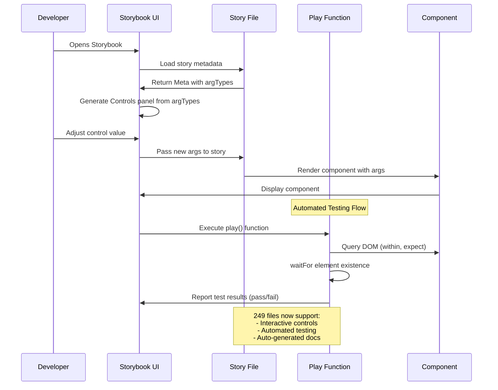

# PR #1: feat(storybook): Add argTypes controls and play test functions to 249 story files (Vibe Kanban)

> **Status**: Pending | **Author**: @yigitkonur | **Files**: 100 | **Comments**: 8

## Summary

**@devin-ai-integration** (COMMENTED): **Devin Review** found 3 potential issues. View issues and 5 additional flags in Devin Review. <!-- devin-review-badge-begin --> <a href="https://app.devin.ai/review/yigitkonur/design-system-retro-ui/pull/1">   <picture>     <source media="(prefers-color-scheme: dark)" srcset="https://static.devi...

**@copilot-pull-request-reviewer** (COMMENTED): Copilot encountered an error and was unable to review this pull request. You can try again by re-requesting a review.

---

## File Reviews

### 📁 components/retroui/

### `CommandDisplay.stories.tsx` (1 comment)

#### Lines 52-56

```diff
@@ -48,6 +49,12 @@ export const Default: Story = {
   args: {
     command: 'npm install retroui',
   },
+  play: async ({ canvasElement }) => {
+    const canvas = within(canvasElement);
+    await waitFor(() => {
+      expect(canvasElement.querySelector('pre, code, [data-slot]') || canvas.getByText(/./)).toBeInTheDocument();
+    });
```

**@devin-ai-integration** [devin]:
> **Issue**: Play function fallback uses getByText(/./), which is likely to throw due to multiple matches
> 🔴 **Play function fallback uses getByText(/./), which is likely to throw due to multiple matches**
> 
> Several stories attempt a “fallback” assertion using `canvas.getByText(/./)` when a selector doesn’t match. `getByText(/./)` will typically match **many** text nodes and throws a “Found multiple elements” error.
> 
> Even if the left side of the `||` returns `null`, the fallback is very likely to throw, making these `play` functions flaky or consistently failing depending on DOM structure.
> 
> <details>
> <summary>Click to expand</summary>
> 
> Example from `CommandDisplay`:
> ```ts
> expect(
>   canvasElement.querySelector('pre, code, [data-slot]') || canvas.getByText(/./)
> ).toBeInTheDocument();
> ```
> 
> This can fail in two ways:
> - selector returns `null` and `getByText(/./)` throws (multiple matches)
> - selector is too broad (`[data-slot]`) and may match unrelated elements, reducing assertion quality
> 
> </details>
> 
> **Recommendation:** Use a specific assertion (e.g., `getByText('npm install retroui')` or `querySelector('pre')`) and if fallbacks are needed, use `queryBy*` APIs and/or more specific regex that matches a unique string.
> 
> ---
> *Was this helpful? React with 👍 or 👎 to provide feedback.*

---

### 📁 components/retroui/typography/

### `Blockquote.stories.tsx` (1 comment)

#### Lines 78-82

```diff
@@ -74,6 +75,12 @@ export const Default: Story = {
   args: {
     children: 'Design is not just what it looks like and feels like. Design is how it works.',
   },
+  play: async ({ canvasElement }) => {
+    const canvas = within(canvasElement);
+    await waitFor(() => {
+      expect(canvas.getByRole('blockquote') || canvas.getByText(/./)).toBeInTheDocument();
+    });
```

**@devin-ai-integration** [devin]:
> **Issue**: Play function uses invalid ARIA role "blockquote" and fallback never executes because getByRole throws
> 🔴 **Play function uses invalid ARIA role "blockquote" and fallback never executes because getByRole throws**
> 
> The `Blockquote` story’s `play` function calls `canvas.getByRole('blockquote')`, but **"blockquote" is not a valid ARIA role**. This throws immediately, so the `|| canvas.getByText(/./)` fallback is dead code.
> 
> **Actual:** play() throws, failing the story’s interaction test.
> **Expected:** query for the `<blockquote>` element via selector or accessible text, and use `queryBy*` if you need fallbacks.
> 
> <details>
> <summary>Click to expand</summary>
> 
> Problematic code:
> ```ts
> expect(canvas.getByRole('blockquote') || canvas.getByText(/./)).toBeInTheDocument();
> ```
> 
> </details>
> 
> **Recommendation:** Use `canvasElement.querySelector('blockquote')` or `canvas.getByText(<specific quote text>)` and avoid `getByText(/./)` which is likely to match multiple elements.
> 
> ---
> *Was this helpful? React with 👍 or 👎 to provide feedback.*

---

### `Code.stories.tsx` (1 comment)

#### Lines 66-70

```diff
@@ -62,6 +63,12 @@ export const Default: Story = {
   args: {
     children: 'npm install retroui',
   },
+  play: async ({ canvasElement }) => {
+    const canvas = within(canvasElement);
+    await waitFor(() => {
+      expect(canvas.getByRole('code') || canvas.getByText(/./)).toBeInTheDocument();
+    });
```

**@devin-ai-integration** [devin]:
> **Issue**: Play function uses invalid ARIA role "code" and fallback never executes because getByRole throws
> 🔴 **Play function uses invalid ARIA role "code" and fallback never executes because getByRole throws**
> 
> The `Code` story’s `play` function calls `canvas.getByRole('code')`, but **"code" is not a valid ARIA role**. Testing Library will throw immediately, so the `|| canvas.getByText(/./)` fallback is never reached.
> 
> **Actual:** play() throws on `getByRole('code')`, causing Storybook interaction tests to fail.
> **Expected:** use a valid query (e.g., `canvasElement.querySelector('code')` or `canvas.getByText(...)`) and avoid throwing queries when attempting fallbacks.
> 
> <details>
> <summary>Click to expand</summary>
> 
> Problematic code:
> ```ts
> expect(canvas.getByRole('code') || canvas.getByText(/./)).toBeInTheDocument();
> ```
> 
> Because `getByRole` throws on failure, `||` does not work as a fallback.
> 
> </details>
> 
> **Recommendation:** Replace with non-throwing queries or valid selectors, e.g. `expect(canvasElement.querySelector('code')).toBeInTheDocument()` or `const el = canvas.queryByText(...); expect(el).toBeInTheDocument();`.
> 
> ---
> *Was this helpful? React with 👍 or 👎 to provide feedback.*

---

## Overall Feedback

### @yigitkonur

@coderabbitai full review

### @coderabbitai [coderabbit]

<details>
<summary>✅ Actions performed</summary>

Full review triggered.

</details>

### @greptile-apps [greptile]

<h2>Greptile Overview</h2>

<h3>Greptile Summary</h3>

This PR adds comprehensive `argTypes` controls and `play()` test functions to 249 Storybook story files across the RetroUI design system, enhancing interactive documentation and automated testing capabilities.

## What Changed

- **249 story files enhanced** with argTypes and play functions
- **+5,807 lines added** across components, foundation, and cross-cutting stories
- **Storybook version bumped** from 10.1.10 to 10.1.11
- **Test coverage** increased with 2,888 passing tests

## Implementation Pattern

All files follow a consistent pattern:
- Import from `'storybook/test'` for play function utilities
- argTypes define prop controls with descriptions and default values
- Play functions verify component rendering using `within`, `expect`, `waitFor`
- Portal components (Dialog, Tooltip, Popover) only verify trigger elements

## Impact

This change is purely additive - it enhances developer experience with interactive controls and automated testing without modifying any production component code or breaking existing functionality.

<h3>Confidence Score: 5/5</h3>

- This PR is safe to merge with no identified risks
- All changes are additive Storybook enhancements that don't affect production code. The PR adds documentation and testing capabilities with 2,888 passing tests and 0 TypeScript errors. No runtime bugs, security issues, or breaking changes identified.
- No files require special attention

<details><summary><h3>Important Files Changed</h3></summary>

| Filename | Overview |
|----------|----------|
| components/retroui/charts/AreaChart.stories.tsx | Added comprehensive argTypes with 10+ controls and play function for chart verification |
| foundation/onboarding/welcome-splash.stories.tsx | Added 10 argTypes controls and play function for button verification |
| foundation/files/file-browser.stories.tsx | Added 15 argTypes with comprehensive controls and multiple play functions for interaction testing |
| foundation/ecommerce/shopping-cart.stories.tsx | Added 10 argTypes for cart properties and play function for rendering verification |
| package.json | Minor version bump for storybook from 10.1.10 to 10.1.11 |
| BATCH_A_COMPLETION_REPORT.md | Documentation file tracking completion status of 35 story files |

</details>

</details>

<h3>Sequence Diagram</h3>



### @devin-ai-integration [devin]

**Devin Review** found 3 potential issues.

View issues and 5 additional flags in Devin Review.

### @copilot-pull-request-reviewer [copilot]

Copilot encountered an error and was unable to review this pull request. You can try again by re-requesting a review.

---
*Generated in consensus mode by pr-consensus*