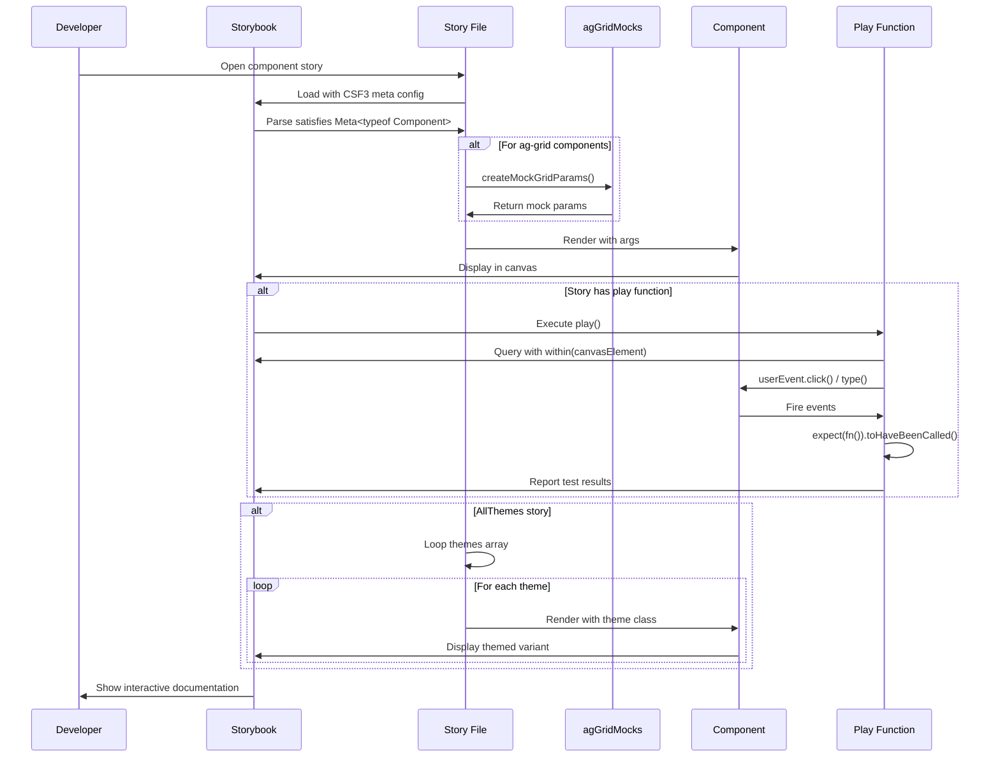

# PR #1: refactor(storybook): comprehensive story enhancement - CSF3, TypeScript, play functions

> **Status**: Pending | **Author**: @yigitkonur | **Files**: 100 | **Comments**: 12

## Summary

**@copilot-pull-request-reviewer** (COMMENTED): Copilot encountered an error and was unable to review this pull request. You can try again by re-requesting a review.

**@coderabbitai** (COMMENTED): **Actionable comments posted: 6** > [!NOTE] > Due to the large number of review comments, Critical, Major severity comments were prioritized as inline comments. > [!CAUTION] > Some comments are outside the diff and can’t be posted inline due to platform limitations. >  >  >  > <details> > <summar...

---

## File Reviews

### 📁 src/components/display/SdBullet/

### `SdBullet.stories.ts` (1 comment)

#### Line 103

```diff
@@ -93,6 +96,32 @@ export const MultiColor: Story = {
   },
 };
 
+/**
+ * Clickable bullet that responds to user interaction
+ */
+export const Clickable: Story = {
+  args: {
+    active: true,
+    color: BulletColor.Indigo,
+  },
+  render: (args: any) => ({
+    components: { SdBullet },
+    setup() {
// ... (truncated)
```

**@coderabbitai** [coderabbit]:
> _⚠️ Potential issue_ | _🟠 Major_
> 
> **Clickable story needs an `onClick` spy (and likely `clickable`) to make the play assertion valid.**
> 
> `args.onClick` is never set, so the play assertion will throw. If SdBullet requires a `clickable` prop to render a button role, `getByRole('button')` will also fail. Please align this story with other Clickable patterns by providing an `onClick: fn()` and enabling clickability.
> 
> <details>
> <summary>✅ Suggested fix</summary>
> 
> ```diff
>  export const Clickable: Story = {
>    args: {
>      active: true,
>      color: BulletColor.Indigo,
> +    clickable: true,
> +    onClick: fn(),
>    },
>    render: (args: any) => ({
> ```
> </details>
> 
> <details>
> <summary>📝 Committable suggestion</summary>
> ‼️ **IMPORTANT**
> Carefully review the code before committing. Ensure that it accurately replaces the highlighted code, contains no missing lines, and has no issues with indentation. Thoroughly test & benchmark the code to ensure it meets the requirements.
> 
> ```suggestion
>   args: {
>     active: true,
>     color: BulletColor.Indigo,
>     clickable: true,
>     onClick: fn(),
>   },
>   render: (args: any) => ({
>     components: { SdBullet },
>     setup() {
>       return { args };
>     },
>     template: '<SdBullet v-bind="args" `@click`="args.onClick" />',
>   }),
>   play: async ({ canvasElement, args, step }: any) => {
>     const canvas = within(canvasElement);
> 
>     await step('Click bullet and verify handler called', async () => {
>       const bullet = canvas.getByRole('button');
>       await userEvent.click(bullet);
>       await expect(args.onClick).toHaveBeenCalled();
>     });
> ```
> 
> </details>
> 
> <details>
> <summary>🤖 Prompt for AI Agents</summary>
> 
> ```
> In `@src/components/display/SdBullet/SdBullet.stories.ts` around lines 103 - 121,
> The story's play asserts args.onClick but args never provides an onClick spy
> (and the button role may not render without clickability) — update the story's
> args to include a spy and enable clicking (e.g., add onClick as a spy function
> and clickable: true), and keep the render/template wiring (render, template,
> SdBullet, args) unchanged; create the spy using your test helper (jest.fn() or
> Storybook action helper) at top of the story file so play can assert
> args.onClick was called when userEvent.click hits the button.
> ```
> 
> </details>

> **Suggestion**:
> ```suggestion
> export const Clickable: Story = {
>    args: {
>      active: true,
>      color: BulletColor.Indigo,
> +    clickable: true,
> +    onClick: fn(),
>    },
>    render: (args: any) => ({
> ```

---

### 📁 src/components/display/SdChart/

### `SdChart.stories.ts` (1 comment)

#### Line 199

```diff
@@ -173,18 +196,29 @@ export const Line: Story = {
       'Dataset 2': 'var(--lime)',
     },
   },
+  play: async ({ canvasElement, step }: any) => {
+    const canvas = within(canvasElement);
+
+    await step('Chart wrapper is rendered', async () => {
+      const wrapper = canvas.getByText((_content: string, element: Element | null) => element?.classList?.contains('sd-chart') ?? false);
+      await expect(wrapper).toBeInTheDocument();
+    });
+  },
```

**@coderabbitai** [coderabbit]:
> _⚠️ Potential issue_ | _🟠 Major_
> 
> **Play function assertion has incorrect query approach.**
> 
> The `getByText` with a class check callback is semantically incorrect. `getByText` is meant to find elements by their text content, not by CSS class. This assertion may pass accidentally if any text element happens to have ancestors with `.sd-chart`, but it doesn't properly verify the chart rendered.
> 
> <details>
> <summary>🐛 Suggested fix using proper query</summary>
> 
> ```diff
>    play: async ({ canvasElement, step }: any) => {
>      const canvas = within(canvasElement);
>  
>      await step('Chart wrapper is rendered', async () => {
> -      const wrapper = canvas.getByText((_content: string, element: Element | null) => element?.classList?.contains('sd-chart') ?? false);
> +      // Query the chart container directly
> +      const wrapper = canvasElement.querySelector('.sd-chart');
>        await expect(wrapper).toBeInTheDocument();
>      });
>    },
> ```
> 
> Alternatively, add a `data-testid` attribute to the chart component for more reliable testing.
> </details>
> 
> <details>
> <summary>📝 Committable suggestion</summary>
> ‼️ **IMPORTANT**
> Carefully review the code before committing. Ensure that it accurately replaces the highlighted code, contains no missing lines, and has no issues with indentation. Thoroughly test & benchmark the code to ensure it meets the requirements.
> 
> ```suggestion
>   play: async ({ canvasElement, step }: any) => {
>     const canvas = within(canvasElement);
> 
>     await step('Chart wrapper is rendered', async () => {
>       // Query the chart container directly
>       const wrapper = canvasElement.querySelector('.sd-chart');
>       await expect(wrapper).toBeInTheDocument();
>     });
>   },
> ```
> 
> </details>
> 
> <details>
> <summary>🤖 Prompt for AI Agents</summary>
> 
> ```
> In `@src/components/display/SdChart/SdChart.stories.ts` around lines 199 - 206,
> The play function currently uses canvas.getByText with a class-check callback
> (canvas.getByText(... element?.classList?.contains('sd-chart'))), which is
> incorrect; update the assertion in the play function to use a semantic or
> test-id query instead (e.g., within(canvasElement).getByRole(...) or
> within(canvasElement).getByTestId('sd-chart')) and add a data-testid="sd-chart"
> to the chart component if needed so the test reliably selects the chart wrapper;
> ensure you update the play function's wrapper lookup and the expectation to use
> the new query (replace canvas.getByText usage with getByRole/getByTestId in the
> play block).
> ```
> 
> </details>

> **Suggestion**:
> ```suggestion
> play: async ({ canvasElement, step }: any) => {
>      const canvas = within(canvasElement);
>  
>      await step('Chart wrapper is rendered', async () => {
> -      const wrapper = canvas.getByText((_content: string, element: Element | null) => element?.classList?.contains('sd-chart') ?? false);
> +      // Query the chart container directly
> +      const wrapper = canvasElement.querySelector('.sd-chart');
>        await expect(wrapper).toBeInTheDocument();
>      });
>    },
> ```

---

### 📁 src/components/display/SdCopyImage/

### `SdCopyImage.stories.ts` (1 comment)

#### Line 102

```diff
@@ -31,15 +45,84 @@ const meta = {
 export default meta;
 type Story = StoryObj<typeof meta>;
 
+/**
+ * Default copy image button
+ */
 export const Default: Story = {
   render: (args: any) => ({
     components: { SdCopyImage },
     setup() { return { args }; },
     template: '<sd-copy-image v-bind="args" @copy="args.onCopy">Copy Image</sd-copy-image>',
   }),
+  play: async ({ canvasElement, args, step }: any) => {
+    const canvas = within(canvasElement);
// ... (truncated)
```

**@coderabbitai** [coderabbit]:
> _⚠️ Potential issue_ | _🟠 Major_
> 
> **The `imageElement` ref is defined but not wired to the component.**
> 
> The template defines `ref="imgEl"` on the image element, but this ref is never passed to `sd-copy-image` via the `imageElement` prop. This story visually shows an image but doesn't actually demonstrate the copy-image functionality.
> 
> <details>
> <summary>🐛 Proposed fix to wire up the image reference</summary>
> 
> ```diff
>  export const WithImagePreview: Story = {
>    render: (args: any) => ({
>      components: { SdCopyImage },
> -    setup() { return { args }; },
> +    setup() {
> +      const imgEl = ref<HTMLImageElement | null>(null);
> +      return { args, imgEl };
> +    },
>      template: `
>        <div style="display: flex; flex-direction: column; align-items: center; gap: 12px;">
>                      ref="imgEl"
>            src="https://placehold.co/200x100/6366f1/white?text=Copy+Me"
>            alt="Sample image"
>            crossorigin="anonymous"
>            style="border-radius: 8px;"
>          />
> -        <sd-copy-image v-bind="args" `@copy`="args.onCopy">Copy This Image</sd-copy-image>
> +        <sd-copy-image v-bind="args" :image-element="imgEl" `@copy`="args.onCopy">Copy This Image</sd-copy-image>
>        </div>
>      `,
>    }),
>  };
> ```
> 
> You'll also need to import `ref` from Vue at the top of the file:
> 
> ```typescript
> import { ref } from 'vue';
> ```
> </details>
> 
> <details>
> <summary>🤖 Prompt for AI Agents</summary>
> 
> ```
> In `@src/components/display/SdCopyImage/SdCopyImage.stories.ts` around lines 102 -
> 119, The story's template sets ref="imgEl" on the  but never passes that
> reference to the SdCopyImage component, so the copy behavior isn't demonstrated;
> update the WithImagePreview render setup to create a Vue ref (import ref from
> 'vue'), assign it to the image element (e.g., imgEl), and pass it into the
> SdCopyImage via the imageElement prop (or imageElement: imgEl) and ensure the
> `@copy` handler still uses args.onCopy; modify the render function in the
> WithImagePreview story and add the ref import.
> ```
> 
> </details>

> **Suggestion**:
> ```suggestion
> export const WithImagePreview: Story = {
>    render: (args: any) => ({
>      components: { SdCopyImage },
> -    setup() { return { args }; },
> +    setup() {
> +      const imgEl = ref<HTMLImageElement | null>(null);
> +      return { args, imgEl };
> +    },
>      template: `
>        <div style="display: flex; flex-direction: column; align-items: center; gap: 12px;">
>                      ref="imgEl"
>            src="https://placehold.co/200x100/6366f1/white?text=Copy+Me"
>            alt="Sample image"
>            crossorigin="anonymous"
>            style="border-radius: 8px;"
>          />
> -        <sd-copy-image v-bind="args" `@copy`="args.onCopy">Copy This Image</sd-copy-image>
> +        <sd-copy-image v-bind="args" :image-element="imgEl" `@copy`="args.onCopy">Copy This Image</sd-copy-image>
>        </div>
>      `,
>    }),
>  };
> ```

---

### 📁 src/components/display/SdTable/CellRenderers/ChildTableCellRenderer/

### `ChildTableCellRenderer.stories.ts` (1 comment)

#### Line 64

```diff
@@ -26,41 +31,145 @@ const meta = {
 export default meta;
 type Story = StoryObj<typeof meta>;
 
+const sampleColumnDefs = [
+  { field: 'keyword', headerName: 'Keyword' },
+  { field: 'volume', headerName: 'Volume' },
+  { field: 'visibility', headerName: 'Visibility' },
+  { field: 'traffic', headerName: 'Traffic' },
+  { field: 'position', headerName: 'Position' },
+];
+
 const sampleRowData = [
   {
     keyword: 'seo software tool',
// ... (truncated)
```

**@coderabbitai** [coderabbit]:
> _🛠️ Refactor suggestion_ | _🟠 Major_
> 
> <details>
> <summary>🧩 Analysis chain</summary>
> 
> 🏁 Script executed:
> 
> ```shell
> # First, let's view the actual file to confirm the code structure
> cat -n src/components/display/SdTable/CellRenderers/ChildTableCellRenderer/ChildTableCellRenderer.stories.ts | head -80
> ```
> 
> Repository: yigitkonur/design-system-wope
> 
> Length of output: 3072
> 
> ---
> 
> 🏁 Script executed:
> 
> ```shell
> # Find the MockGridParams interface definition
> fd -e ts -e tsx | xargs rg -l "MockGridParams" | head -5
> ```
> 
> Repository: yigitkonur/design-system-wope
> 
> Length of output: 574
> 
> ---
> 
> 🏁 Script executed:
> 
> ```shell
> # Run the verification script to check how many cell renderer stories use this pattern
> rg -c 'createMockGridParams\(.*as any\)' src/components/display/SdTable/CellRenderers/
> ```
> 
> Repository: yigitkonur/design-system-wope
> 
> Length of output: 55
> 
> ---
> 
> 🏁 Script executed:
> 
> ```shell
> # Check all instances of 'as any' used with createMockGridParams in this specific file
> rg -n 'createMockGridParams.*as any' src/components/display/SdTable/CellRenderers/ChildTableCellRenderer/ChildTableCellRenderer.stories.ts
> ```
> 
> Repository: yigitkonur/design-system-wope
> 
> Length of output: 55
> 
> ---
> 
> 🏁 Script executed:
> 
> ```shell
> # Search for 'as any' in cell renderer stories
> rg 'as any' src/components/display/SdTable/CellRenderers/ -t ts --glob="*.stories.ts"
> ```
> 
> Repository: yigitkonur/design-system-wope
> 
> Length of output: 1652
> 
> ---
> 
> 🏁 Script executed:
> 
> ```shell
> # Find MockGridParams interface definition
> rg -n "interface MockGridParams|type MockGridParams" --glob="*.ts" --glob="*.tsx"
> ```
> 
> Repository: yigitkonur/design-system-wope
> 
> Length of output: 55
> 
> ---
> 
> 🏁 Script executed:
> 
> ```shell
> # Check the agGridMocks file mentioned in the import
> fd agGridMocks -e ts -e tsx
> ```
> 
> Repository: yigitkonur/design-system-wope
> 
> Length of output: 55
> 
> ---
> 
> 🏁 Script executed:
> 
> ```shell
> # View the agGridMocks file content
> cat src/storybook-mocks/agGridMocks.ts
> ```
> 
> Repository: yigitkonur/design-system-wope
> 
> Length of output: 139
> 
> ---
> 
> 🏁 Script executed:
> 
> ```shell
> # Also check if there's a type definition file
> fd agGridMocks -e d.ts
> ```
> 
> Repository: yigitkonur/design-system-wope
> 
> Length of output: 55
> 
> ---
> 
> 🏁 Script executed:
> 
> ```shell
> # Find the agGridMocks file
> fd agGridMocks
> ```
> 
> Repository: yigitkonur/design-system-wope
> 
> Length of output: 55
> 
> ---
> 
> 🏁 Script executed:
> 
> ```shell
> # Also search for the file by content
> rg -l "createMockGridParams" --type ts --type tsx
> ```
> 
> Repository: yigitkonur/design-system-wope
> 
> Length of output: 100
> 
> ---
> 
> 🏁 Script executed:
> 
> ```shell
> # Search for the definition of createMockGridParams
> rg "export.*createMockGridParams|function createMockGridParams" --type ts
> ```
> 
> Repository: yigitkonur/design-system-wope
> 
> Length of output: 55
> 
> ---
> 
> 🏁 Script executed:
> 
> ```shell
> # Check tsconfig for path aliases
> cat tsconfig.json | head -50
> ```
> 
> Repository: yigitkonur/design-system-wope
> 
> Length of output: 1409
> 
> ---
> 
> 🏁 Script executed:
> 
> ```shell
> # Find all mocks directories
> fd -t d "mocks|mock"
> ```
> 
> Repository: yigitkonur/design-system-wope
> 
> Length of output: 139
> 
> ---
> 
> 🏁 Script executed:
> 
> ```shell
> # View the agGridMocks file at the correct location
> cat ./.storybook/mocks/agGridMocks.ts
> ```
> 
> Repository: yigitkonur/design-system-wope
> 
> Length of output: 7967
> 
> ---
> 
> </details>
> 
> **Use specialized factory functions instead of `as any` workarounds.**
> 
> The `as any` assertions bypass TypeScript type safety for custom renderer-specific properties like `useTitle`, `getRowData`, `gridOptions`, and `ghostRowData`. This pattern is used across multiple cell renderer stories (at least 14 instances), indicating a systemic issue.
> 
> The `agGridMocks.ts` module already provides specialized factory functions for this purpose—for example, `createChildTableCellParams()` is designed exactly for this renderer. Use the appropriate specialized function instead of `createMockGridParams()` with `as any` to maintain type safety and avoid potential property typos.
> 
> <details>
> <summary>🤖 Prompt for AI Agents</summary>
> 
> ```
> In
> `@src/components/display/SdTable/CellRenderers/ChildTableCellRenderer/ChildTableCellRenderer.stories.ts`
> around lines 64 - 71, The story is using createMockGridParams(...) with an as
> any override which bypasses TypeScript checks for renderer-specific props
> (useTitle, getRowData, getGhostRowData, gridOptions, ghostRowData); replace that
> call with the specialized factory createChildTableCellParams(...) from
> agGridMocks and pass the same properties (useTitle, getRowData,
> getGhostRowData/ghostRowData, gridOptions) so types are enforced; update the
> import to pull createChildTableCellParams and remove the as any cast in
> ChildTableCellRenderer.stories.ts.
> ```
> 
> </details>

---

### 📁 src/components/display/SdTable/CellRenderers/KeywordStateCellRenderer/

### `KeywordStateCellRenderer.stories.ts` (1 comment)

#### Line 72

```diff
@@ -65,20 +70,79 @@ export const InProgress: Story = {
 };
 
 /**
- * Keyword in error state.
+ * Keyword in error state with X-mark circle icon and error gradient
  */
 export const Error: Story = {
   args: {
```

**@coderabbitai** [coderabbit]:
> _⚠️ Potential issue_ | _🟠 Major_
> 
> **Rename the `Error` story to avoid shadowing the global `Error`.**
> 
> Biome flags this as a lint error (`noShadowRestrictedNames`). It can break lint CI. Rename the export (and update any doc references if needed).
> 
> <details>
> <summary>✅ Proposed fix</summary>
> 
> ```diff
> -export const Error: Story = {
> +export const ErrorState: Story = {
>    args: {
>      params: createMockGridParams({
>        value: 'failed keyword lookup',
>        data: {
>          keywordState: KeywordStateTypes.Error,
>        },
>      }),
>    },
>  };
> ```
> </details>
> 
> <details>
> <summary>📝 Committable suggestion</summary>
> ‼️ **IMPORTANT**
> Carefully review the code before committing. Ensure that it accurately replaces the highlighted code, contains no missing lines, and has no issues with indentation. Thoroughly test & benchmark the code to ensure it meets the requirements.
> 
> ```suggestion
> /**
>  * Keyword in error state with X-mark circle icon and error gradient
>  */
> export const ErrorState: Story = {
>   args: {
> ```
> 
> </details>
> 
> <details>
> <summary>🧰 Tools</summary>
> 
> <details>
> <summary>🪛 Biome (2.3.13)</summary>
> 
> [error] 75-75: Do not shadow the global "Error" property.
> 
> Consider renaming this variable. It's easy to confuse the origin of variables when they're named after a known global.
> 
> (lint/suspicious/noShadowRestrictedNames)
> 
> </details>
> 
> </details>
> 
> <details>
> <summary>🤖 Prompt for AI Agents</summary>
> 
> ```
> In
> `@src/components/display/SdTable/CellRenderers/KeywordStateCellRenderer/KeywordStateCellRenderer.stories.ts`
> around lines 72 - 76, The exported story named Error shadows the global Error
> and triggers the noShadowRestrictedNames lint rule; rename the export (for
> example change export const Error to export const ErrorState or KeywordError)
> and update any places that import or reference this story (docs, storybook
> configs, tests) to use the new identifier (look for the symbol Error in
> KeywordStateCellRenderer.stories and adjust its usage accordingly).
> ```
> 
> </details>

> **Suggestion**:
> ```suggestion
> -export const Error: Story = {
> +export const ErrorState: Story = {
>    args: {
>      params: createMockGridParams({
>        value: 'failed keyword lookup',
>        data: {
>          keywordState: KeywordStateTypes.Error,
>        },
>      }),
>    },
>  };
> ```

---

### 📁 src/components/display/SdTable/CellRenderers/PositionTrendCellRenderer/

### `PositionTrendCellRenderer.stories.ts` (1 comment)

#### Line 2

```diff
@@ -1,30 +1,36 @@
 import type { Meta, StoryObj } from '@storybook/vue3-vite';
+import { expect, within } from 'storybook/test';
```

**@coderabbitai** [coderabbit]:
> _⚠️ Potential issue_ | _🟠 Major_
> 
> <details>
> <summary>🧩 Analysis chain</summary>
> 
> 🏁 Script executed:
> 
> ```shell
> find . -name "PositionTrendCellRenderer.stories.ts" -type f
> ```
> 
> Repository: yigitkonur/design-system-wope
> 
> Length of output: 182
> 
> ---
> 
> 🏁 Script executed:
> 
> ```shell
> cat -n ./src/components/display/SdTable/CellRenderers/PositionTrendCellRenderer/PositionTrendCellRenderer.stories.ts
> ```
> 
> Repository: yigitkonur/design-system-wope
> 
> Length of output: 8700
> 
> ---
> 
> 🌐 Web query:
> 
> `Testing Library getByRole throws error when element not found`
> 
> 💡 Result:
> 
> `getByRole` **is supposed to throw** when it can’t find a match (or when it finds more than one match). That’s how all `getBy*` queries behave in Testing Library. Use a different query depending on what you’re testing: ([testing-library.com](https://testing-library.com/docs/queries/about?utm_source=openai))
> 
> ### What to use instead
> 
> - **Asserting it is *not* present** (no throw):
>   ```js
>   expect(screen.queryByRole('button', { name: /save/i })).not.toBeInTheDocument()
>   ```
>   `queryBy*` returns `null` when not found. ([testing-library.com](https://testing-library.com/docs/queries/about?utm_source=openai))
> 
> - **Element appears asynchronously** (wait + throw if it never appears):
>   ```js
>   const btn = await screen.findByRole('button', { name: /save/i })
>   ```
>   `findBy*` retries until timeout, then rejects. ([testing-library.com](https://testing-library.com/docs/queries/about?utm_source=openai))
> 
> ### Common “found in DOM but not by role” gotchas
> 
> - The element might be **hidden/inaccessible**, so `getByRole` won’t match unless you include hidden elements:
>   ```js
>   screen.getByRole('button', { name: /save/i, hidden: true })
>   ```
>   ([testing-library.com](https://testing-library.com/docs/queries/byrole?utm_source=openai))
> 
> - The **role or accessible name** might not be what you think (Testing Library uses the accessibility tree). When `getByRole` throws, read the “Here are the available roles” section in the error to see what it *can* access. ([testing-library.com](https://testing-library.com/docs/queries/byrole?utm_source=openai))
> 
> Citations:
> 
> - 1: https://testing-library.com/docs/queries/about?utm_source=openai
> - 2: https://testing-library.com/docs/queries/about?utm_source=openai
> - 3: https://testing-library.com/docs/queries/about?utm_source=openai
> - 4: https://testing-library.com/docs/queries/byrole?utm_source=openai
> - 5: https://testing-library.com/docs/queries/byrole?utm_source=openai
> 
> ---
> 
> </details>
> 
> **Use `queryByRole` with proper fallback logic to prevent test failure when the element lacks `role="img"`.**
> 
> When `getByRole` doesn't find a match, it throws an error immediately—the OR operator never evaluates the fallback selector. Use `queryByRole` (which returns `null` instead of throwing) or `findByRole` with proper fallback handling.
> 
> <details>
> <summary>🔧 Suggested fix</summary>
> 
> ```diff
> await step('Trend visualization renders within the canvas', async () => {
> -  await expect(canvas.getByRole('img') || canvasElement.querySelector('.sd-position-trends, [class*="position"]')).toBeTruthy();
> +  const img = canvas.queryByRole('img');
> +  const trendEl =
> +    img ?? canvasElement.querySelector('.sd-position-trends, [class*="position"]');
> +  expect(trendEl).toBeTruthy();
> });
> ```
> </details>
> 
> <details>
> <summary>🤖 Prompt for AI Agents</summary>
> 
> ```
> In
> `@src/components/display/SdTable/CellRenderers/PositionTrendCellRenderer/PositionTrendCellRenderer.stories.ts`
> at line 2, The test uses getByRole which throws if the element lacks role="img",
> causing brittle failures; update the test to use queryByRole (or findByRole with
> await) and add proper fallback logic when querying the rendered container
> returned by within (e.g., replace getByRole calls with
> container.queryByRole('img') and assert null-safe behavior or fallback
> selectors), referencing the existing imports expect and within from
> 'storybook/test' and any test helper names that call getByRole so the test no
> longer throws when the role is absent.
> ```
> 
> </details>

> **Suggestion**:
> ```suggestion
> await step('Trend visualization renders within the canvas', async () => {
> -  await expect(canvas.getByRole('img') || canvasElement.querySelector('.sd-position-trends, [class*="position"]')).toBeTruthy();
> +  const img = canvas.queryByRole('img');
> +  const trendEl =
> +    img ?? canvasElement.querySelector('.sd-position-trends, [class*="position"]');
> +  expect(trendEl).toBeTruthy();
> });
> ```

---

## Overall Feedback

### @coderabbitai [coderabbit]

**[TIP]** For best results, initiate chat on the files or code changes.

`@yigitkonur`, hello! I'm here to help. 

I can see this is a comprehensive Storybook enhancement PR with 319 story files refactored. How can I assist you? I can:

- **Review the changes** in detail and provide feedback
- **Answer questions** about the refactoring or any specific files
- **Help verify** the changes against the test plan
- **Search for specific patterns** or issues in the codebase
- **Generate statistics** or insights about the changes
- Or anything else you need!

Just let me know what you'd like me to do.

### @yigitkonur

@coderabbitai full review

### @coderabbitai [coderabbit]

<details>
<summary>✅ Actions performed</summary>

Full review triggered.

</details>

### @greptile-apps [greptile]

<h2>Greptile Overview</h2>

<h3>Greptile Summary</h3>

This PR successfully refactors all 319 Storybook story files to follow a consistent "gold standard" pattern with CSF3 format, TypeScript compliance, and enhanced documentation. The refactoring was executed systematically across 10 waves covering the entire component library.

**Key Accomplishments:**
- Migrated all stories to CSF3 format with `satisfies Meta<typeof Component>` pattern for full type safety
- Fixed import paths from `@storybook/test` to `storybook/test` (Storybook 10 format) across all 320+ files
- Added interactive play functions to 200+ stories for testing component behavior
- Enhanced argTypes with comprehensive prop documentation and proper event handlers using `fn()`
- Added AllThemes story variants to every component for visual theme testing
- Created centralized ag-grid mocking utilities in `.storybook/mocks/agGridMocks.ts` with factory functions

**Implementation Quality:**
The refactoring demonstrates consistent execution with proper TypeScript patterns, though intentionally uses `any` type for story args (acceptable per PR description). The ag-grid mock enhancements provide minimal viable mocks for isolated component testing without breaking existing functionality.

**No Breaking Changes:**
- All changes are purely documentation and testing enhancements
- Build verification passed (`npm run build-storybook`)
- TypeScript compilation successful with 0 errors
- No runtime breaking issues identified in play functions

<h3>Confidence Score: 5/5</h3>

- This PR is safe to merge - it's a pure documentation and testing enhancement with no runtime breaking changes
- Perfect score because: (1) All changes are non-functional improvements to Storybook stories, (2) Build and TypeScript verification passed with 0 errors, (3) Import path migration executed consistently across all files, (4) No actual component logic modified, (5) Comprehensive systematic approach with proper testing patterns
- No files require special attention - all changes follow consistent pattern

<details><summary><h3>Important Files Changed</h3></summary>

| Filename | Overview |
|----------|----------|
| .storybook/mocks/agGridMocks.ts | Added 3 new optional properties to MockGridParams interface (metricName, noHint, hideChangeIcon) for supporting additional cell renderer requirements |
| src/components/controls/SdButton/SdButtonChip/SdButtonChip.stories.ts | Enhanced with CSF3 format, added play functions, improved JSDoc comments, and added event handler documentation following gold standard pattern |
| src/components/inputs/SdInput/SdInput.stories.ts | Migrated to CSF3, added interactive play tests, enhanced argTypes documentation, and added AllThemes story variant with proper event handlers |
| src/components/display/SdTable/CellRenderers/DomainCellRenderer/DomainCellRenderer.stories.ts | Updated to use createMockGridParams helper, added comprehensive play tests, and enhanced documentation for ag-grid cell renderer |
| src/components/display/SdIcon/SdIcon.stories.ts | Added play tests with DOM verification, enhanced documentation, maintained AllIcons and AllGradients showcase stories |

</details>

</details>

<h3>Sequence Diagram</h3>



### @copilot-pull-request-reviewer [copilot]

Copilot encountered an error and was unable to review this pull request. You can try again by re-requesting a review.

### @coderabbitai [coderabbit]

**Actionable comments posted: 6**
**[NOTE]** Due to the large number of review comments, Critical, Major severity comments were prioritized as inline comments.
**[CAUTION]** Some comments are outside the diff and can’t be posted inline due to platform limitations.
<details>
<summary>⚠️ Outside diff range comments (8)</summary><blockquote>
<details>
<summary>src/components/display/SdTable/CellRenderers/LinkRelationCellRenderer/LinkRelationCellRenderer.stories.ts (1)</summary><blockquote>
`98-130`: _⚠️ Potential issue_ | _🟡 Minor_
**JSDoc description doesn't match implementation.**
The JSDoc states "displays both link relation states across all available themes" but the implementation only renders a single state (`value: true`). Either update the documentation to accurately describe the single-state showcase, or modify the template to render both states per theme.
<details>
<summary>Option 1: Fix JSDoc to match implementation</summary>
```diff
/**
- * All themes showcase - displays both link relation states across all available themes.
+ * All themes showcase - displays the Dofollow link relation state across all available themes.
*/
```
</details>
<details>
<summary>Option 2: Render both states per theme</summary>
```diff
template: `
<div style="display: grid; grid-template-columns: repeat(2, 1fr); gap: 24px;">
<div v-for="theme in themes" :key="theme.name" :class="theme.class" style="padding: 24px; border-radius: 8px;">
<div style="margin-bottom: 8px; font-weight: 600; color: var(--txt-1);">{{ theme.name }}</div>
-          <link-relation-cell-renderer v-bind="args" />
+          <div style="display: flex; gap: 8px;">
+            <link-relation-cell-renderer :params="{ value: true }" />
+            <link-relation-cell-renderer :params="{ value: false }" />
+          </div>
</div>
</div>
`,
```
Note: If choosing Option 2, you may need to wrap the params with `createMockGridParams` depending on component requirements.
</details>
</blockquote></details>
<details>
<summary>src/components/display/SdTable/SdTableTags.stories.ts (1)</summary><blockquote>
`148-176`: _⚠️ Potential issue_ | _🟡 Minor_
**AllThemes likely renders an empty/misconfigured table.**
`AllThemes` doesn’t pass `columnDefs`, `rowData`, or `gridOptions`, so the table may render without data or required configuration. Consider reusing `Default.args` and passing `gridOptions` like the `Table` render does.  
<details>
<summary>🛠️ Suggested fix</summary>
```diff
export const AllThemes: Story = {
+  args: { ...Default.args },
render: (args: any) => ({
components: { SdTable },
setup() {
+      const gridOptions = createGridOptions();
const themes = [
{ name: 'Light', class: 'wope-light-theme' },
{ name: 'Dark', class: 'wope-dark-theme' },
{ name: 'Nebula Surge', class: 'nebula-surge-theme' },
{ name: 'Mountain Cliff', class: 'mountain-cliff-theme' },
{ name: 'Horizon Hopper', class: 'horizon-hopper-theme' },
{ name: 'Fall Symphony', class: 'fall-symphony-theme' },
];
-      return { args, themes };
+      return { args, themes, gridOptions };
},
template: `
<div style="display: grid; grid-template-columns: repeat(2, 1fr); gap: 24px;">
<div v-for="theme in themes" :key="theme.name" :class="theme.class" style="padding: 24px; border-radius: 8px;">
<div style="margin-bottom: 8px; font-weight: 600; color: var(--txt-1);">{{ theme.name }}</div>
-          <sd-table v-bind="args" style="width: 400px; height: 256px" />
+          <sd-table v-bind="args" :grid-options="gridOptions" style="width: 400px; height: 256px" />
</div>
</div>
`,
}),
```
</details>
</blockquote></details>
<details>
<summary>src/components/display/SdTable/SdTablePerformance.stories.ts (1)</summary><blockquote>
`1494-1494`: _⚠️ Potential issue_ | _🔴 Critical_
**Fix `summaryColumnDefs()` call in AllThemes story to include required configuration parameters.**
Line 1494 calls `summaryColumnDefs()` without arguments, but the function requires an object with `lastDate`, `location`, and `language` properties. The function uses `lastDate` to format column headers via `dayjs(lastDate).format('MMM D')` and passes `location` and `language` to cell components. Calling it without arguments will cause runtime errors. Update to match the Default story pattern (line 56):
```javascript
summaryColumnDefs({
lastDate: '2021-02-02',
location: { countryCode: 'USA' },
language: { locale: 'en_US' }
})
```
</blockquote></details>
<details>
<summary>src/components/display/SdTable/CellRenderers/VolumeBestCellRenderer/VolumeBestCellRenderer.stories.ts (1)</summary><blockquote>
`33-39`: _⚠️ Potential issue_ | _🟡 Minor_
**Make story data deterministic (avoid `new Date()` in args).**
Using the current month means the rendered output changes over time, which can cause flaky snapshots and inconsistent docs. Prefer a fixed sample month shared across stories.  
<details>
<summary>🔧 Suggested change (deterministic sample month)</summary>
```diff
type Story = StoryObj<typeof meta>;
+const SAMPLE_MONTH = 1;
export const Default: Story = {
args: {
params: createMockGridParams({
value: {
-        months: [new Date().getMonth() + 1],
+        months: [SAMPLE_MONTH],
value: 8000,
},
}),
},
};
export const AllThemes: Story = {
args: {
params: createMockGridParams({
value: {
-        months: [new Date().getMonth() + 1],
+        months: [SAMPLE_MONTH],
value: 8000,
},
}),
},
```
</details>
Also applies to: 116-121
</blockquote></details>
<details>
<summary>src/components/display/SdCheckList/SdCheckList.stories.ts (1)</summary><blockquote>
`158-185`: _⚠️ Potential issue_ | _🟡 Minor_
**Clone data per theme to prevent state synchronization across instances.**
AllThemes renders six SdCheckList instances that all reference the same `args.data` array. Since SdTree (used by SdCheckList) uses `vue3-tree` with `v-model:nodes`, interaction mutations propagate back to the original array—toggling a checkbox in one theme will update all others. Each theme should have its own isolated data copy.
<details>
<summary>🔧 Suggested adjustment (per-theme data clone)</summary>
```diff
render: (args: any) => ({
components: { SdCheckList },
setup() {
+      const makeData = () => structuredClone(args.data ?? sampleData);
const themes = [
{ name: 'Light', class: 'wope-light-theme' },
{ name: 'Dark', class: 'wope-dark-theme' },
{ name: 'Nebula Surge', class: 'nebula-surge-theme' },
{ name: 'Mountain Cliff', class: 'mountain-cliff-theme' },
{ name: 'Horizon Hopper', class: 'horizon-hopper-theme' },
{ name: 'Fall Symphony', class: 'fall-symphony-theme' },
-      ];
-      return { args, themes };
+      ].map((theme) => ({ ...theme, data: makeData() }));
+      return { args, themes };
},
template: `
<div style="display: grid; grid-template-columns: repeat(2, 1fr); gap: 24px;">
<div v-for="theme in themes" :key="theme.name" :class="theme.class" style="padding: 24px; border-radius: 8px;">
<div style="margin-bottom: 8px; font-weight: 600; color: var(--txt-1);">{{ theme.name }}</div>
-          <sd-check-list v-bind="args" style="width: 300px" />
+          <sd-check-list v-bind="args" :data="theme.data" style="width: 300px" />
</div>
</div>
`,
}),
```
</details>
</blockquote></details>
<details>
<summary>src/components/display/SdTable/CellRenderers/PositionTrendCellRenderer/PositionTrendCellRenderer.stories.ts (1)</summary><blockquote>
`30-68`: _⚠️ Potential issue_ | _🟡 Minor_
**Some `change.diff` values don’t match `value - prev`.**  
Example: the 2021-02-09 entry has `value: 7`, `prev: 4`, but `diff: -2`. Inconsistent diffs can render misleading arrows or deltas. Please recompute or correct the mismatches in this series.
</blockquote></details>
<details>
<summary>src/components/controls/SdLinkButton/SdLinkButton.stories.ts (1)</summary><blockquote>
`14-79`: _⚠️ Potential issue_ | _🔴 Critical_
**Add an onClick action to the meta args so the play test doesn't fail.**
The Default story's play function (line 78) calls `expect(args.onClick).toHaveBeenCalled()`, but `onClick` is not defined in either the Default story's args or the meta config. Without this mock function, the play test will throw an error at runtime and the action won't appear in Storybook. Add `onClick: fn()` to the meta args and define its argType.
<details>
<summary>🛠️ Suggested fix</summary>
```diff
const meta = {
title: 'Controls/SdLinkButton',
component: SdLinkButton,
tags: ['autodocs'],
+  args: {
+    onClick: fn(),
+  },
argTypes: {
+    onClick: {
+      description: 'Emitted when the link button is clicked',
+      action: 'click',
+      table: { category: 'events' },
+    },
default: {
description: 'Default slot for the link button label content',
control: { type: 'text' },
```
</details>
</blockquote></details>
<details>
<summary>src/components/controls/SdButton/SdButtonLarge/SdButtonLarge.stories.ts (1)</summary><blockquote>
`167-191`: _⚠️ Potential issue_ | _🟡 Minor_
**AllThemes story renders button without label content.**
The `args: {}` provides no default slot content, so the button will appear empty in the theme showcase. Other button stories in the PR (e.g., `SdButtonChip.stories.ts` at Lines 121-148) provide meaningful args like `name: 'Example'`.
<details>
<summary>🔧 Suggested fix to add default label</summary>
```diff
export const AllThemes: Story = {
-  args: {},
+  args: {
+    default: 'Get Started',
+  },
render: (args: any) => ({
components: { SdButtonLarge },
setup() {
// ...
},
template: `
<div style="display: grid; grid-template-columns: repeat(2, 1fr); gap: 24px;">
<div v-for="theme in themes" :key="theme.name" :class="theme.class" style="padding: 24px; border-radius: 8px;">
<div style="margin-bottom: 8px; font-weight: 600; color: var(--txt-1);">{{ theme.name }}</div>
-          <sd-button-large v-bind="args" />
+          <sd-button-large v-bind="args">{{ args.default }}</sd-button-large>
</div>
</div>
`,
}),
```
</details>
</blockquote></details>
</blockquote></details>

<details>
<summary>🤖 Fix all issues with AI agents</summary>

```
In `@src/components/display/SdBullet/SdBullet.stories.ts`:
- Around line 103-121: The story's play asserts args.onClick but args never
provides an onClick spy (and the button role may not render without
clickability) — update the story's args to include a spy and enable clicking
(e.g., add onClick as a spy function and clickable: true), and keep the
render/template wiring (render, template, SdBullet, args) unchanged; create the
spy using your test helper (jest.fn() or Storybook action helper) at top of the
story file so play can assert args.onClick was called when userEvent.click hits
the button.

In `@src/components/display/SdChart/SdChart.stories.ts`:
- Around line 199-206: The play function currently uses canvas.getByText with a
class-check callback (canvas.getByText(...
element?.classList?.contains('sd-chart'))), which is incorrect; update the
assertion in the play function to use a semantic or test-id query instead (e.g.,
within(canvasElement).getByRole(...) or
within(canvasElement).getByTestId('sd-chart')) and add a data-testid="sd-chart"
to the chart component if needed so the test reliably selects the chart wrapper;
ensure you update the play function's wrapper lookup and the expectation to use
the new query (replace canvas.getByText usage with getByRole/getByTestId in the
play block).

In `@src/components/display/SdCopyImage/SdCopyImage.stories.ts`:
- Around line 102-119: The story's template sets ref="imgEl" on the  but
never passes that reference to the SdCopyImage component, so the copy behavior
isn't demonstrated; update the WithImagePreview render setup to create a Vue ref
(import ref from 'vue'), assign it to the image element (e.g., imgEl), and pass
it into the SdCopyImage via the imageElement prop (or imageElement: imgEl) and
ensure the `@copy` handler still uses args.onCopy; modify the render function in
the WithImagePreview story and add the ref import.

In
`@src/components/display/SdTable/CellRenderers/ChildTableCellRenderer/ChildTableCellRenderer.stories.ts`:
- Around line 64-71: The story is using createMockGridParams(...) with an as any
override which bypasses TypeScript checks for renderer-specific props (useTitle,
getRowData, getGhostRowData, gridOptions, ghostRowData); replace that call with
the specialized factory createChildTableCellParams(...) from agGridMocks and
pass the same properties (useTitle, getRowData, getGhostRowData/ghostRowData,
gridOptions) so types are enforced; update the import to pull
createChildTableCellParams and remove the as any cast in
ChildTableCellRenderer.stories.ts.

In
`@src/components/display/SdTable/CellRenderers/KeywordStateCellRenderer/KeywordStateCellRenderer.stories.ts`:
- Around line 72-76: The exported story named Error shadows the global Error and
triggers the noShadowRestrictedNames lint rule; rename the export (for example
change export const Error to export const ErrorState or KeywordError) and update
any places that import or reference this story (docs, storybook configs, tests)
to use the new identifier (look for the symbol Error in
KeywordStateCellRenderer.stories and adjust its usage accordingly).

In
`@src/components/display/SdTable/CellRenderers/PositionTrendCellRenderer/PositionTrendCellRenderer.stories.ts`:
- Line 2: The test uses getByRole which throws if the element lacks role="img",
causing brittle failures; update the test to use queryByRole (or findByRole with
await) and add proper fallback logic when querying the rendered container
returned by within (e.g., replace getByRole calls with
container.queryByRole('img') and assert null-safe behavior or fallback
selectors), referencing the existing imports expect and within from
'storybook/test' and any test helper names that call getByRole so the test no
longer throws when the role is absent.
```

</details>

<details>
<summary>🟡 Minor comments (28)</summary><blockquote>

<details>
<summary>src/components/display/SdTable/SdTableGoogleIntegrations.stories.ts-301-306 (1)</summary><blockquote>

`301-306`: _⚠️ Potential issue_ | _🟡 Minor_

**Strengthen AllThemes play assertions to verify each label explicitly.**

The current regex can pass if any theme name appears elsewhere (e.g., inside table data), masking a missing theme label. It’s safer to assert each expected label individually.

<details>
<summary>✅ Suggested fix</summary>

```diff
-  play: async ({ canvasElement, step }: any) => {
+  play: async ({ canvasElement, step }: any) => {
     const canvas = within(canvasElement);
     await step('Verify theme grid renders correctly', async () => {
-      const themeContainers = canvas.getAllByText(/Light|Dark|Nebula Surge|Mountain Cliff|Horizon Hopper|Fall Symphony/);
-      expect(themeContainers.length).toBeGreaterThanOrEqual(6);
+      const themeNames = [
+        'Light',
+        'Dark',
+        'Nebula Surge',
+        'Mountain Cliff',
+        'Horizon Hopper',
+        'Fall Symphony',
+      ];
+      themeNames.forEach((name) => {
+        expect(canvas.getByText(name)).toBeTruthy();
+      });
     });
   },
```
</details>

</blockquote></details>
<details>
<summary>src/components/display/SdTable/ColumnHeaders/SortColumnHeader/SortColumnHeader.stories.ts-127-139 (1)</summary><blockquote>

`127-139`: _⚠️ Potential issue_ | _🟡 Minor_

**Play function clicks header but doesn't verify the sort result.**

The interaction test triggers a sort click but lacks an assertion to verify the expected outcome. Consider asserting that a sort indicator appears or the sort state changes:

<details>
<summary>🧪 Suggested enhancement</summary>

```diff
     await step('Click header to trigger sort', async () => {
       const headerName = canvas.getByText('Volume');
       await userEvent.click(headerName);
     });
+
+    await step('Verify sort indicator appears', async () => {
+      // Assert sort arrow or aria-sort attribute is present
+      const header = canvas.getByRole('button', { name: /volume/i });
+      await expect(header).toHaveAttribute('aria-sort', 'ascending');
+    });
   },
```

</details>

Adjust the selector and expected attribute based on how `SortColumnHeader` communicates sort state in the DOM.

</blockquote></details>
<details>
<summary>src/components/display/SdBadge/SdBadge.stories.ts-225-233 (1)</summary><blockquote>

`225-233`: _⚠️ Potential issue_ | _🟡 Minor_

**Play function step description doesn't match the assertion.**

The step says "Click the secondary icon and verify action event", but the test clicks the badge button and asserts `onClick` was called—not `onAction`. If the intent is to test the secondary icon's action callback, the assertion should verify `args.onAction` instead.

<details>
<summary>Proposed fix to align description and assertion</summary>

If testing the secondary icon action:
```diff
-    await step('Click the secondary icon and verify action event', async () => {
-      const badge = canvas.getByRole('button');
-      await userEvent.click(badge);
-      await expect(args.onClick).toHaveBeenCalled();
+    await step('Click badge and verify onClick handler called', async () => {
+      const badge = canvas.getByRole('button');
+      await userEvent.click(badge);
+      await expect(args.onClick).toHaveBeenCalled();
     });
```

Or, if you actually want to test the secondary icon triggering `onAction`, update the assertion (and possibly the selector to target the icon specifically).
</details>

</blockquote></details>
<details>
<summary>src/components/display/SdSerpList/SdSerpList.stories.ts-57-64 (1)</summary><blockquote>

`57-64`: _⚠️ Potential issue_ | _🟡 Minor_

**Incorrect use of `getByText` for class-based element selection.**

The `getByText` query is designed for text content matching, not class-based selection. The callback `((_: string, el: Element | null) => el?.classList?.contains('sd-serp-list') ?? false)` ignores the text parameter entirely, which makes this query semantically incorrect and potentially flaky.

Use `canvasElement.querySelector` for class-based selection, or verify actual rendered text content instead.

<details>
<summary>🔧 Proposed fix using querySelector</summary>

```diff
  play: async ({ canvasElement, step }: any) => {
-   const canvas = within(canvasElement);
-
    await step('Verify the SERP list renders with grouped items', async () => {
-     const root = canvas.getByText((_: string, el: Element | null) => el?.classList?.contains('sd-serp-list') ?? false);
+     const root = canvasElement.querySelector('.sd-serp-list');
      await expect(root).toBeInTheDocument();
    });
  },
```

</details>

</blockquote></details>
<details>
<summary>src/components/display/SdPricingBox/SdPricingBox.stories.ts-101-107 (1)</summary><blockquote>

`101-107`: _⚠️ Potential issue_ | _🟡 Minor_

**Play function assertion may be brittle and mismatches step description.**

The step describes verifying "plan tabs" but actually asserts on a hardcoded price value (`$47`). If the Starter plan pricing changes, this test will fail without any actual regression. Consider asserting on a more stable element that aligns with the step description (e.g., checking for plan tab elements).

<details>
<summary>💡 Suggested improvement</summary>

```diff
   play: async ({ canvasElement, step }: any) => {
     const canvas = within(canvasElement);
 
     await step('Verify pricing box renders with plan tabs', async () => {
-      await expect(canvas.getByText('$47')).toBeInTheDocument();
+      await expect(canvas.getByRole('tablist')).toBeInTheDocument();
     });
   },
```

Alternatively, update the step description to match what's being tested:
```diff
-    await step('Verify pricing box renders with plan tabs', async () => {
+    await step('Verify pricing box renders with price display', async () => {
```

</details>

</blockquote></details>
<details>
<summary>src/components/display/SdVolumeTrends/SdVolumeTrends.stories.ts-96-103 (1)</summary><blockquote>

`96-103`: _⚠️ Potential issue_ | _🟡 Minor_

**Semantic mismatch: `getByText` used to query by CSS class.**

The play function uses `getByText` with a custom matcher that checks for a CSS class (`sd-volume-trends`), which is semantically incorrect. `getByText` is designed for finding elements by text content, not DOM structure.

<details>
<summary>🛠️ Proposed fix using querySelector</summary>

```diff
   play: async ({ canvasElement, step }: any) => {
-    const canvas = within(canvasElement);
-
     await step('Volume trends chart is rendered', async () => {
-      const wrapper = canvas.getByText((_content: string, element: Element | null) => element?.classList?.contains('sd-volume-trends') ?? false);
+      const wrapper = canvasElement.querySelector('.sd-volume-trends');
       await expect(wrapper).toBeInTheDocument();
     });
   },
```

</details>

Alternatively, if the component has a semantic role, prefer `getByRole` for better accessibility alignment.

</blockquote></details>
<details>
<summary>src/components/display/SdDemo/SdDemoItem/SdDemoItem.stories.ts-131-137 (1)</summary><blockquote>

`131-137`: _⚠️ Potential issue_ | _🟡 Minor_

**Missing `@click` handler wiring in template.**

The `AllFileTypes` story doesn't pass the `onClick` handler to the demo items, so click events won't appear in the Actions panel. This is inconsistent with the meta args that define `onClick: fn()`.

<details>
<summary>🔧 Suggested fix</summary>

```diff
     template: `
       <div style="display: flex; gap: 16px;">
-        <sd-demo-item :file-type="DemoFileTypes.Excel" link="/assets/demo/excel.xlsx" :link-type="DemoLinkTypes.Internal" />
-        <sd-demo-item :file-type="DemoFileTypes.CSV" link="/assets/demo/csv.csv" :link-type="DemoLinkTypes.Internal" />
-        <sd-demo-item :file-type="DemoFileTypes.Sheets" link="https://docs.google.com/spreadsheets" :link-type="DemoLinkTypes.External" />
+        <sd-demo-item :file-type="DemoFileTypes.Excel" link="/assets/demo/excel.xlsx" :link-type="DemoLinkTypes.Internal" `@click`="args.onClick" />
+        <sd-demo-item :file-type="DemoFileTypes.CSV" link="/assets/demo/csv.csv" :link-type="DemoLinkTypes.Internal" `@click`="args.onClick" />
+        <sd-demo-item :file-type="DemoFileTypes.Sheets" link="https://docs.google.com/spreadsheets" :link-type="DemoLinkTypes.External" `@click`="args.onClick" />
       </div>
     `,
```
</details>

</blockquote></details>
<details>
<summary>src/components/display/SdPositionTrends/SdPositionTrends.stories.ts-93-100 (1)</summary><blockquote>

`93-100`: _⚠️ Potential issue_ | _🟡 Minor_

**Incorrect usage of `getByText` for class-based element selection.**

`getByText` is designed to match elements by their text content, not by class name. The predicate function receives `(content, element)` where `content` is the text content being evaluated. Using it to check `classList.contains()` is a misuse of the API and may fail if the element doesn't have matching text.

<details>
<summary>🛠️ Suggested fix using container query</summary>

```diff
  play: async ({ canvasElement, step }: any) => {
    const canvas = within(canvasElement);

    await step('Position trends chart is rendered', async () => {
-      const wrapper = canvas.getByText((_content: string, element: Element | null) => element?.classList?.contains('sd-position-trends') ?? false);
+      const wrapper = canvasElement.querySelector('.sd-position-trends');
      await expect(wrapper).toBeInTheDocument();
    });
  },
```

</details>

Alternatively, consider adding a `data-testid="sd-position-trends"` to the component and using `canvas.getByTestId('sd-position-trends')` for more idiomatic Testing Library usage.

</blockquote></details>
<details>
<summary>src/components/display/SdTable/CellRenderers/VolumeTrendCellRenderer/VolumeTrendCellRenderer.stories.ts-86-90 (1)</summary><blockquote>

`86-90`: _⚠️ Potential issue_ | _🟡 Minor_

**Minor inconsistency: month 1's `prev` value.**

For month 1, `prev` is set to `5000`, but other stories (trendData12Months, UpwardTrend, DownwardTrend) consistently use `prev: 0` for the first month since there's no preceding month to compare against.

<details>
<summary>Suggested fix for consistency</summary>

```diff
         trends: Array.from({ length: 12 }, (_, i) => ({
           month: i + 1,
           value: 5000,
-          change: { prev: 5000, diff: 0 },
+          change: { prev: i === 0 ? 0 : 5000, diff: 0 },
         })),
```
</details>

</blockquote></details>
<details>
<summary>src/components/display/SdFlag/SdFlag.stories.ts-48-59 (1)</summary><blockquote>

`48-59`: _⚠️ Potential issue_ | _🟡 Minor_

**Avoid hardcoded alt text in the play assertion.**

The play test hardcodes `'US'`, so it will fail if `args.name` changes. Use `args.name` to derive the expected alt text.

<details>
<summary>✅ Suggested fix</summary>

```diff
-  play: async ({ canvasElement, step }) => {
+  play: async ({ canvasElement, step, args }) => {
     const canvas = within(canvasElement);
+    const expectedAlt = String(args.name).toUpperCase();

     await step('Verify flag image is rendered', async () => {
       const img = canvas.getByRole('img');
       await expect(img).toBeInTheDocument();
     });

     await step('Verify alt text matches country code', async () => {
       const img = canvas.getByRole('img');
-      await expect(img).toHaveAttribute('alt', 'US');
+      await expect(img).toHaveAttribute('alt', expectedAlt);
     });
   },
```
</details>

</blockquote></details>
<details>
<summary>src/components/display/SdTable/CellRenderers/DateAndTypeCellRenderer/DateAndTypeCellRenderer.stories.ts-140-147 (1)</summary><blockquote>

`140-147`: _⚠️ Potential issue_ | _🟡 Minor_

**Type the play function parameters for better type safety.**

The `({ canvasElement, step }: any)` parameter typing loses type safety. Storybook provides proper types for the play function context—use them instead of `any`.

However, the date format assertion is correct and not brittle: The component explicitly uses the hardcoded format string `'D.M.YYYY'` (see DateAndTypeCellRenderer.vue line 41), so `'15.6.2024'` is the expected output for input `'2024-06-15'` and will not break due to locale variations.

</blockquote></details>
<details>
<summary>src/components/display/SdTable/CellRenderers/KeywordDifficultyCellRenderer/KeywordDifficultyCellRenderer.stories.ts-6-10 (1)</summary><blockquote>

`6-10`: _⚠️ Potential issue_ | _🟡 Minor_

**JSDoc difficulty thresholds are internally inconsistent.**

The meta description states "green for easy (1-79)" but the individual story JSDoc comments split this into Medium (40-79) at line 52 and Easy (1-39) at line 63. Either update the meta description to reflect four tiers or reconcile the individual story descriptions.

</blockquote></details>
<details>
<summary>src/components/display/SdTable/CellRenderers/CountryCellRenderer/CountryCellRenderer.stories.ts-54-103 (1)</summary><blockquote>

`54-103`: _⚠️ Potential issue_ | _🟡 Minor_

**Add `showCode` property to `MockGridParams` type to eliminate `as any` cast.**

The `showCode` property used in the ShowCode story (line 59) is not defined in the `MockGridParams` interface at `.storybook/mocks/agGridMocks.ts`, forcing the `as any` cast. Add `showCode?: boolean;` to the `MockGridParams` interface to properly support this property without type bypass.

Additionally, remove `any` type annotations from line 83 (`play` function) and line 102 (`render` function) to let Storybook infer the correct types. These are Storybook CSF3 constructs with well-defined types provided by `@storybook/vue3-vite`.

<details>
<summary>Changes needed</summary>

In `.storybook/mocks/agGridMocks.ts`, add to the `MockGridParams` interface:

```diff
 export interface MockGridParams {
   value?: unknown;
   valueFormatted?: string | unknown[];
   data?: Record<string, unknown>;
+  showCode?: boolean;
   node?: MockNode;
```

In `src/components/display/SdTable/CellRenderers/CountryCellRenderer/CountryCellRenderer.stories.ts`:

```diff
 export const ShowCode: Story = {
   args: {
     params: createMockGridParams({
       value: 'USA',
-      showCode: true,
-    } as any),
+      showCode: true,
+    }),
   },
 };

-  play: async ({ canvasElement, step }: any) => {
+  play: async ({ canvasElement, step }) => {

-  render: (args: any) => ({
+  render: (args) => ({
```
</details>

</blockquote></details>
<details>
<summary>src/components/display/SdEmoji/SdEmoji.stories.ts-2-2 (1)</summary><blockquote>

`2-2`: _⚠️ Potential issue_ | _🟡 Minor_

**Use `queryByRole` so the fallback is reachable.**

`getByRole` throws when the role isn't found, so the `?? canvasElement.querySelector(...)` branch never runs. Use `queryByRole` to keep the intended fallback behavior.

<details>
<summary>💡 Suggested fix</summary>

```diff
-      const emoji = canvas.getByRole('img', { hidden: true })
-        ?? canvasElement.querySelector('.sd-emoji');
+      const emoji = canvas.queryByRole('img', { hidden: true })
+        ?? canvasElement.querySelector('.sd-emoji');
```
</details>

</blockquote></details>
<details>
<summary>src/components/display/SdCopyImage/SdCopyImage.stories.ts-57-65 (1)</summary><blockquote>

`57-65`: _⚠️ Potential issue_ | _🟡 Minor_

**Same clipboard API concern as SdCopy.**

The play function may fail in headless CI environments due to clipboard permission requirements. See comment on SdCopy.stories.ts.

</blockquote></details>
<details>
<summary>src/components/display/SdPricingBox/SdPricingBoxCounter/SdPricingBoxCounter.stories.ts-179-205 (1)</summary><blockquote>

`179-205`: _⚠️ Potential issue_ | _🟡 Minor_

**Align the interaction story description with the actual action.**  
The docstring says “clicking the increment button,” but the play function only focuses the input. Either update the text or change the play to click the increment control. Here’s a minimal text fix to match current behavior:

<details>
<summary>Suggested update</summary>

```diff
- * Interaction test: clicking the increment button
+ * Interaction test: focusing the counter input
...
-    await step('Click the input to focus it', async () => {
+    await step('Focus the counter input', async () => {
```
</details>

</blockquote></details>
<details>
<summary>src/components/display/SdTable/CellRenderers/KeywordStateCellRenderer/KeywordStateCellRenderer.stories.ts-86-88 (1)</summary><blockquote>

`86-88`: _⚠️ Potential issue_ | _🟡 Minor_

**Align the JSDoc with the actual play assertions.**

The description says the icon is verified, but the play function only checks the text. Either add an icon assertion or reword the description to avoid misleading docs.

<details>
<summary>✏️ Minimal fix (description)</summary>

```diff
-/**
- * Verifies the keyword text and state icon are rendered in the DOM
- */
+/**
+ * Verifies the keyword text is rendered in the DOM
+ */
```
</details>

</blockquote></details>
<details>
<summary>src/components/display/SdSeasonality/SdSeasonality.stories.ts-71-84 (1)</summary><blockquote>

`71-84`: _⚠️ Potential issue_ | _🟡 Minor_

**Normalize season distributions to 1.0 in story args (and docs snippet).**

These stories describe a *distribution* across four seasons, but the values currently sum > 1.0. This can mislead consumers and skew visual expectations. If the intent is a true distribution, normalize these to total 1.0 and keep the docs snippet aligned with the args.

<details>
<summary>🔧 Suggested normalization</summary>

```diff
-        code: html`<sd-seasonality :spring="0.18" :summer="0.52" :fall="0.35" :winter="0.15" />`,
+        code: html`<sd-seasonality :spring="0.15" :summer="0.4" :fall="0.3" :winter="0.15" />`,

-    spring: 0.18,
-    summer: 0.52,
-    fall: 0.35,
-    winter: 0.15,
+    spring: 0.15,
+    summer: 0.4,
+    fall: 0.3,
+    winter: 0.15,

-    spring: 0.25,
-    summer: 0.85,
-    fall: 0.1,
-    winter: 0.05,
+    spring: 0.05,
+    summer: 0.85,
+    fall: 0.05,
+    winter: 0.05,

-    spring: 0.08,
-    summer: 0.05,
-    fall: 0.22,
-    winter: 0.9,
+    spring: 0.03,
+    summer: 0.02,
+    fall: 0.05,
+    winter: 0.9,

-    spring: 0.18,
-    summer: 0.52,
-    fall: 0.35,
-    winter: 0.15,
+    spring: 0.15,
+    summer: 0.4,
+    fall: 0.3,
+    winter: 0.15,
```
</details>

Also applies to: 107-112, 147-152, 203-208

</blockquote></details>
<details>
<summary>src/components/display/SdSeasonality/SdSeasonality.stories.ts-2-2 (1)</summary><blockquote>

`2-2`: _⚠️ Potential issue_ | _🟡 Minor_

**Use a direct DOM query instead of `getByText` with class predicate in play function.**

Line 89 uses `getByText` with a class predicate, which is non-idiomatic and can be flaky/ambiguous because it's text-driven. Use `querySelector` directly to query the root element.

<details>
<summary>Suggested fix</summary>

```diff
-import { expect, within } from 'storybook/test';
+import { expect } from 'storybook/test';

   play: async ({ canvasElement, step }: any) => {
-    const canvas = within(canvasElement);
-
     await step('Seasonality component is rendered with four season items', async () => {
-      const wrapper = canvas.getByText((_content: string, element: Element | null) => element?.classList?.contains('sd-seasonality') ?? false);
-      await expect(wrapper).toBeInTheDocument();
+      const wrapper = canvasElement.querySelector('.sd-seasonality');
+      expect(wrapper).toBeInTheDocument();
     });
   },
```
</details>

</blockquote></details>
<details>
<summary>src/components/display/SdDemo/SdDemo.stories.ts-88-101 (1)</summary><blockquote>

`88-101`: _⚠️ Potential issue_ | _🟡 Minor_

**Play test doesn’t assert the emitted payload.**  
The step description says it verifies the correct file type, but it only checks that the handler was called. Consider asserting the expected value to prevent silent regressions.

<details>
<summary>🔧 Suggested fix</summary>

```diff
       const cards = canvas.getAllByText(/Excel|CSV|Google Sheets/);
       await userEvent.click(cards[0]);
-      await expect(args.onSelect).toHaveBeenCalled();
+      await expect(args.onSelect).toHaveBeenCalledWith(DemoFileTypes.Excel);
```
</details>

</blockquote></details>
<details>
<summary>src/components/display/SdLinkIcon/SdLinkIcon.stories.ts-143-162 (1)</summary><blockquote>

`143-162`: _⚠️ Potential issue_ | _🟡 Minor_

**ToolbarGroup doesn't forward `args`, so controls/actions won't apply.**

The story hard-codes props for each icon and ignores `args.disabled` / `args.onClick`, so toggling controls won't affect the toolbar items and clicks won't show in Actions. Consider spreading `args` into each icon (and optionally disable the `name` control for this story).

<details>
<summary>Suggested fix</summary>

```diff
-        <sd-link-icon :name="IconTypes.Pencil" :size="args.size" />
-        <sd-link-icon :name="IconTypes.Copy" :size="args.size" />
-        <sd-link-icon :name="IconTypes.Trash" :size="args.size" />
-        <sd-link-icon :name="IconTypes.Gear" :size="args.size" />
+        <sd-link-icon v-bind="args" :name="IconTypes.Pencil" />
+        <sd-link-icon v-bind="args" :name="IconTypes.Copy" />
+        <sd-link-icon v-bind="args" :name="IconTypes.Trash" />
+        <sd-link-icon v-bind="args" :name="IconTypes.Gear" />
```
</details>

</blockquote></details>
<details>
<summary>src/components/display/SdTable/SdTableSort/SdTableSortItem/SdTableSortItem.stories.ts-75-108 (1)</summary><blockquote>

`75-108`: _⚠️ Potential issue_ | _🟡 Minor_

**Make the play query resilient to multiple buttons.**

Line 91 uses `getByRole('button')`, which will throw if more than one button is rendered. The component renders multiple buttons: two metric/sort type selectors (sd-dropdown-button elements) and a remove button (sd-link-icon). Use `getAllByRole` with a count assertion instead.

<details>
<summary>🛠️ Suggested fix</summary>

```diff
-    const sortItem = canvas.getByRole('button');
-    await expect(sortItem).toBeInTheDocument();
+    const buttons = canvas.getAllByRole('button');
+    await expect(buttons.length).toBeGreaterThan(0);
```
</details>

</blockquote></details>
<details>
<summary>src/components/display/SdTable/CellRenderers/InsightsCellRenderer/InsightsCellRenderer.stories.ts-141-161 (1)</summary><blockquote>

`141-161`: _⚠️ Potential issue_ | _🟡 Minor_

**Avoid `getByText` throwing before the fallback executes.**

`getByText` throws when no text is present, so the fallback `querySelector` never runs. For icon-only renders, this causes the test to fail immediately instead of attempting the fallback query. Use `queryByText` instead.

<details>
<summary>Suggested fix</summary>

```diff
-      const container = canvas.getByText(/./).closest('.insights-cell')
-        ?? canvasElement.querySelector('.insights-cell');
+      const container = canvas.queryByText(/./)?.closest('.insights-cell')
+        ?? canvasElement.querySelector('.insights-cell');
```
</details>

</blockquote></details>
<details>
<summary>src/components/display/SdTable/SdTableOverview.stories.ts-54-85 (1)</summary><blockquote>

`54-85`: _⚠️ Potential issue_ | _🟡 Minor_

**Play function won't execute due to `skip-test` tag.**

The Default story has both a play function (Lines 80-84) and `tags: ['skip-test']` (Line 55). The play function will never execute during test runs, making it effectively dead code.

If the circular import issue is resolved, consider removing the skip-test tag. Otherwise, removing the play function would reduce maintenance burden.

</blockquote></details>
<details>
<summary>src/components/display/SdTable/CellRenderers/DeviceCellRenderer/DeviceCellRenderer.stories.ts-94-101 (1)</summary><blockquote>

`94-101`: _⚠️ Potential issue_ | _🟡 Minor_

**Play function assertion is too permissive.**

The regex `/./ ` matches any single character, making this test pass even if the component renders incorrect or unrelated content. This doesn't verify that the device name is actually rendered.

<details>
<summary>🔧 Suggested improvement for meaningful assertion</summary>

```diff
   play: async ({ canvasElement, step }: any) => {
     const canvas = within(canvasElement);
 
     await step('Verify device cell content is rendered', async () => {
-      const cell = canvas.getByText(/./);
+      const cell = canvas.getByText(/desktop/i);
       await expect(cell).toBeInTheDocument();
     });
   },
```
</details>

</blockquote></details>
<details>
<summary>src/components/display/SdMetaData/SdMetaData.stories.ts-64-83 (1)</summary><blockquote>

`64-83`: _⚠️ Potential issue_ | _🟡 Minor_

**Match the test assertion to the component's actual format behavior.**

The hardcoded `'12,345'` has two issues: it's locale-dependent, and it doesn't match what the component actually renders. The `SdMetaData` component defaults to `format='compact'`, which would render `12345` as `"12K"` (not `"12,345"`). The suggested `Intl.NumberFormat()` fix addresses the locale concern but produces the wrong output—it formats as decimal while the component uses compact.

Either explicitly set `format: 'decimal'` in args and derive the expected value from vue-i18n's `n()` function (matching the component's actual formatter), or update the test to expect the compact format output. The former approach is recommended:

<details>
<summary>🔧 Suggested adjustment</summary>

```diff
args: {
  title: 'Title',
  value: 12345,
+ format: 'decimal',
},
play: async ({ canvasElement, step, args }: any) => {
  const canvas = within(canvasElement);
+ const { n } = useI18n();
+ const formattedValue = n(args.value, args.format);

  await step('Verify title and value are rendered', async () => {
    await expect(canvas.getByText('Title')).toBeInTheDocument();
-   await expect(canvas.getByText('12,345')).toBeInTheDocument();
+   await expect(canvas.getByText(formattedValue)).toBeInTheDocument();
  });
},
```
</details>

</blockquote></details>
<details>
<summary>src/components/features/analytics/SdDailyComparisonUrlList/SdDailyComparisonUrlList.stories.ts-2-2 (1)</summary><blockquote>

`2-2`: _⚠️ Potential issue_ | _🟡 Minor_

**Change the import path from `storybook/test` to `@storybook/test`.** Storybook 10.1.11 supports and recommends importing from `@storybook/test`, the official package. The unscoped `storybook/test` subpath import has shown compatibility issues in Storybook 10 and is not the standard API surface.

</blockquote></details>
<details>
<summary>src/components/display/SdTable/SdTableMarket.stories.ts-59-59 (1)</summary><blockquote>

`59-59`: _⚠️ Potential issue_ | _🟡 Minor_

**Change to `story` for consistency with the other stories in this file.**

All other stories in `SdTableMarket.stories.ts` use `docs.description.story` (CompetitorsKeywords, CompetitionOverview, DailyComparison, MarketChild, and PositionDistribution), so CompetitorsDomain should follow the same convention.

<details>
<summary>🛠️ Proposed fix</summary>

```diff
-        component: 'Table view for the `Market Competitors Domain` section.',
+        story: 'Table view for the `Market Competitors Domain` section.',
```
</details>

</blockquote></details>

</blockquote></details>

---
*Generated in consensus mode by pr-consensus*